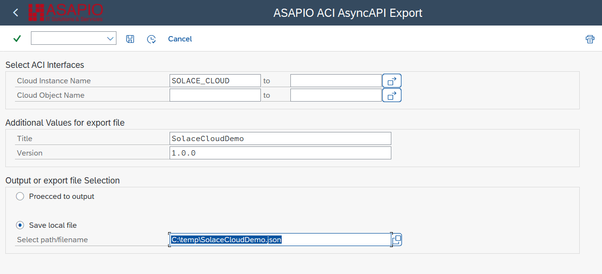

Reference

# AsyncAPI® Support

Export a machine-readable AsyncAPI specification for your ASAPIO integration scenarios – describing channels, message schemas, and platform bindings. Ready for use in API portals, contract tests, code generation, and developer self-service tooling.

## Overview

AsyncAPI provides a standard for defining event-driven APIs using asynchronous messaging. It is used by various tools to increase interoperability.

By providing an AsyncAPI export for interfaces configured in the ASAPIO Integration Add-on, events from the SAP system can be easily integrated into API management solutions. These solutions serve as a central documentation hub for the available APIs in an architecture. The export makes it easy to get a correct schema definition of the configured payload structure and combine it with information about the target topic/queue/endpoint.

**Note:** New feature in release 9.32304. All interfaces that define the payload using DB/CDS views or the Payload Designer are supported. Interfaces using custom extractors/formatters or notification events are currently not supported.

## Export AsyncAPI Specification

To export an AsyncAPI specification for your interfaces:

AsyncAPIExport Screen

- **Transaction:** SA38
- **Report:** `/ASADEV/ACI_ASYNCAPI_EXPORT`

Specify the following parameters:

- **Cloud Instance:** The target system for which to generate the specification
- **Outbound Object:** Optional – if empty, all configured interfaces are exported
- **Title:** A name for the AsyncAPI specification
- **Version:** Version string for the generated AsyncAPI specification
- **Path / filename:** Where to save the generated specification file

The export provides a file containing the specification for the selected interfaces. You can import this file into other tools that support AsyncAPI.
