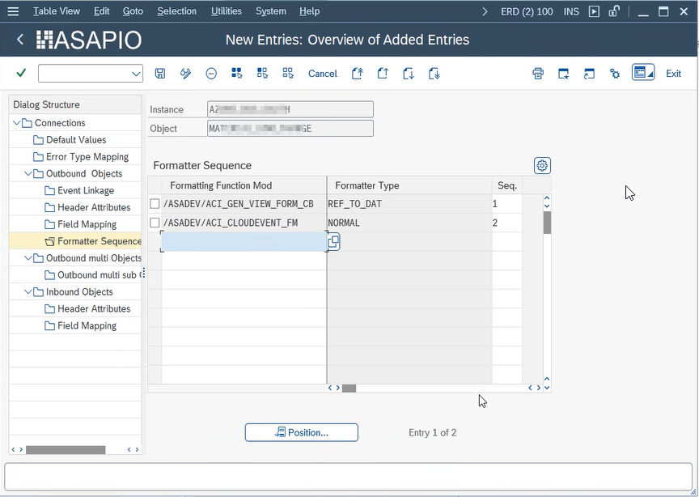
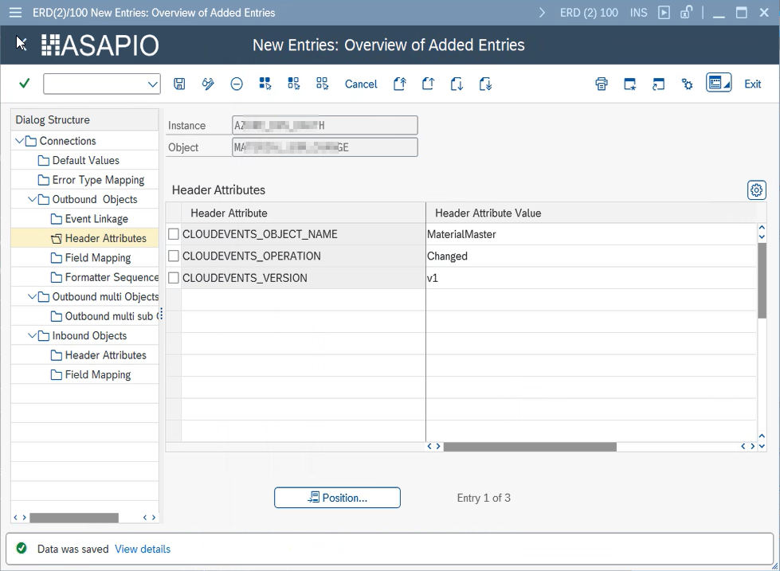
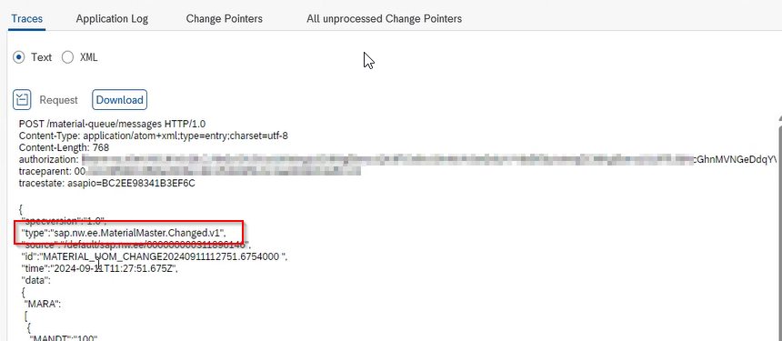

Outbound Messaging

# CloudEvents Format

Structure outbound messages as CloudEvents v1.0 – the CNCF standard envelope format supported by Azure Event Grid, Solace, Confluent, and many other platforms. Covers the attribute mapping, format options, and a worked example payload.

## Overview

The [CloudEvents](https://cloudevents.io/) specification is a vendor-neutral format for describing events, maintained by the Cloud Native Computing Foundation (CNCF). ASAPIO supports the CloudEvents format as of release **9.32310**.

When enabled, outbound messages are wrapped in a CloudEvents envelope with standard attributes such as `id`, `source`, `specversion`, `type`, and `time`, in addition to the data payload.

## Activate CloudEvents Formatting

To enable CloudEvents formatting for an outbound object, add the following two entries to the **Formatter Sequence** in the connection instance configuration.

CloudEvents formatter sequence configuration

- **Transaction:** `/ASADEV/ACI_SETTINGS`
- Select your Connection Instance and Outbound Object
- Navigate to **Formatter Sequence**
- Add the two formatters in this exact order:

| Seq. | Function Module | Description |
| --- | --- | --- |
| 1 | `/ASADEV/ACI_GEN_VIEW_FORM_CB` | Generate JSON payload from the configured view/payload design |
| 2 | `/ASADEV/ACI_CLOUDEVENT_FM` | Wrap the JSON payload in a CloudEvents envelope |

## Optional Header Attributes

You can control parts of the CloudEvents envelope using the following optional header attributes in the outbound object configuration:

CloudEvents optional header attributes

CloudEvents – resulting type field in payload

| Header Attribute | Description |
| --- | --- |
| `CLOUDEVENTS_OBJECT_NAME` | Overrides the event `type` field in the CloudEvents envelope. |
| `CLOUDEVENTS_OPERATION` | Sets the operation type (e.g., `created`, `updated`, `deleted`). |
| `CLOUDEVENTS_VERSION` | Sets the `dataschema` version field in the envelope. |
