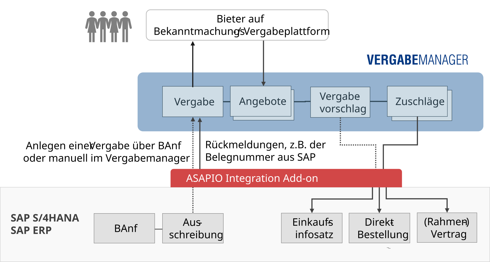

Connectors

# AI Vergabemanager Connector

## Overview

AI VERGABEMANAGER integration overview

The ASAPIO connector for **AI VERGABEMANAGER** enables SAP ERP and S/4HANA customers to integrate public procurement processes directly with the AI VERGABEMANAGER tendering platform.

Purchase requisitions (PRs) created in SAP can automatically become tenders (Vergaben) in AI VERGABEMANAGER. The connector supports a wide range of German public procurement procedures, including:

- VOL / VgV (award of contracts for goods and services)
- SektVO (utilities sector)
- UVgO (procurement below threshold)
- Preisanfragen (price enquiries)

## Features

- **Status monitor:** Track the status of active tenders directly from within SAP.
- **Bid bundle:** Collect and bundle bids received in AI VERGABEMANAGER for processing in SAP.
- **Document support:** Automatically attach SAP documents to the tender, including Projekt, Ausschreibung, and Leistungsverzeichnis.

## Documentation

Detailed configuration documentation is provided as a PDF to licensed customers on request. Please [contact ASAPIO Support](../../support/index.md) or your account manager to obtain it.
