Connectors

# Amazon® Web Services Connector

## Overview

ASAPIO supports sending SAP event payloads to multiple AWS services using **AWS Signature Version 4 (SigV4)** request signing. Supported services include:

- **Amazon EventBridge** – event bus for routing and filtering events
- **Amazon SNS** – Simple Notification Service for fan-out messaging
- **Amazon Kinesis** – data streaming for real-time analytics
- **Amazon S3** – object storage for event payload archiving

## IAM Users & Permissions

Create a dedicated IAM user for each AWS service, following the principle of least privilege. Required IAM permissions per service:

| Service | Required Permission |
| --- | --- |
| EventBridge | `events:PutEvents` |
| SNS | `sns:Publish` |
| Kinesis | `kinesis:PutRecord`, `kinesis:PutRecords` |
| S3 | `s3:PutObject` |

## Setup

### 1. Activate BC-Set

Activate the BC-Set `/ASADEV/ACI_BCSET_FRAMEWORK_AWS` via transaction **SCPR20**.

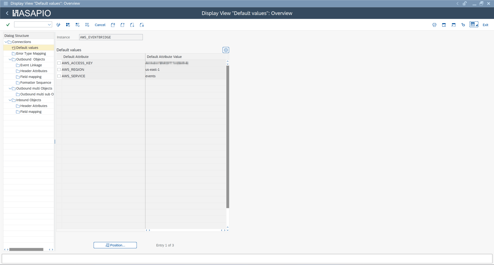

BC-Set activation – /ASADEV/ACI\_BCSET\_FRAMEWORK\_AWS in SCPR20

### 2. Create Cloud Instance

In `/ASADEV/ACI_SETTINGS`, create an instance with:

| Field | Value |
| --- | --- |
| Cloud Adapter | `/ASADEV/CL_ACI_AWS_HANDLER` |
| Cloud Type | `AWS` |

Set the following default values:

| Key | Value |
| --- | --- |
| `AWS_ACCESS_KEY` | IAM user Access Key ID |
| `AWS_REGION` | AWS region (e.g. `eu-central-1`) |
| `AWS_SERVICE` | `sns`, `kinesis`, `s3`, or `events` |

Store the IAM user's secret access key in `/ASADEV/SCI_TPW`.

### 3. Response Handler

Configure the response handler `/ASADEV/ACI_AWS_RESP_HANDLER` on the outbound object so AWS API responses are interpreted correctly.

## Service-Specific Header Attributes

### EventBridge

| Header Attribute | Description |
| --- | --- |
| `AWS_EVENTBRIDGE_DETAIL_TYPE` | The `detail-type` field in the EventBridge event |
| `EVENT_BUS_NAME` | Target event bus name or ARN |
| `SOURCE` | The `source` field (e.g. `com.company.sap`) |

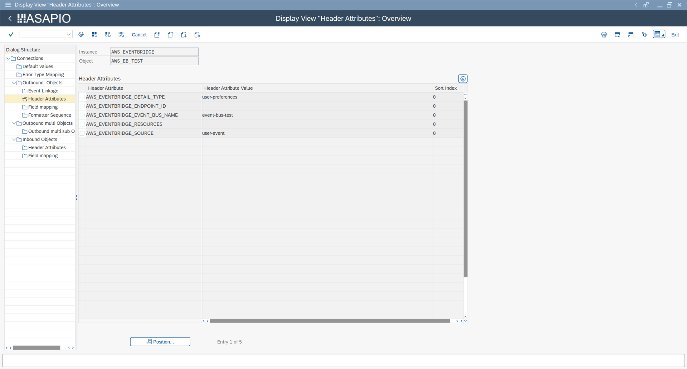

EventBridge header attributes – AWS\_EVENTBRIDGE\_DETAIL\_TYPE, EVENT\_BUS\_NAME, SOURCE

### SNS

| Header Attribute | Description |
| --- | --- |
| `AWS_TOPIC` | SNS topic ARN |
| `AWS_TOPIC_OWNER` | AWS account ID of the topic owner (if cross-account) |

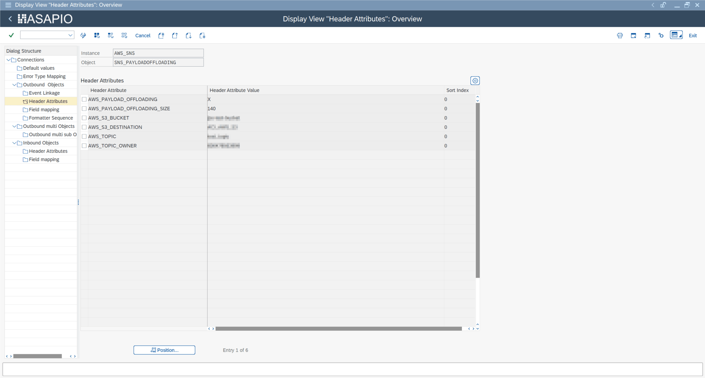

SNS outbound object configuration

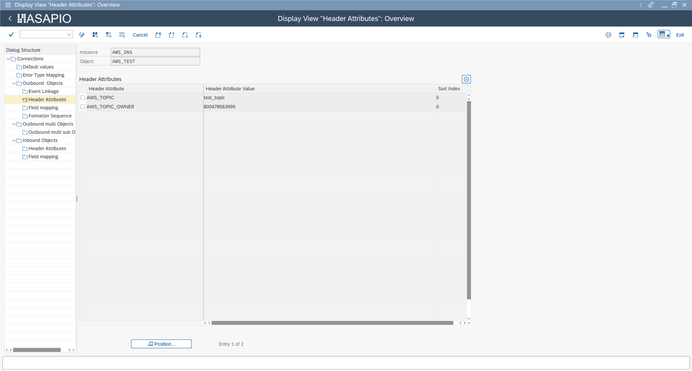

SNS header attributes – AWS\_TOPIC and AWS\_TOPIC\_OWNER

### Kinesis

| Header Attribute | Description |
| --- | --- |
| `AWS_KINESIS_STREAM_NAME` | Name of the Kinesis data stream |

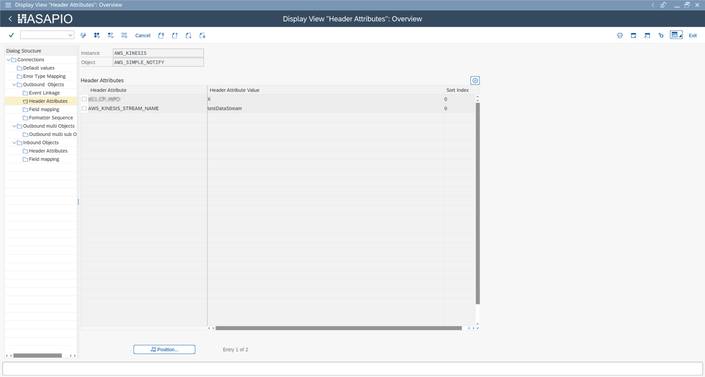

Kinesis header attribute – AWS\_KINESIS\_STREAM\_NAME

### S3

| Header Attribute | Description |
| --- | --- |
| `AWS_S3_BUCKET` | Target S3 bucket name |

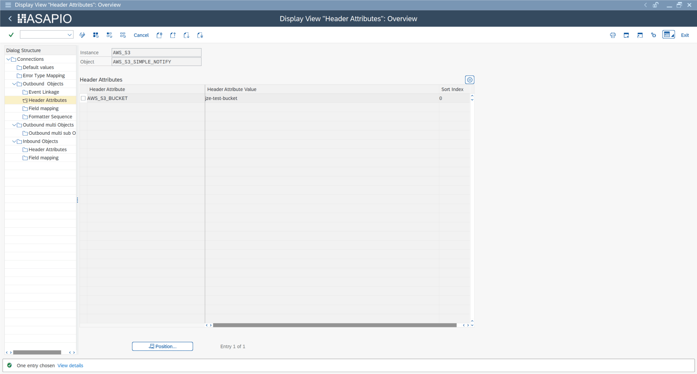

S3 header attribute – AWS\_S3\_BUCKET

## SNS Payload Offloading (S3)

For SNS messages exceeding 256 KB, ASAPIO can automatically offload the payload to S3 and send a reference link in the SNS message. Configure the following header attributes:

| Header Attribute | Description |
| --- | --- |
| `AWS_PAYLOAD_OFFLOADING` | `X` – enables payload offloading |
| `AWS_PAYLOAD_OFFLOADING_SIZE` | Threshold in bytes (default: 256000) |
| `AWS_S3_BUCKET` | Target S3 bucket for offloaded payloads |
| `AWS_S3_DESTINATION` | S3 key prefix / folder path |

## Custom SNS Message Attributes

As of release **9.32507**, you can add custom message attributes to SNS messages. Configure attributes in the Field Mapping of the outbound object using the naming convention `AWS_MESSAGE_ATTRIBUTE_<index>` (e.g. `AWS_MESSAGE_ATTRIBUTE_1`). Each entry maps an SAP field to an SNS message attribute key.

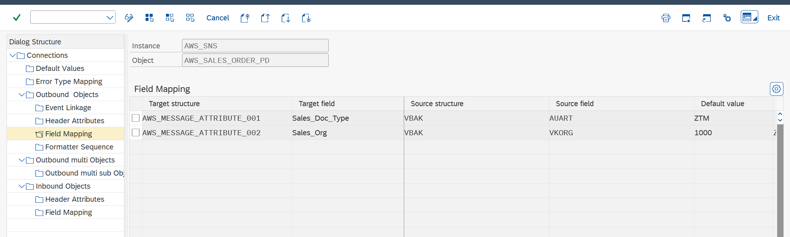

Custom SNS message attributes – Field Mapping configuration

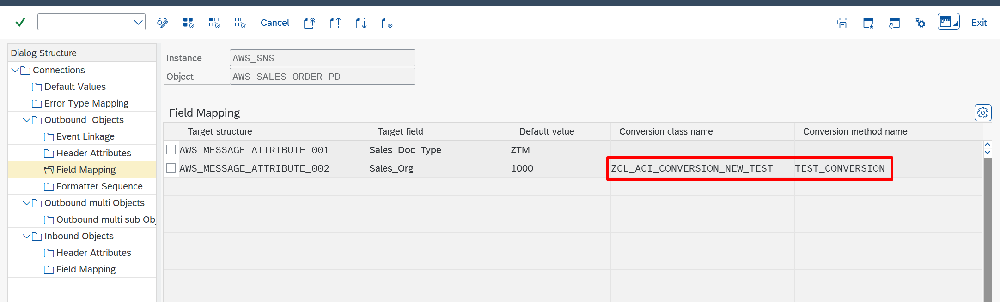

SNS message attribute conversion class configuration

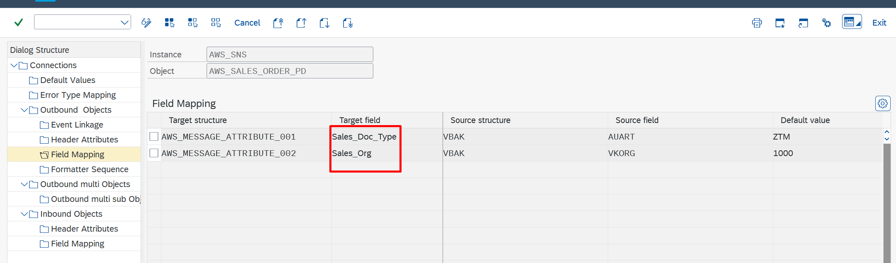

SNS message attribute name mapping

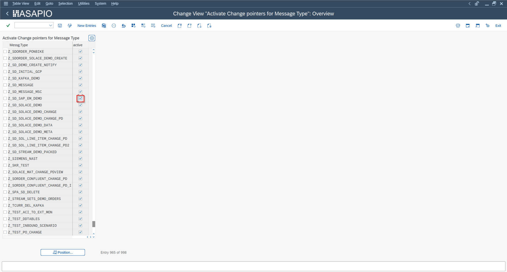

Custom message attributes visible in ACI Monitor

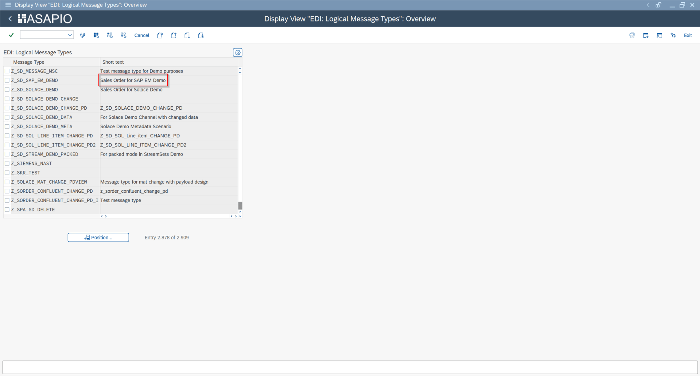

SNS message with custom attributes in AWS Console
