Connectors

# Microsoft Azure® Connector

## Overview

The ASAPIO Azure connector enables SAP systems to send events and data to Microsoft Azure messaging and storage services. The supported Azure services are:

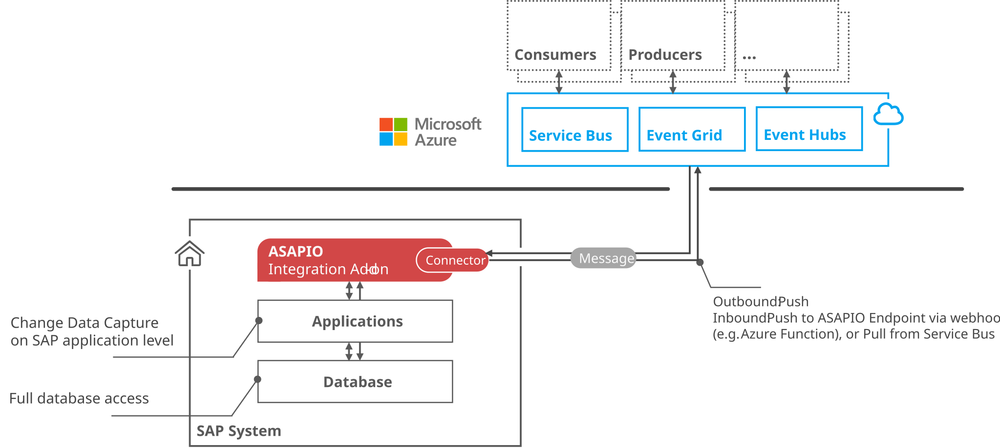

azure integration

- **Azure Service Bus** – enterprise-grade message queue and pub/sub broker
- **Azure Event Hubs** – big-data event streaming platform
- **Azure Event Grid** – fully managed event routing service
- **Azure Data Lake Storage Gen2 (ADLS)** – scalable data lake storage

## Prerequisites

- Microsoft Azure account with the relevant services provisioned (Event Hubs namespace, Service Bus namespace, Event Grid topic, or ADLS Gen2 storage account)
- Entra ID (Azure AD) app registration or Managed Identity configured (for OAuth authentication)
- Network connectivity from the SAP system to the Azure endpoints (HTTPS/443)

## Authentication Options

ASAPIO supports three authentication methods for Azure:

| Method | Key Settings | Recommended For |
| --- | --- | --- |
| **OAuth (Entra ID)** | `AZURE_CLIENT_ID`, `TOKEN_DESTINATION` | App registrations with client secret |
| **Managed Identity** | `AZURE_SERVICE_TYPE`, `AZURE_AUTH_TYPE=MANAGED_IDENTITY` | Azure-hosted SAP (e.g. S/4HANA on Azure VMs) |
| **SAS Key** | `AZURE_KEY_NAME`, `AZURE_NAMESPACE` | Simple access without Entra ID |

Store OAuth client secrets or SAS keys in the ABAP Secure Store: transaction `/ASADEV/SCI_TPW`.

## RFC Destinations

Create two HTTP RFC destinations (SM59, type G):

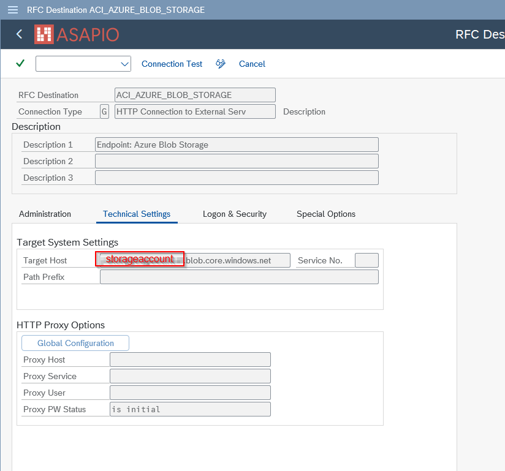

RFC destination for Blob Storage endpoint

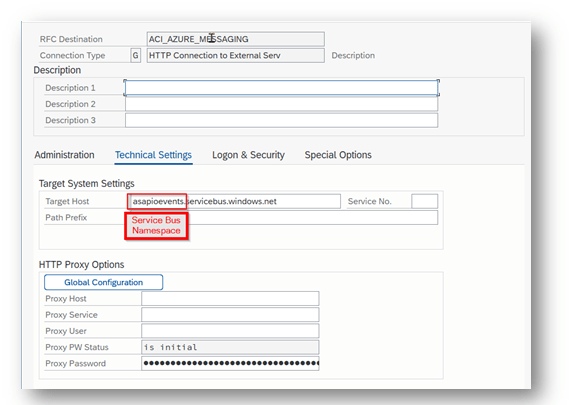

RFC destination for Azure Service Bus / Event Hub Namespace (SM59)

1. **Messaging endpoint:** The Azure service endpoint (e.g. `your-namespace.servicebus.windows.net`)
2. **OAuth endpoint:** `login.microsoftonline.com` – for OAuth token retrieval (not needed for SAS/Managed Identity)

Import the relevant Azure root certificates (Baltimore CyberTrust, DigiCert) into STRUST (SSL Client Standard).

## BC-Set Activation

Activate the Azure framework BC-Set via transaction **SCPR20**:

- BC-Set: `/ASADEV/ACI_BCSET_FRAMEWORK_AZ`

## Cloud Instance Configuration

Create the connection instance in **SPRO → ASAPIO Cloud Integrator – Connection and Replication Object Customizing** (transaction `/ASADEV/ACI_SETTINGS`). Specify the RFC destination for the messaging endpoint, the ISO code page, and set the Cloud Type to `AZURE`. Also add the handler class `/ASADEV/CL_ACI_AZURE_REST` to the cloud adapter list.

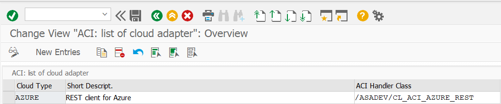

Cloud adapter configuration – handler class /ASADEV/CL\_ACI\_AZURE\_REST

| Field | Value |
| --- | --- |
| Cloud Adapter | `/ASADEV/CL_ACI_AZURE_REST` |
| RFC Destination | Azure messaging RFC destination |
| Success Response Codes | `201`, `202` |

### OAuth Default Values

| Key | Value |
| --- | --- |
| `AZURE_CLIENT_ID` | Entra ID application (client) ID |
| `TOKEN_DESTINATION` | RFC destination for OAuth endpoint |
| `AZURE_AUTH_TYPE` | `oauth` |

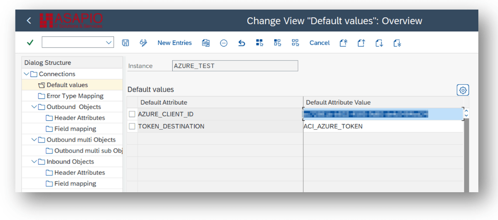

OAuth default values – AZURE\_CLIENT\_ID and TOKEN\_DESTINATION

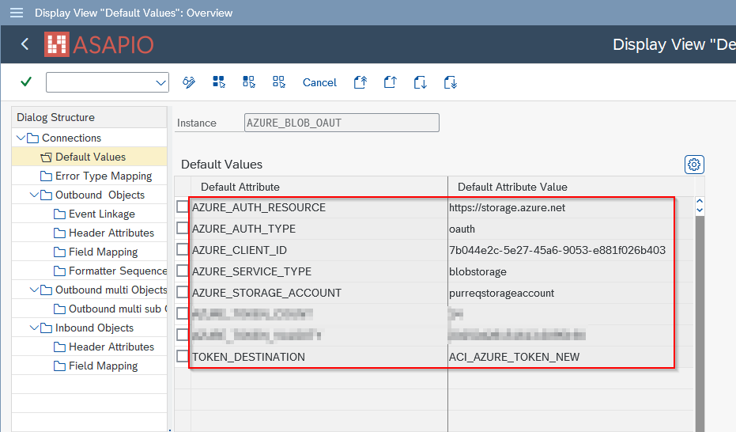

OAuth configuration in the cloud instance default values screen

### Managed Identity Default Values

Note: Managed Identity authentication only works when the SAP system is also running in the Azure cloud.

| Key | Value |
| --- | --- |
| `AZURE_SERVICE_TYPE` | Target service (e.g. `servicebus`) |
| `AZURE_AUTH_TYPE` | `MANAGED_IDENTITY` |
| `TOKEN_DESTINATION` | RFC destination for Managed Identity endpoint (must use HTTP, not HTTPS) |

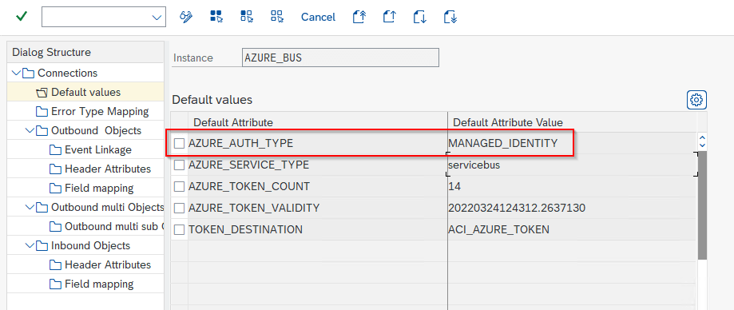

Managed Identity default values – AZURE\_SERVICE\_TYPE and AZURE\_AUTH\_TYPE

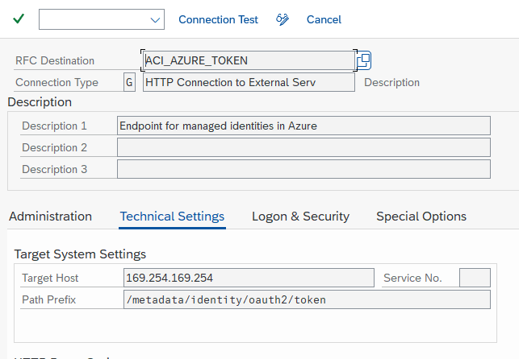

Managed Identity RFC destination – must use HTTP (not HTTPS)

### SAS Key Default Values

| Key | Value |
| --- | --- |
| `AZURE_KEY_NAME` | Name of the SAS policy (not required for Data Lake Storage) |
| `AZURE_NAMESPACE` | Namespace for Azure Service Bus / Event Hub (not required for Data Lake Storage) |

## Service-Specific Endpoint Configuration

### Azure Service Bus

Set `AZURE_SERVICE_TYPE=servicebus` and `AZURE_AUTH_TYPE` (oauth or sas) as connection default values. Specify the target queue or topic in the outbound object header attribute `AZURE_TOPIC`.

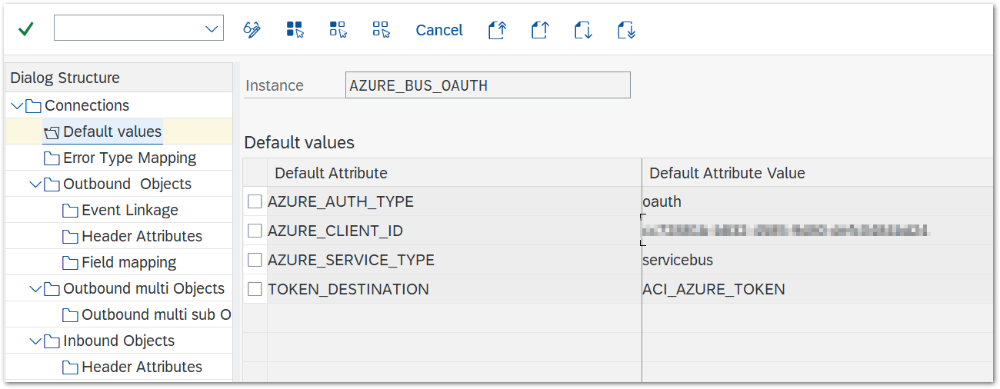

Service Bus OAuth default values configuration

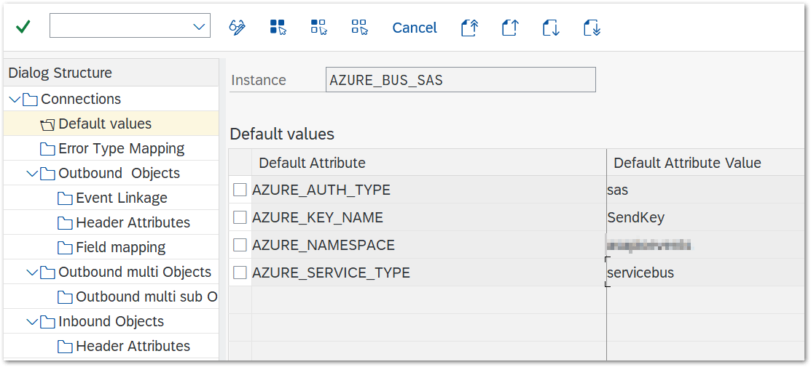

Service Bus SAS default values configuration

### Azure Event Hubs

Set `AZURE_SERVICE_TYPE=eventhub` and `AZURE_TOPIC` to the event hub name. For SAS-based authentication, also set `AZURE_NAMESPACE` (Event Hubs namespace) and `AZURE_KEY_NAME`.

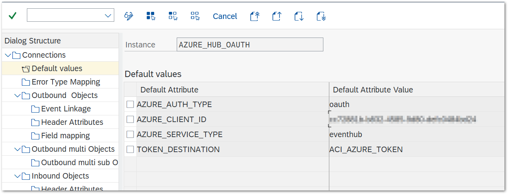

Event Hubs OAuth default values configuration

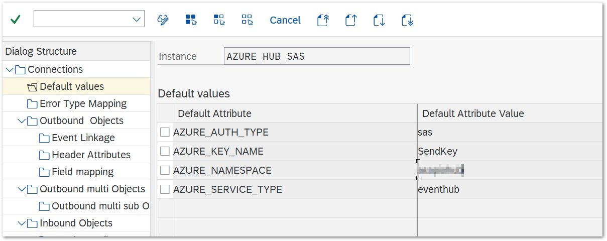

Event Hubs SAS default values – AZURE\_NAMESPACE and AZURE\_KEY\_NAME

### Azure Event Grid

Event Grid supports SAS-based authentication. Configure the following default values: `AZURE_SERVICE_TYPE=eventgrid`, `AZURE_AUTH_TYPE=sas`, `AZURE_GRID_REGION` (technical region name), and `AZURE_GRID_TOPIC` (topic name).

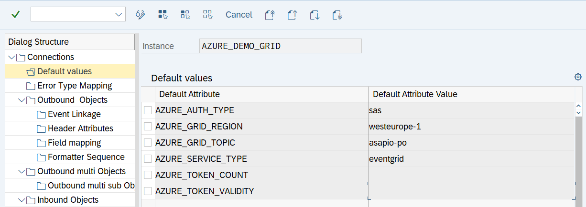

Event Grid configuration – AZURE\_GRID\_REGION and AZURE\_GRID\_TOPIC

### Azure Data Lake Storage (ADLSgen2)

Set `AZURE_SERVICE_TYPE=datalake` and `AZURE_STORAGE_ACCOUNT` as connection default values. For OAuth, also configure `AZURE_CLIENT_ID` and `TOKEN_DESTINATION`. Specify the target container via `AZURE_CONTAINER`. Available from release 9.32507.

### Custom HTTP Endpoint

Only OAuth authentication with Entra ID is supported for custom HTTP endpoints. Set `AZURE_AUTH_RESOURCE` (the resource URI) as a connection default value, and `ACI_HTTP_URI` (the path to send messages to) as an outbound object header attribute.

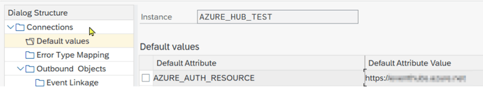

Custom HTTP endpoint – AZURE\_AUTH\_RESOURCE connection default value

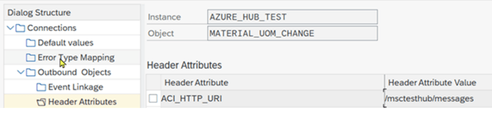

Custom HTTP endpoint – ACI\_HTTP\_URI outbound object header attribute

## Outbound Messaging

For outbound messaging, you can use and combine the following methods. All methods require a message type (WE81, BD50) and an event linkage (SWE2 or Event Studio), and use `AZURE_TOPIC` as the target header attribute.

- **Simple Notifications** – extractor `/ASADEV/ACI_SIMPLE_NOTIFY`; sends a trigger notification without payload extraction
- **Message Builder (Generic View Extractor)** – extractor `/ASADEV/ACI_GEN_VIEW_EXTRACTOR`; extracts and formats data from a configured database view
- **Packed Load** – extractor `/ASADEV/ACI_GEN_VIEW_EXT_PACK` with Load Type set to Packed Load; splits large datasets into manageable packs
- **IDoc Capturing** or **Custom-built** triggers and extractors

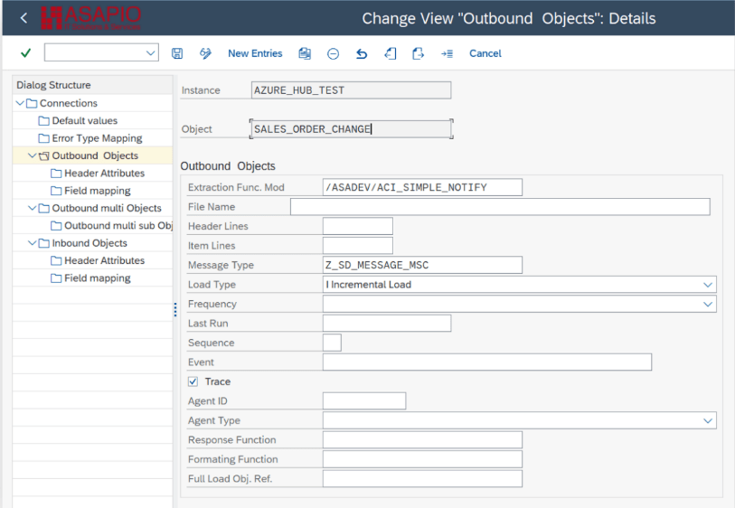

Simple Notification outbound object configuration

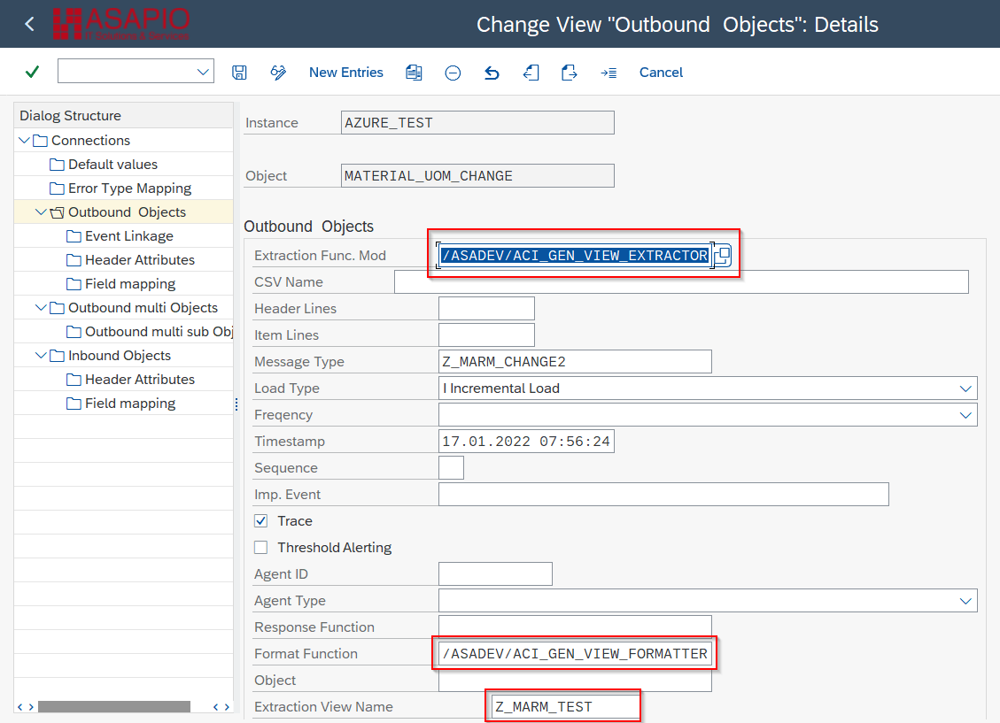

Message Builder outbound object configuration

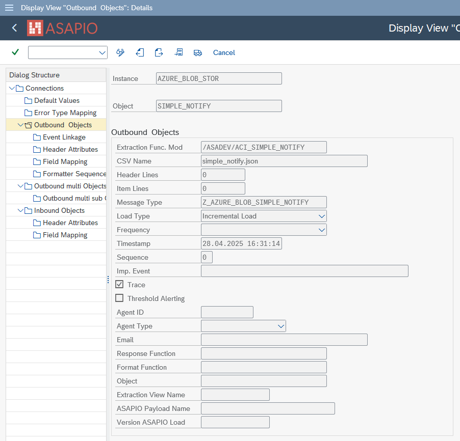

Outbound object – connection and replication object customizing

### Key Header Attributes

| Attribute | Description |
| --- | --- |
| `AZURE_TOPIC` | Target queue, topic, or event hub name (mandatory) |
| `ACI_ADD_LOGSYS` | `X` – adds the SAP logical system to the top level of the payload (generic view extractors/formatters only) |
| `AZURE_IMMEDIATE_RETRY` | Number of immediate retry attempts on failure (default: 2) |
| `AZURE_CONTAINER` | Container name (Data Lake Storage or payload offloading) |

## Payload Offloading (Service Bus)

For large messages exceeding Service Bus limits, ASAPIO can offload the payload to Azure Blob Storage and send a reference URL in the Service Bus message. Enable with:

| Attribute | Value |
| --- | --- |
| `AZURE_PAYLOAD_OFFLOADING` | `X` |
| `AZURE_CONTAINER` | Blob container name |

Multiple authentication combinations are supported for the Blob Storage and Service Bus endpoints (separate OAuth or SAS configurations).

## Inbound: Azure Service Bus Pull

ASAPIO can pull messages from an Azure Service Bus queue using Peek-Lock mode. Messages are read and processed, then deleted from the queue. This is repeated until the queue is empty. Configure the inbound object in transaction `/ASADEV/ACI_SETTINGS`.

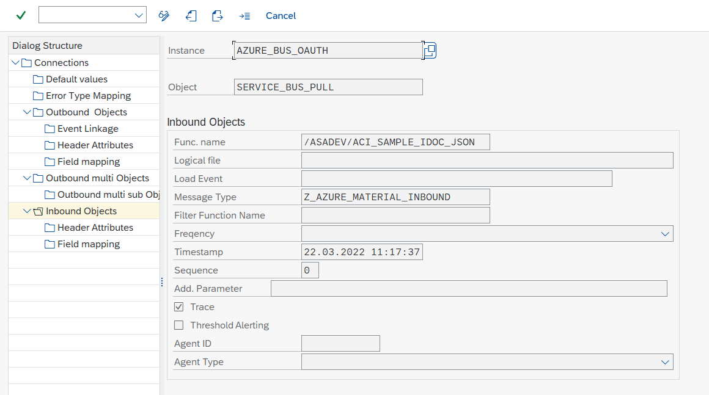

Inbound Object configuration for Azure Service Bus pull

Then configure the queue name and polling settings in the inbound object's header attributes:

| Attribute | Description |
| --- | --- |
| `AZURE_QUEUE_NAME` | Queue to pull messages from (mandatory) |
| `AZURE_PULL_DURATION` | Duration of polling in seconds (default: 60) |
| `AZURE_PULL_WAIT` | Wait between polls when queue is empty, in seconds (default: 3) |

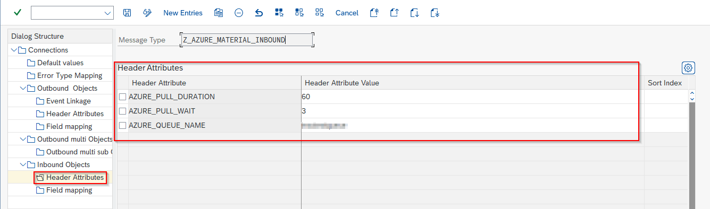

Inbound header attributes – AZURE\_QUEUE\_NAME configuration
