Connectors

# Confluent® Connector

## Overview

The ASAPIO Confluent connector is certified by Confluent and supports two connectivity modes:

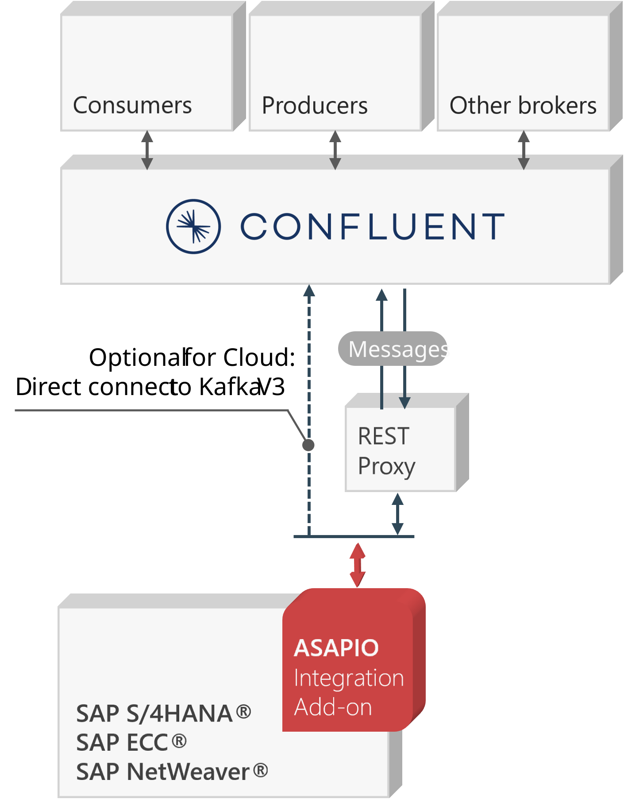

Confluent REST proxy block architecture

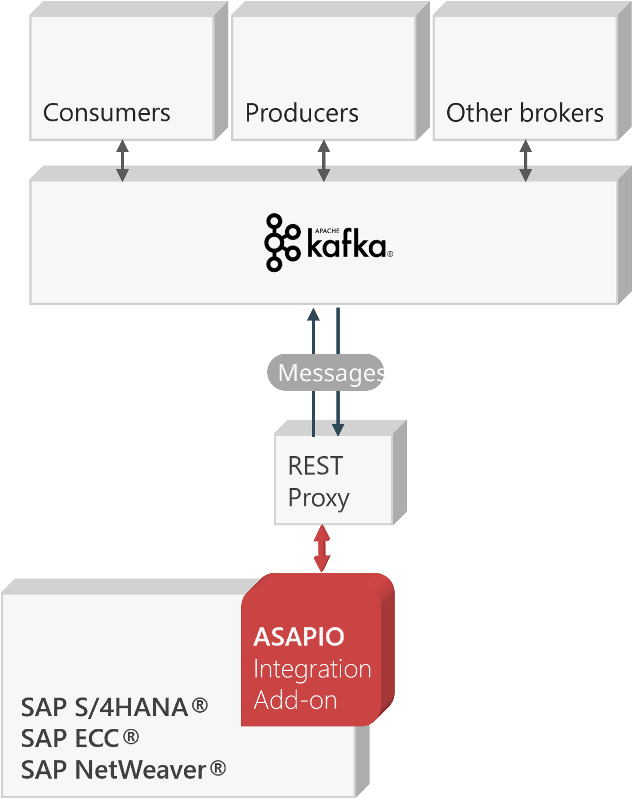

Native Apache Kafka protocol block architecture

- **REST Proxy** – standard approach using the Confluent REST Proxy v2 API over HTTPS
- **Native Kafka Protocol** – direct Kafka protocol connection without a REST proxy (from release 2510)

## REST Proxy Setup

### RFC Destination

Create an HTTP RFC destination (SM59, type G) pointing to your Confluent REST Proxy endpoint. Basic authentication or SSL certificate authentication can be configured in the RFC destination's Logon & Security tab. After saving, use the connection test to verify connectivity (expect HTTP 200).

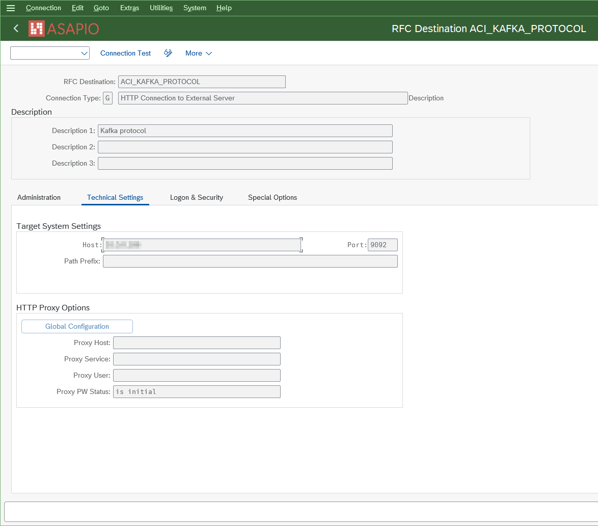

Native Kafka protocol RFC destination (SM59, type G)

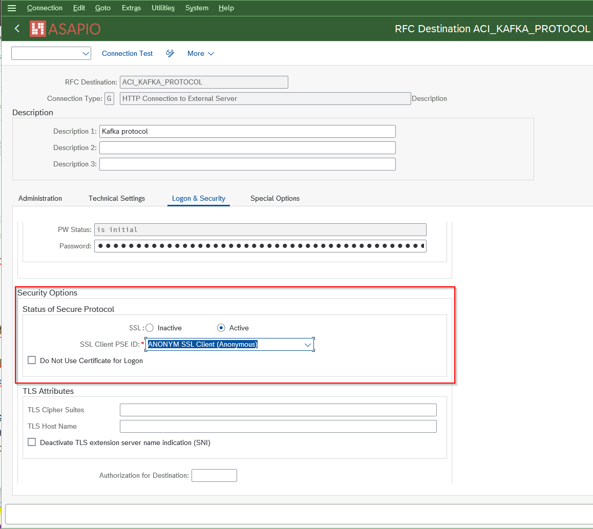

Native Kafka RFC destination – Logon & Security tab with certificates

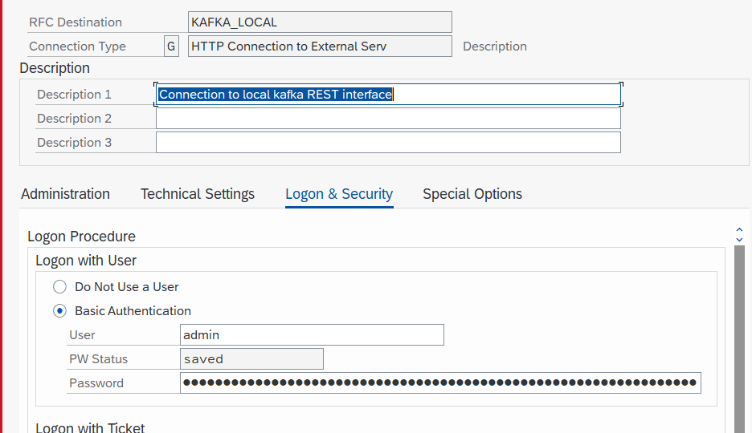

REST proxy authentication – Basic Auth configuration

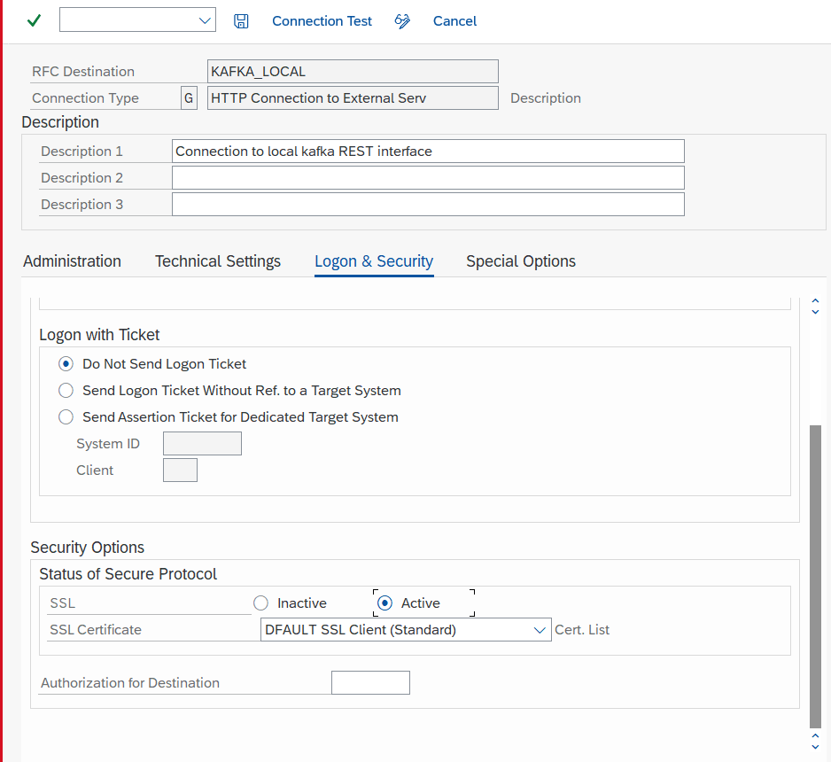

REST proxy authentication – SSL certificate configuration

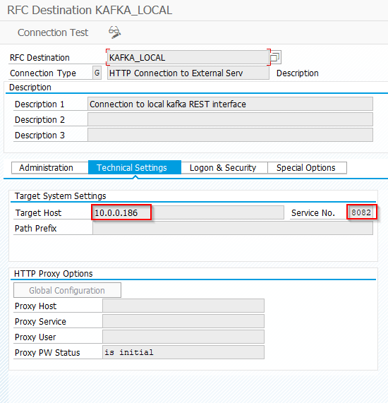

RFC destination for Confluent REST Proxy endpoint

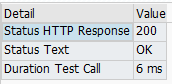

Connection test – HTTP 200 success

### BC-Set & Cloud Adapter

Activate BC-Set `/ASADEV/ACI_BCSET_FRAMEWORK_KAFK` via SCPR20. This sets up the cloud adapter (`/ASADEV/CL_ACI_KAFKA_HANDLER`), code pages, and IDoc segment definitions. If you do not use the BC-Set, configure them manually in SPRO.

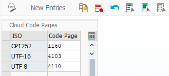

Cloud code pages configuration in SPRO

### Cloud Instance

Create the connection instance in **SPRO → ASAPIO Cloud Integrator – Connection and Replication Object Customizing** (transaction `/ASADEV/ACI_SETTINGS`):

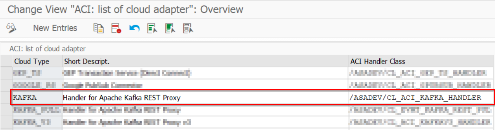

Cloud adapter configuration – /ASADEV/CL\_ACI\_KAFKA\_HANDLER

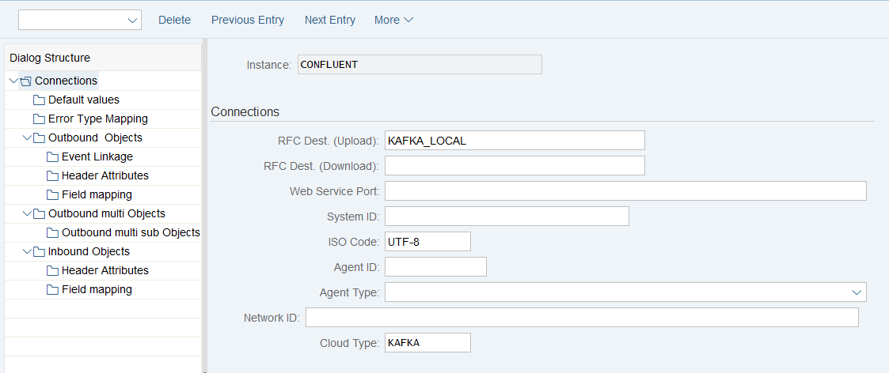

Cloud instance configuration in /ASADEV/ACI\_SETTINGS

| Field | Value |
| --- | --- |
| Cloud Adapter | `/ASADEV/CL_ACI_KAFKA_HANDLER` |
| Cloud Type | `KAFKA` (REST proxy) or `S4KAFKA` (native) |

Connection default values:

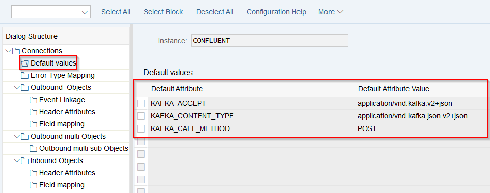

Connection default values – KAFKA\_ACCEPT, KAFKA\_CALL\_METHOD, KAFKA\_CONTENT\_TYPE

| Key | Value |
| --- | --- |
| `KAFKA_ACCEPT` | `application/vnd.kafka.v2+json` |
| `KAFKA_CALL_METHOD` | `POST` |
| `KAFKA_CONTENT_TYPE` | `application/vnd.kafka.json.v2+json` (or `application/vnd.kafka.jsonschema.v2+json` for payloads with schema registry) |

**Note:** Configure HTTP response code **207** as a success response in the error mapping – the Confluent REST Proxy returns 207 for successfully processed batch produce requests.

## Native Kafka Protocol (S4KAFKA)

From release 2510, the connector supports direct Kafka protocol connectivity without a REST proxy, via an ABAP daemon that maintains a persistent connection and session to the Kafka broker. Use Cloud Type `S4KAFKA` and Cloud Adapter `/ASADEV/CL_S4_KAFKA_HANDLER`.

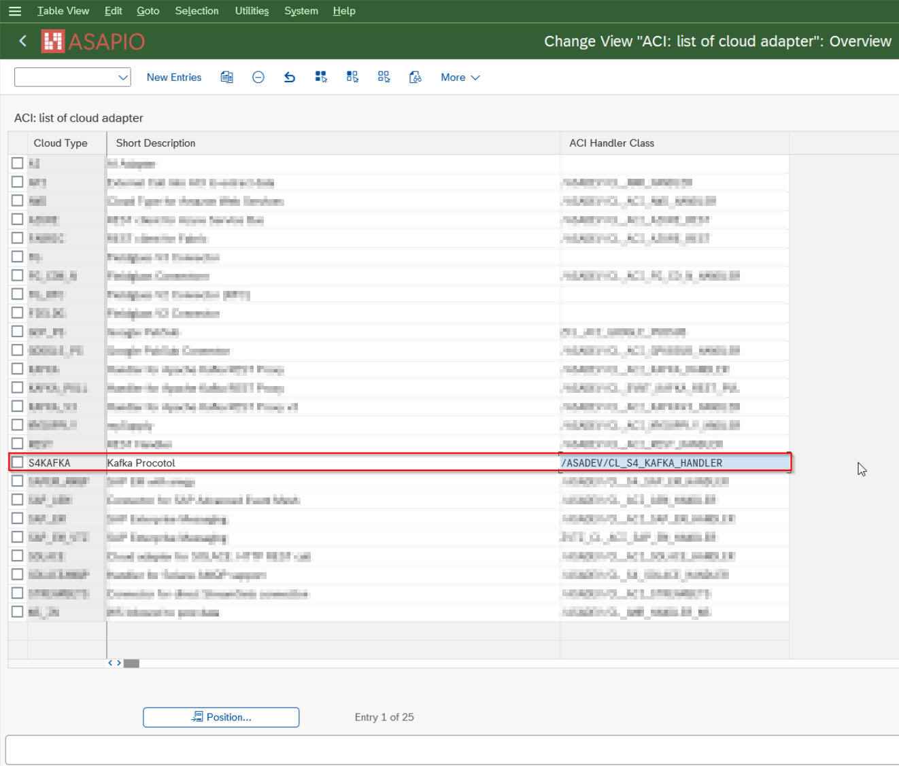

Native Kafka cloud adapter – /ASADEV/CL\_S4\_KAFKA\_HANDLER

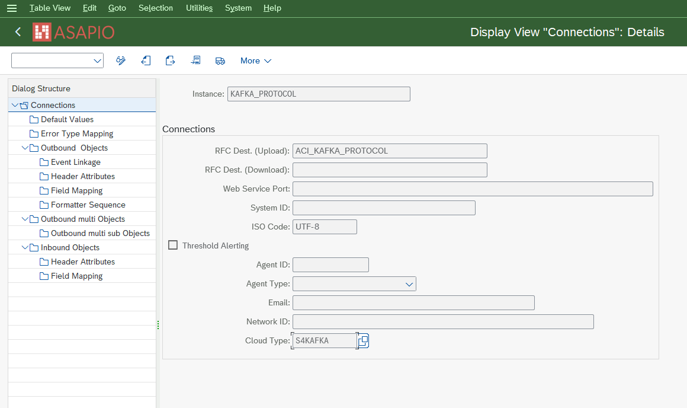

Native Kafka protocol connection instance configuration

## Outbound Configuration

For outbound messaging, use and combine the following methods. All methods require a message type (WE81 + BD50 activation) and an event linkage (SWE2). `/ASADEV/ACI_KAFKA_RESP_HANDLER` is mandatory as the Response Function for all outbound objects.

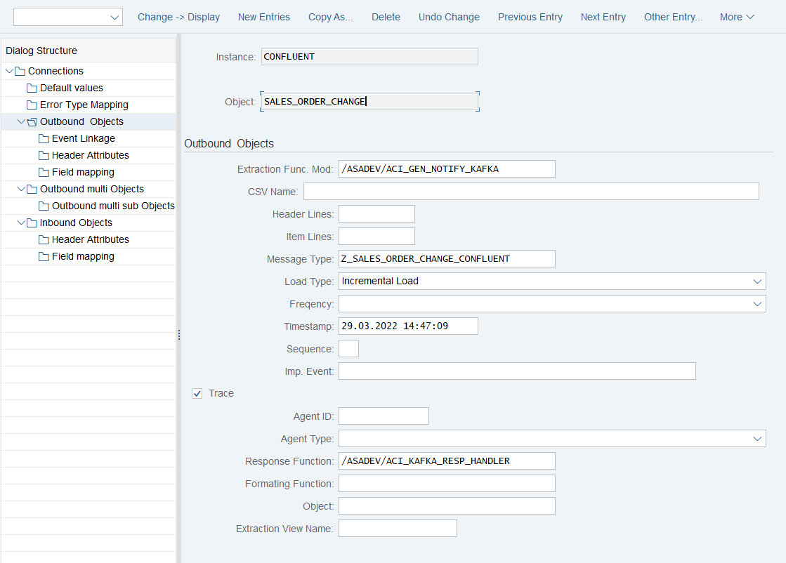

Simple Notification outbound object configuration

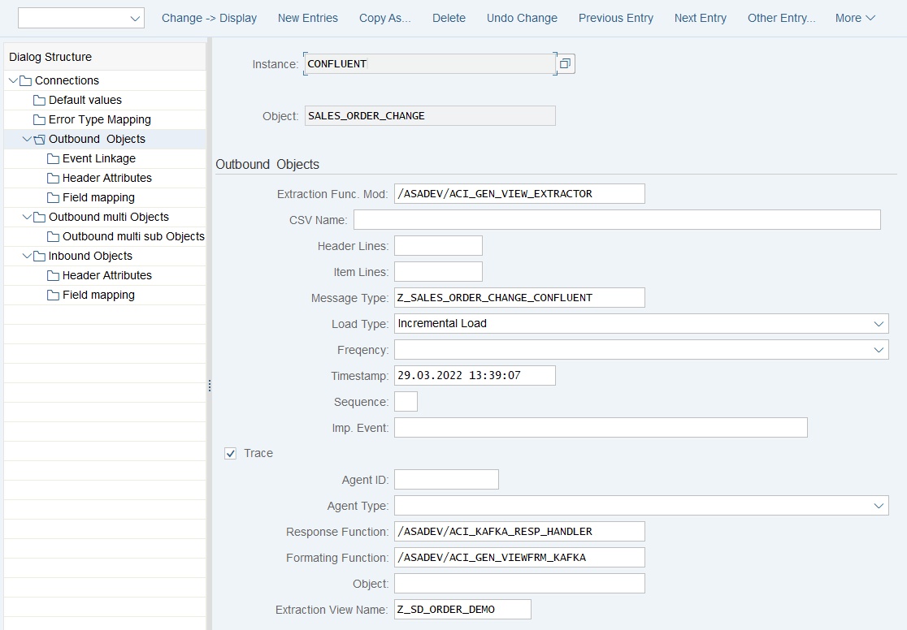

Message Builder outbound object configuration

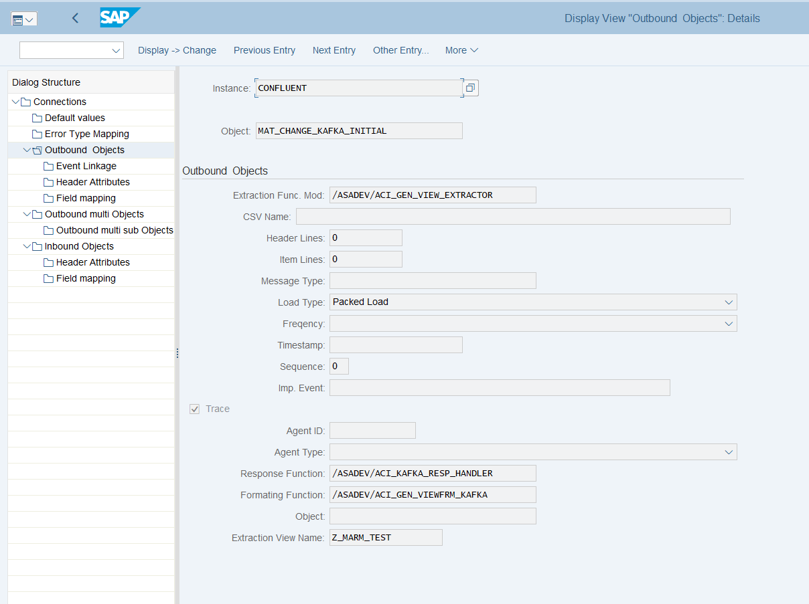

Packed Load outbound object configuration

| Role | Function Module |
| --- | --- |
| Simple notification | `/ASADEV/ACI_GEN_NOTIFY_KAFKA` |
| Response handler (mandatory) | `/ASADEV/ACI_KAFKA_RESP_HANDLER` |
| DB view extractor / Packed Load | `/ASADEV/ACI_GEN_VIEW_EXTRACTOR` (use Load Type: Packed Load for large datasets) |
| Formatter | `/ASADEV/ACI_GEN_VIEWFRM_KAFKA` |

### Key Header Attributes

| Attribute | Description |
| --- | --- |
| `KAFKA_TOPIC` | Target Kafka topic name |
| `KAFKA_KEY_FIELD` | Semicolon-separated list of fields used as the Kafka message key |
| `KAFKA_SCHEMA_ID` | Schema registry ID for the message value (Avro/JSON schema) |
| `KAFKA_KEY_SCHEMA_ID` | Schema registry ID for the message key |

## Dead Letter Queues (2510+)

From release **2510**, ASAPIO supports routing failed messages to a Dead Letter Queue (DLQ) topic – either after a specified number of retries, or on specific HTTP error codes. Configure this using outbound object header attributes:

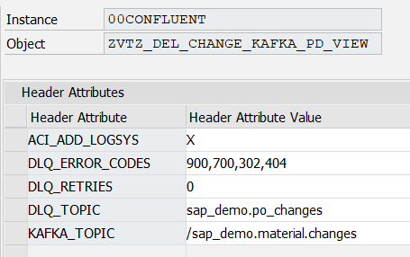

Dead Letter Queue header attributes configuration

| Attribute | Description |
| --- | --- |
| `DLQ_TOPIC` | Name of the dead letter queue topic |
| `DLQ_ERROR_CODES` | HTTP error codes that trigger DLQ routing (comma-separated) |
| `DLQ_RETRIES` | Number of retry attempts before moving to DLQ |

## Inbound: REST Proxy Pull

ASAPIO can pull messages from Kafka via the Confluent REST Proxy consumer API. Configure the inbound object in transaction `/ASADEV/ACI_SETTINGS`, then set the header attributes for the consumer group, instance, and topic. The inbound function module creates a generic IDoc (`/ASADEV/ACI_GENERIC_IDOC`), which can be processed asynchronously. From SP09 (9.32405), the pull correctly supports the Host header for load-balanced REST Proxy instances.

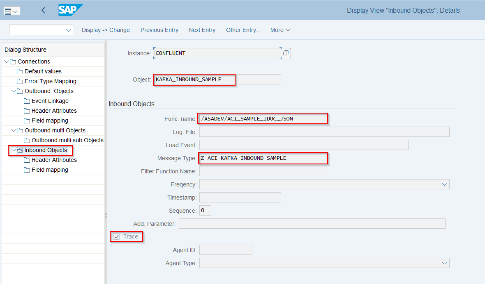

Inbound Object configuration for Confluent pull

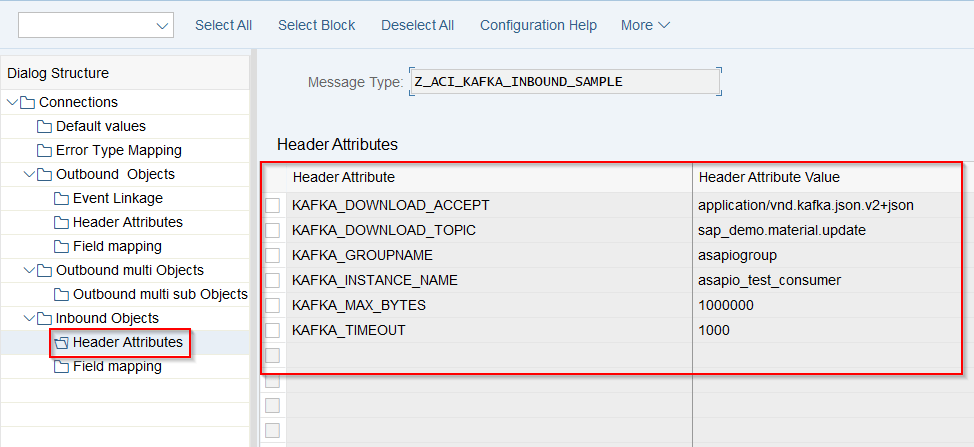

Inbound header attributes – KAFKA\_GROUPNAME, KAFKA\_INSTANCE\_NAME, KAFKA\_DOWNLOAD\_TOPIC

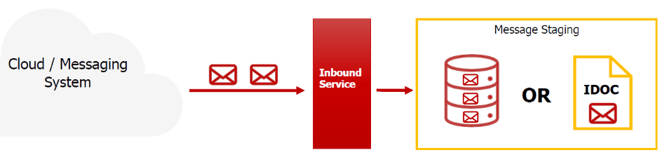

Inbound IDoc processing – /ASADEV/ACI\_GENERIC\_IDOC architecture

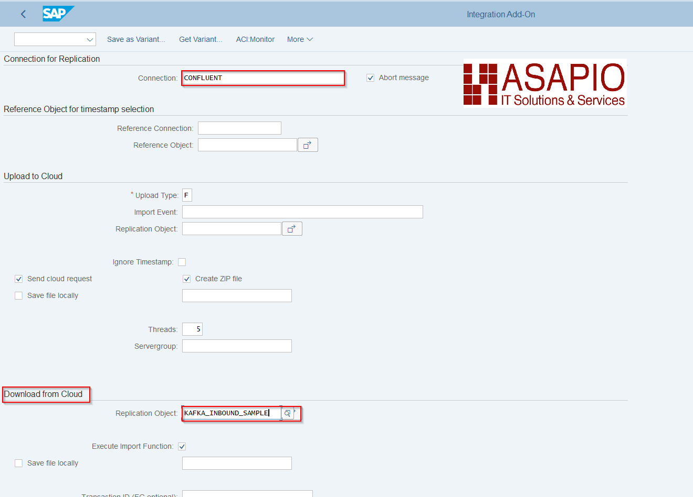

Execute inbound pull in /ASADEV/ACI – upload type and variant selection

| Attribute | Description |
| --- | --- |
| `KAFKA_DOWNLOAD_TOPIC` | Topic to subscribe to |
| `KAFKA_GROUPNAME` | Consumer group name |
| `KAFKA_INSTANCE_NAME` | Consumer instance name (unique per SAP client) |
| `KAFKA_MAX_BYTES` | Maximum bytes per pull request |
| `KAFKA_TIMEOUT` | Consumer timeout in milliseconds |
| `KAFKA_CONSUMER_FORMAT` | Message format: `json` or `binary` |
| `KAFKA_CONSUMER_OFFSET_RESET` | Offset reset strategy: `earliest` or `latest` |
| `KAFKA_CONSUMER_AUTO_COMMIT` | `true` – auto-commit offsets after successful processing |
