Connectors

# Microsoft Fabric® Connector

## Overview

The ASAPIO Microsoft Fabric connector enables direct, event-driven loading of SAP data into Microsoft Fabric Lakehouses and Mirrors via the OneLake storage API. Authentication uses OAuth via Microsoft Entra ID.

## Prerequisites

- Microsoft Azure account with Microsoft Fabric enabled
- Microsoft Entra ID application registration with permissions to access OneLake
- A Microsoft Fabric workspace with a Lakehouse or Mirror configured

## RFC Destinations

Create two HTTP RFC destinations (transaction SM59, type G):

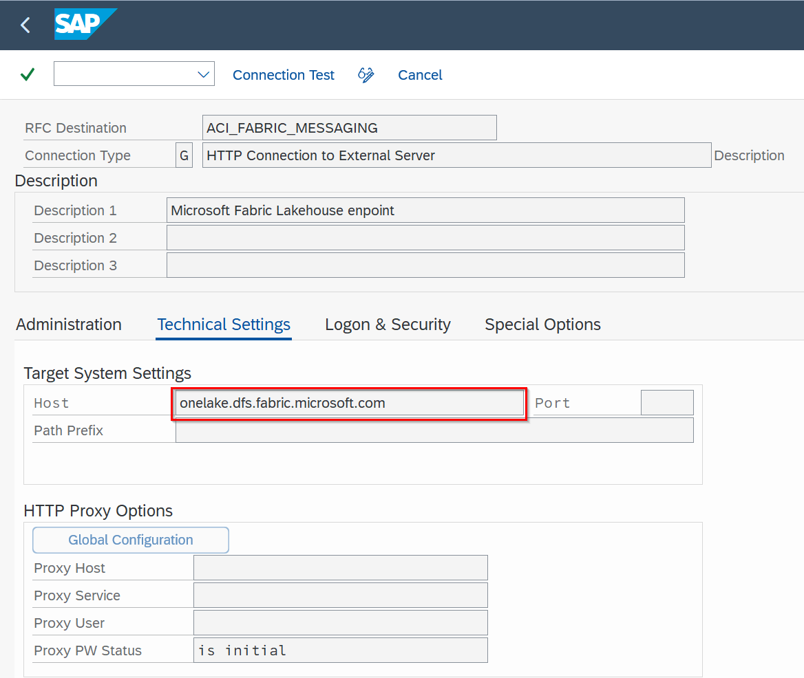

RFC destination for OneLake endpoint (SM59, type G) – target host: onelake.dfs.fabric.microsoft.com

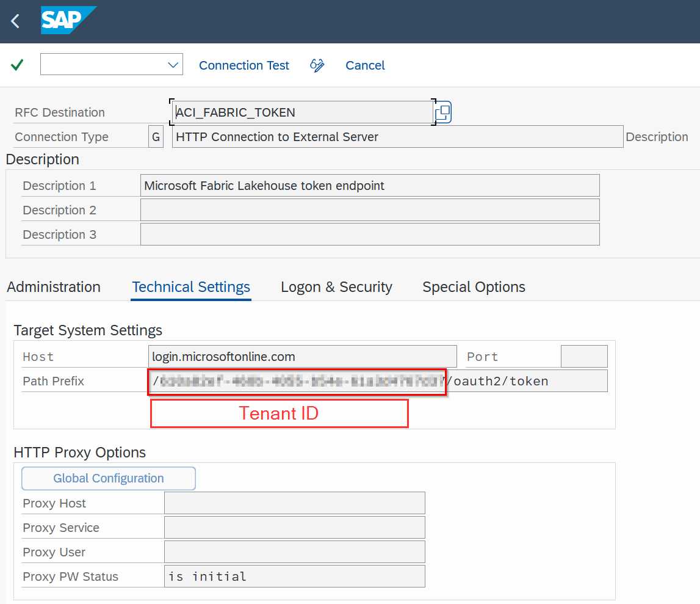

RFC destination for OAuth endpoint – login.microsoftonline.com with path prefix /<tenantID>/oauth2/token

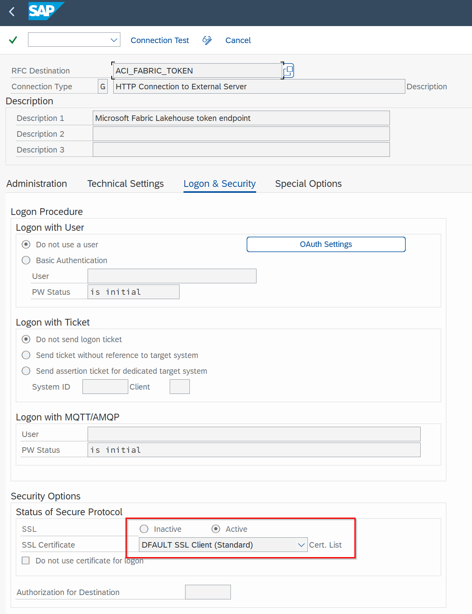

Logon & Security tab – SSL certificate list

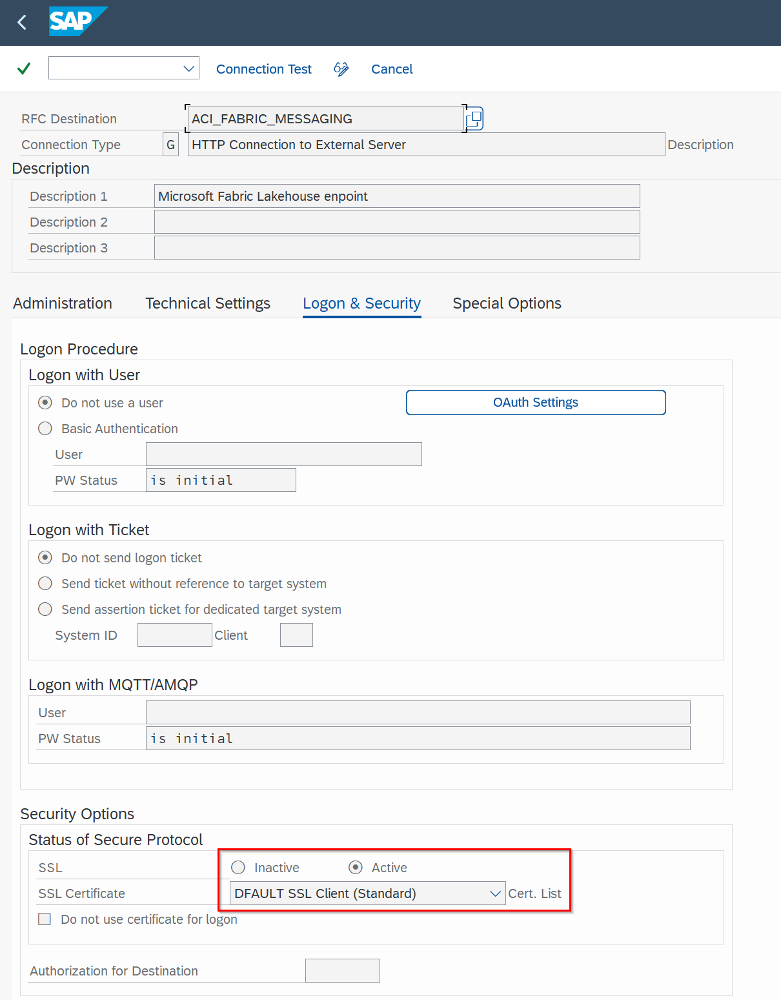

STRUST – import certificate and add to certificate list

1. **OneLake endpoint:** `onelake.dfs.fabric.microsoft.com`
2. **OAuth endpoint:** `login.microsoftonline.com`

## BC-Set

Activate the same Azure framework BC-Set via SCPR20: `/ASADEV/ACI_BCSET_FRAMEWORK_AZ`

## Cloud Instance

Create the connection instance in `/ASADEV/ACI_SETTINGS` with Cloud Type `FABRIC`. Set OAuth default values:

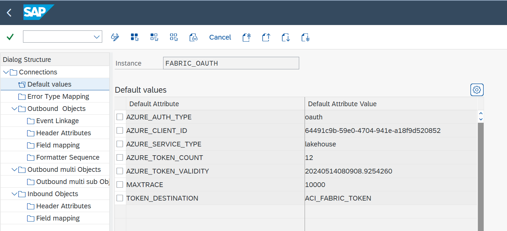

Cloud instance configuration in /ASADEV/ACI\_SETTINGS

| Key | Value |
| --- | --- |
| `AZURE_CLIENT_ID` | Microsoft Entra ID application (client) ID |
| `TOKEN_DESTINATION` | OAuth RFC destination name |
| `AZURE_AUTH_TYPE` | `oauth` |

## Open Mirroring (Parquet Format)

Introduced in release **9.32504**, the Fabric Open Mirroring feature allows SAP data to be continuously replicated into a Fabric Mirror in Parquet format, enabling native Microsoft Fabric analytics without ETL pipelines. Prerequisites: create a Mirrored Database in Microsoft Fabric first.

Configure the outbound object with the Parquet formatter and set the following header attributes:

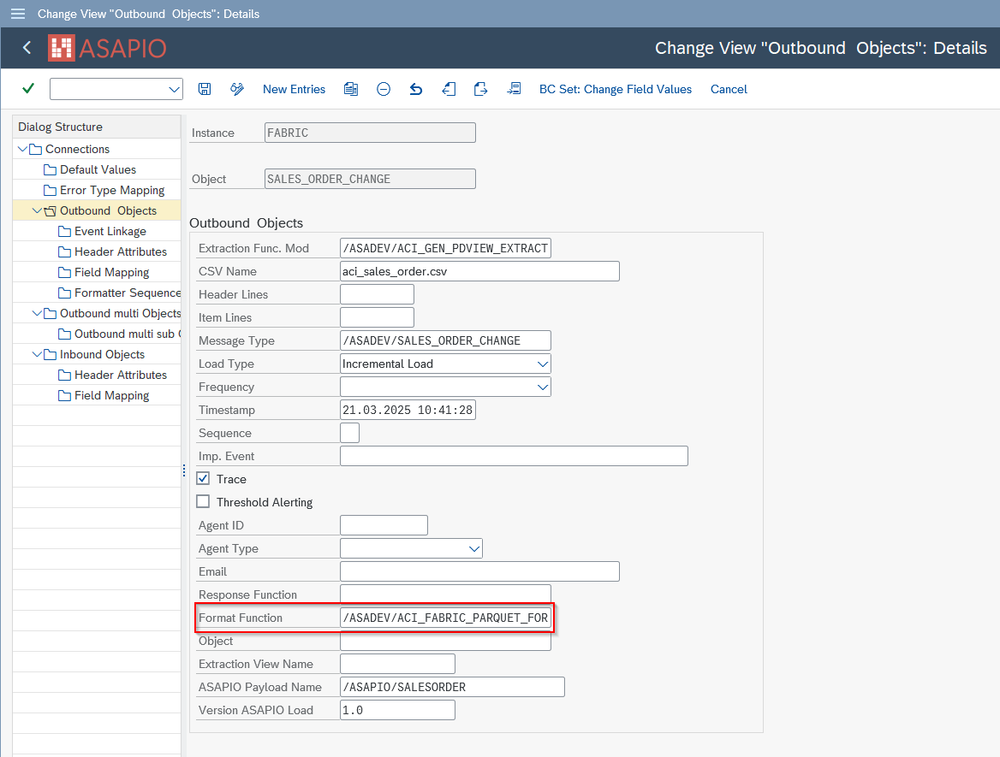

Fabric Open Mirroring – /ASADEV/ACI\_FABRIC\_PARQUET\_FORM formatter configuration

- **Formatter:** `/ASADEV/ACI_FABRIC_PARQUET_FORM`

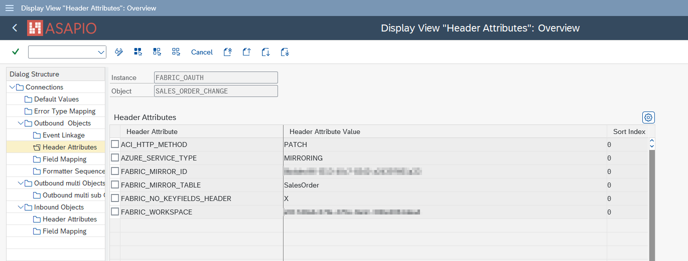

Open Mirroring header attributes – FABRIC\_MIRROR\_ID, FABRIC\_MIRROR\_TABLE, FABRIC\_WORKSPACE

| Header Attribute | Value |
| --- | --- |
| `ACI_HTTP_METHOD` | `PATCH` |
| `AZURE_SERVICE_TYPE` | `MIRRORING` |
| `FABRIC_MIRROR_ID` | Fabric Mirror GUID from the Fabric portal |
| `FABRIC_MIRROR_TABLE` | Target table name within the Mirror |
| `FABRIC_WORKSPACE` | Fabric workspace GUID |

## Lakehouse (File Upload)

For Lakehouse scenarios (uploading files to OneLake), configure:

| Header Attribute | Value |
| --- | --- |
| `ACI_HTTP_METHOD` | `PATCH` |
| `FABRIC_FILE_PATH` | Target file path within the Lakehouse |
| `FABRIC_LAKEHOUSE` | Lakehouse GUID from the Fabric portal |
| `FABRIC_WORKSPACE` | Fabric workspace GUID |

## Predefined Content Data Catalog

ASAPIO ships with a Predefined Content Data Catalog for Microsoft Fabric containing ready-to-use payload designs for the 30+ most common SAP data objects, including both SAP S/4HANA CDS view versions and SAP ERP table-based versions:

- GL Accounting Documents
- Sales Orders (header and items)
- Purchase Orders (header and items)
- Delivery Documents
- Material Movements / Goods Receipts
- Change Pointers (for delta loading)
- …and 25+ more objects

Each catalog item includes a payload design and a ready-to-deploy Event Studio interface definition.

## Custom Data Products

For objects not in the catalog, create custom payload designs in Payload Designer (`/n/ASADEV/DESIGN`) and configure the outbound object with the extractor function module `/ASADEV/ACI_GEN_PDVIEW_EXTRACT`.

## Initial / Packed Load

For bulk loading of historical data into Microsoft Fabric, use the Packed Load feature with the extractor and Parquet formatter:

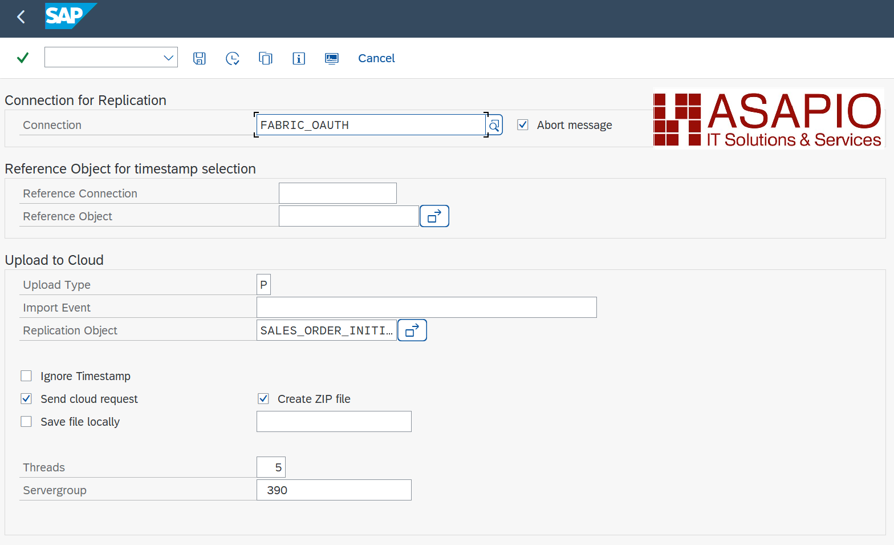

Packed Load outbound object configuration

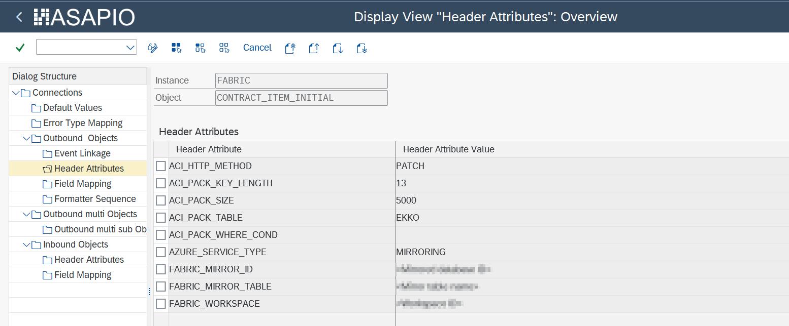

Packed Load header attributes for Open Mirroring

- Extractor: `/ASADEV/ACI_GEN_PDVIEW_EXTRACT` with Load Type: Packed Load
- Formatter: `/ASADEV/ACI_PARQUET_FORMATTER`

This sends data in Parquet-formatted batches instead of individual JSON events, significantly reducing processing overhead for large initial loads.

## Lakehouse Notebook

ASAPIO provides a downloadable PySpark notebook for Microsoft Fabric that automates the import of CSV files into a Lakehouse database (Delta tables). Import the notebook into your Microsoft Fabric workspace and configure the file path, Delta table path, and file name pattern. The notebook can be scheduled as a pipeline job.

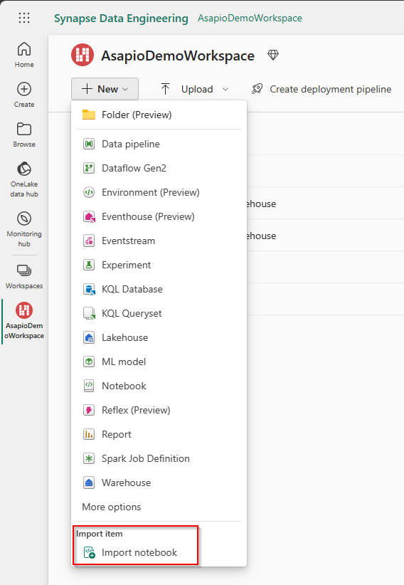

Fabric Notebook – import and attach to Lakehouse

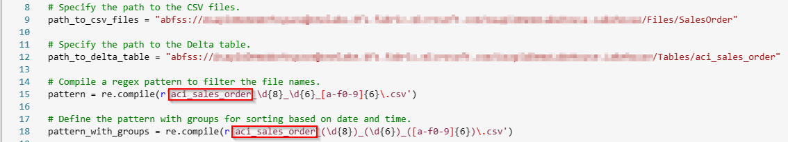

Notebook configuration – path\_to\_csv\_files and path\_to\_delta\_table variables

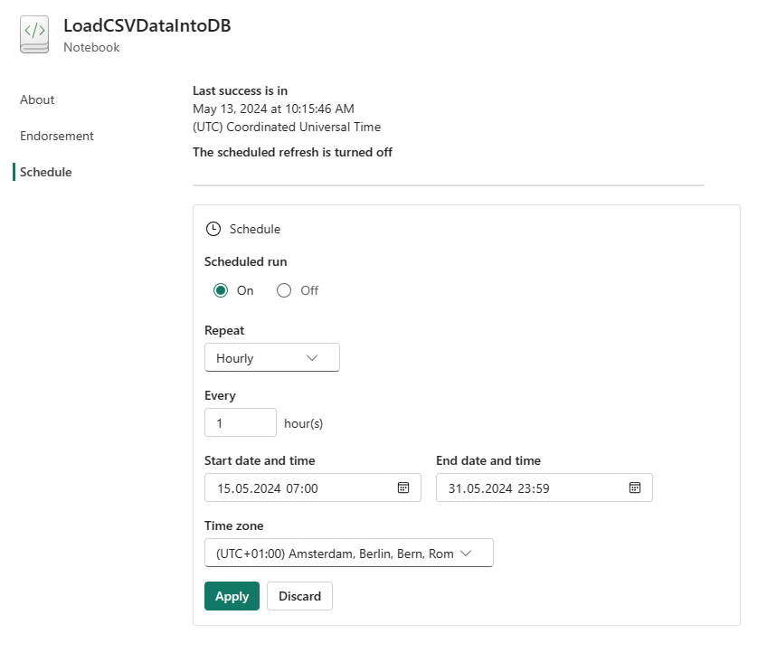

Notebook scheduled as a pipeline job
