Connectors

# Google® Pub/Sub® Connector

## Prerequisites

- Google Cloud account with the Google Pub/Sub API enabled
- A Google Cloud project with at least one Pub/Sub topic
- A Google Cloud service account with the **IAP-secured Web App User** role (or Pub/Sub Publisher role) in IAM

## RFC Destinations

Create two HTTP RFC destinations (transaction SM59, type G):

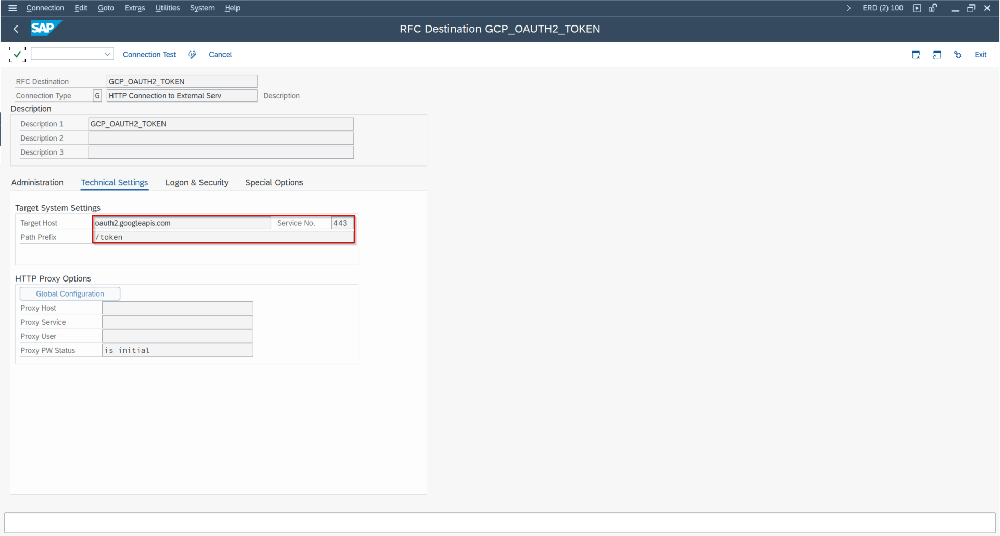

RFC destination for OAuth2 endpoint – target host: oauth2.googleapis.com

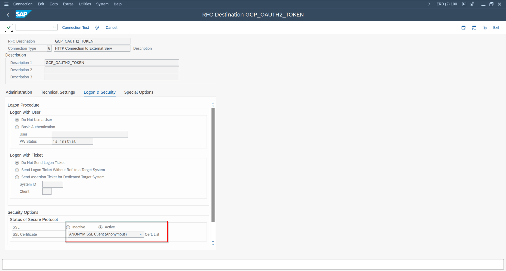

Special Options tab – HTTP 1.0 and Accept Cookie settings for OAuth RFC destination

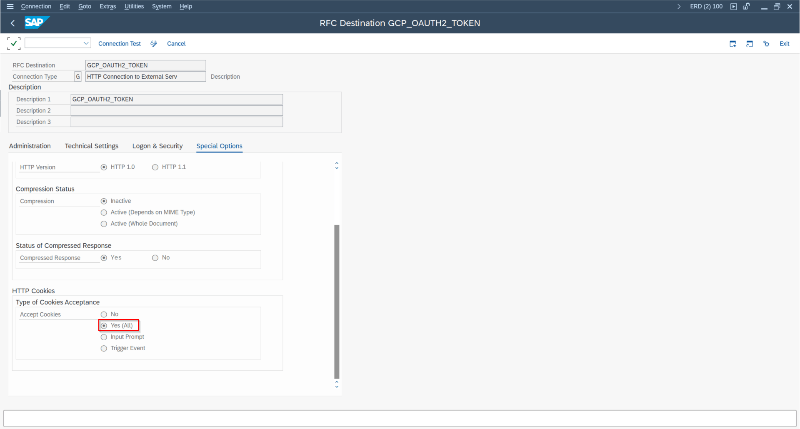

RFC destination for Pub/Sub endpoint – target host: pubsub.googleapis.com

1. **OAuth endpoint:** `oauth2.googleapis.com` – used for JWT-based OAuth token retrieval
2. **Google Pub/Sub endpoint:** `pubsub.googleapis.com` – the main messaging endpoint

## Certificate Import

Import the required GlobalSign root and intermediate certificates into transaction STRUST (SSL Client Standard):

STRUST – import P12 certificate for service account (newer ABAP releases)

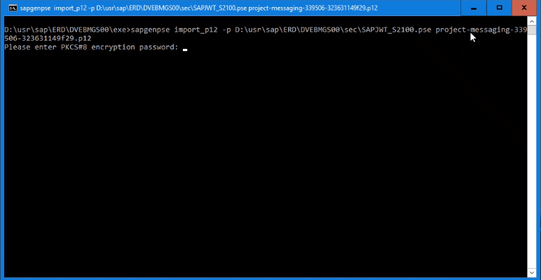

sapgenpse import\_p12 command for converting P12 to PSE on older ABAP releases

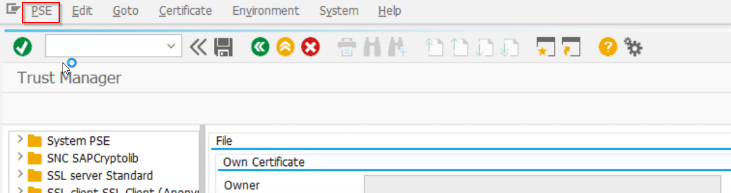

STRUST – import PSE file and save to SSF Application

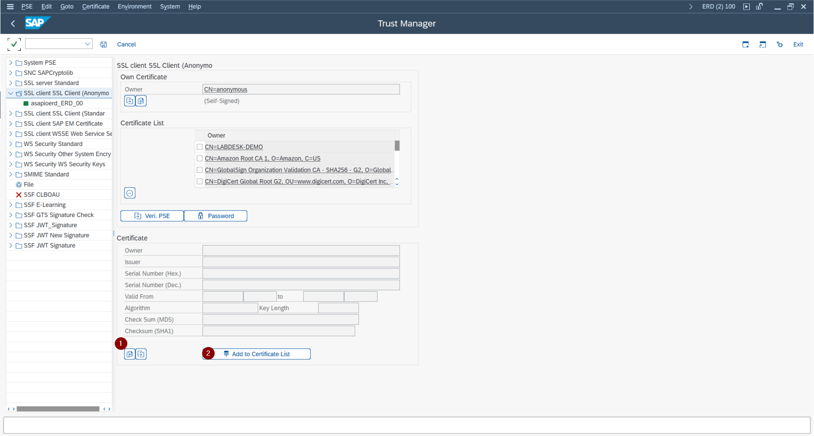

STRUST – Add to Certificate List and Save

- GlobalSign Root CA
- GlobalSign RSA OV SSL CA 2018

## Service Account Setup

1. In Google Cloud IAM, create or select a service account and download its P12 certificate.
2. In ABAP, create an SSF application in the `SSFAPPLIC` table (transaction **SSFA**) for the Google certificate.
3. Import the P12 certificate file into STRUST using PSE Import. On older ABAP releases, use `sapgenpse import_p12` to create the PSE first.

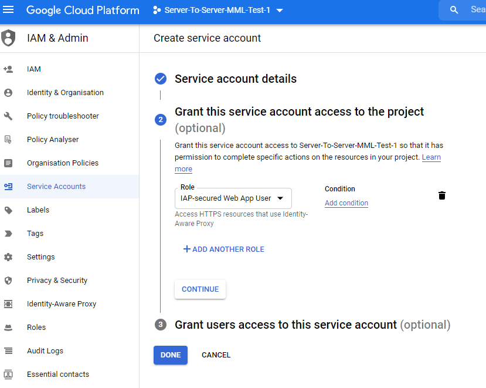

Google Cloud IAM – creating service account with IAP-secured Web App User role

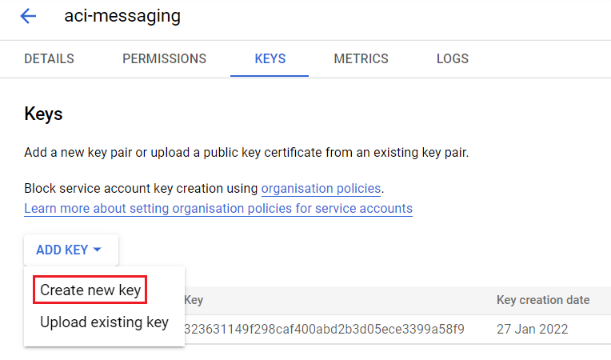

Google Cloud – Actions > Manage Keys – download P12 key for service account

## Cloud Instance

In `/ASADEV/ACI_SETTINGS`, create a cloud instance with:

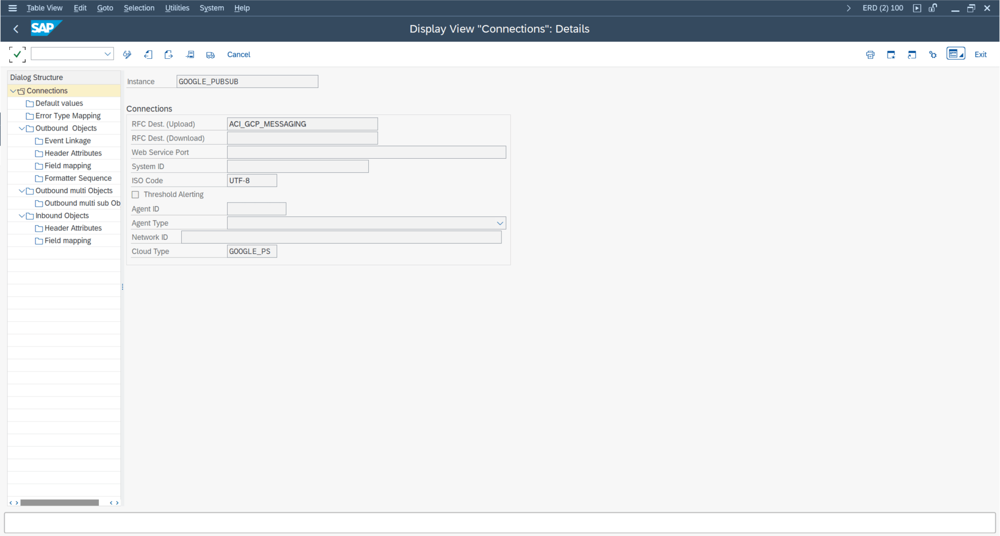

Cloud instance configuration in /ASADEV/ACI\_SETTINGS – Cloud Type GOOGLE\_PS

| Field | Value |
| --- | --- |
| Cloud Adapter | `/ASADEV/CL_ACI_GPUBSUB_HANDLER` |
| Cloud Type | `GOOGLE_PS` |
| RFC Destination | Pub/Sub RFC destination |

Set the following default values for the instance:

| Default Value Key | Value |
| --- | --- |
| `GCP_EMAIL_SERVICEACCT_JWT_ISS` | Service account email address |
| `GCP_TOKEN_DESTINATION` | OAuth RFC destination name |
| `GCP_SSF_PROFILE` | Name of the SSF application created in SSFA |

## Outbound Configuration

Two function module combinations are available for outbound messaging:

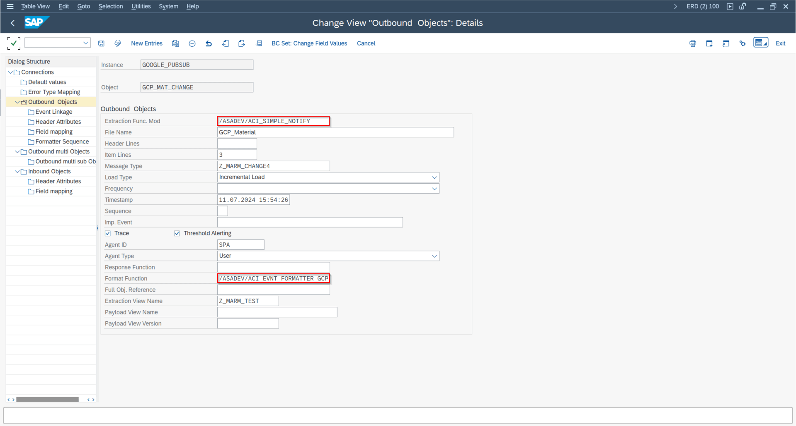

Simple Notification outbound object configuration with GCP formatter

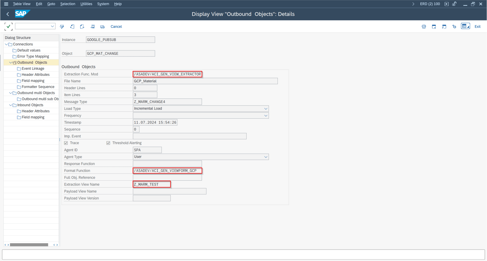

Header attribute GOOGLE\_TOPIC – projects/<project>/topics/<topic>

| Purpose | Extractor FM | Formatter FM |
| --- | --- | --- |
| Simple notifications | `/ASADEV/ACI_SIMPLE_NOTIFY` | `/ASADEV/ACI_EVNT_FORMATTER_GCP` |
| Payload Designer / DB view | `/ASADEV/ACI_GEN_VIEW_EXTRACTOR` | `/ASADEV/ACI_GEN_VIEWFORM_GCP` |

Set the header attribute `GOOGLE_TOPIC` to the full Pub/Sub topic resource name, e.g. `projects/my-project/topics/my-topic`.

## Custom Message Attributes

As of release **9.32507**, you can add custom metadata attributes to Pub/Sub messages. This is configured in the **Field Mapping** of the outbound object:

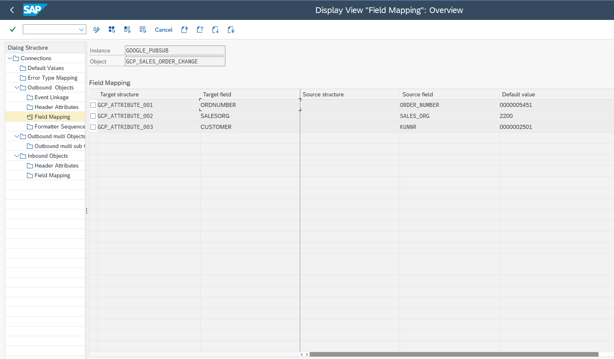

gcp attr config

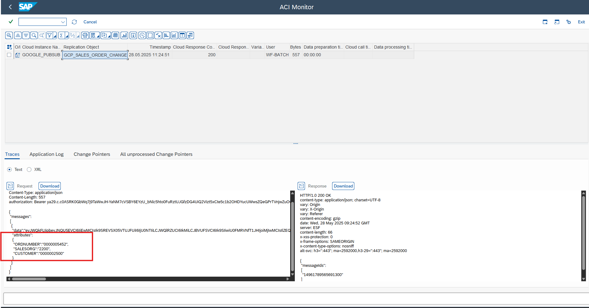

gcp attr monitor

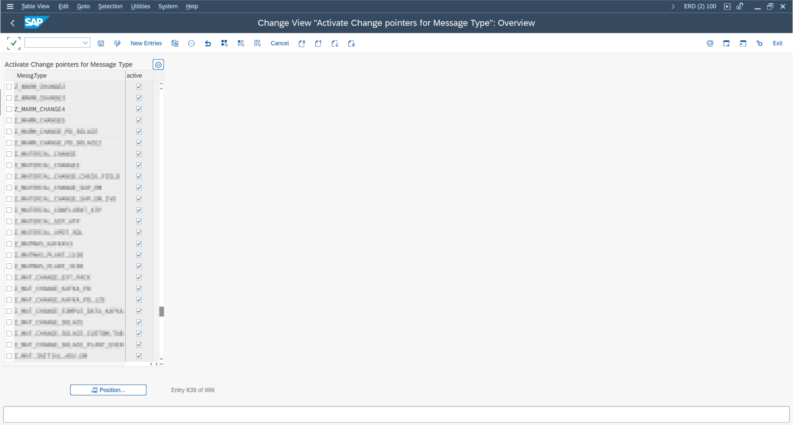

23 min 4

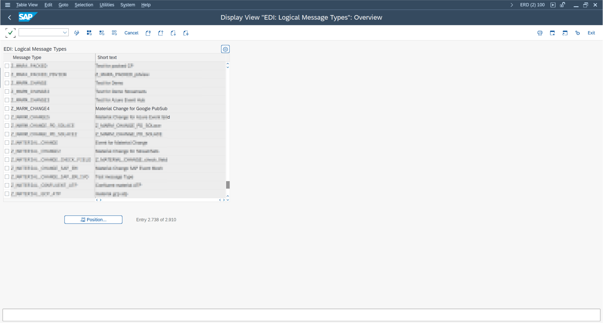

22 min 4

- **Source Field:** SAP field from the extract view (or a constant value)
- **Default Value:** Static attribute value
- **Target Field:** Attribute key name in the Pub/Sub message

The resulting message will include an `attributes` object alongside the `data` field in the Pub/Sub message envelope.
