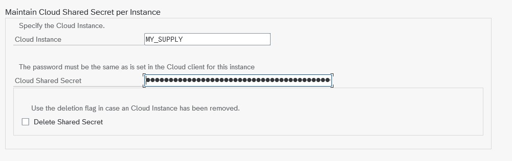

Connectors

# mysupply Connector

## Overview

The ASAPIO mysupply connector integrates SAP purchase requisition (PR) items with the [mysupply](https://www.mysupply.ai/) AI-powered procurement platform. The integration enables:

- **Outbound:** React to PR item changes in SAP and send the PR item data to the mysupply Demand API when the relevant blocked indicator is set.
- **Inbound:** Poll the mysupply Demand API for closed deals and update the corresponding PR items in SAP via IDoc processing.

## Basic Configuration

### SSL Certificate

Import the mysupply server certificate into transaction STRUST (SSL Client Standard) to enable HTTPS connections.

### RFC Destination

Create an HTTP RFC destination (transaction SM59, type G) pointing to `test-api.mysupply.io:443` (or the production endpoint). Store the mysupply API key in `/ASADEV/SCI_TPW`.

### Cloud Instance

Create the connection instance in `/ASADEV/ACI_SETTINGS` with Cloud Type `MYSUPPLY`.

Set cloud connection password

## Outbound Configuration

Configure the outbound object with these function modules:

| Role | Function Module |
| --- | --- |
| Extractor | `/ASADEV/ACI_GEN_PDVIEW_EXTRACT` |
| Response Handler | `/ASADEV/RESP_MYSUPPLY_PR` |
| Formatter | `/ASADEV/DEMA_CUSTOM_FORMATTER` |
| Payload Design | `/ASAPIO/MYSUPPLY_DEMAND` version `V1 DEMAND` |

Set up the event linkage for Business Object `BUS2105` (Purchase Requisition), event `CHANGED`.

The default filter in the Payload Designer restricts sending to PR items where `eban~blcked = 1`. Adjust this as needed for your process.

### Standard Outbound Fields

The default payload definition `/ASAPIO/MYSUPPLY_DEMAND` includes the following fields. Use transaction `/ASADEV/DESIGN` to view or extend the field mapping.

| SAP table/field | Description |
| --- | --- |
| `EBAN-BANFN` | Purchase requisition number |
| `EBAN-BNFPO` | Item number |
| `EBAN-MATNR` | Material number |
| `EBAN-MENGE` | Quantity |
| `EBAN-TXZ01` | Short text |
| `EBAN-PREIS` | Valuation price (per price unit) |
| `EBAN-PEINH` | Price unit |
| `EBAN-MEINS` | Unit of measure |
| `EBAN-WAERS` | Currency |
| `EBAN-LIFNR` | Desired vendor – creditor number |
| (calculated) | Desired vendor name (from LFA1-NAME1) |
| (calculated) | Desired vendor primary email (from vendor communication settings) |
| `EBAN-WERKS` | Plant code |
| (calculated) | SAP source system |
| (calculated) | Transfer date and time |

## Inbound Configuration

The inbound direction polls mysupply for closed deals and updates PR items via IDoc. Configure:

- **WE81:** Create a message type for the mysupply inbound IDoc
- **WE82:** Link the message type to basic type `/ASADEV/ACI_GENERIC_IDOC`
- **WE57:** Assign the inbound function module `/ASADEV/INB_DEAL_MYSUPPLY` to the message type and IDoc type `/ASADEV/ACI_GENERIC_IDOC`
- **BD51:** Register the function module for inbound processing
- **WE42:** Define the process code for inbound handling
- **WE20:** Set up the partner profile for logical system `LOCAL` (default). To use a different logical system, add the default attribute `ACI_EDI_PARTNER_PROFILE` on the connection instance in SPRO.

### Inbound Fields Updated in SAP

| SAP Field | Source in mysupply |
| --- | --- |
| `EBAN-PREIS` | Awarded price from mysupply deal |
| `EBAN-FLIEF` | Fixed supplier from mysupply deal |
| `EBAN-MENGE` | Awarded quantity |

### Optional Inbound Fields

Additional fields can be mapped via BAdI method `CHANGE_PR_DATA_BEFORE_POST`:

| SAP Field | Description |
| --- | --- |
| `EBAN-LIFNR` | Desired vendor (instead of fixed vendor) as returned from mysupply |
| `EBAN-WAERS` | Currency as returned from mysupply |
| `EBAN-BPUEB` | Can be set to a specific value |

## Unit of Measure Mapping

The connector maps between mysupply and SAP units of measure. Any value not listed below is mapped to *other*.

| SAP UoM | mysupply UoM |
| --- | --- |
| CM | centimeter |
| CCM | cubic-centimeter |
| M3 | cubic-meter |
| G | gram |
| M | meter |
| MM | millimeter |
| M2 | square-meter |
| KG | kilogram |
| KWH | kilowatt-hour |
| L | liter |
| PC | piece |
| CM2 | square-centimeter |
| TON | ton |
| MIN | minute |
| HOUR | hour |
| DAY | day |
| MONTH | month |
| (any other) | other |

## BAdI Extensions

Enhancement spot `/ASADEV/MYSUPPLY_INBOUND` provides the following BAdI methods:

| Method | Description |
| --- | --- |
| `MAP_DEAL_FROM_IDOC_SINGLE` | Customer mapping – single field |
| `MAP_DEAL_FROM_IDOC` | Customer mapping – full deal |
| `CHANGE_PR_DATA_BEFORE_POST` | Modify PR data before posting to SAP |
| `CUSTOM_POST` | Custom processing after PR has been changed |
| `CHANGE_RUNTIME_PARAMETER` | Change runtime parameters of the inbound process |

## Known Restrictions

- Multiple changes to a PR item result in multiple demands being created in mysupply. This can be changed so that a PR item is sent only once (configurable on request).
- `EBAN-PEINH` (price unit) must remain the same as in the PR, as this is not handled by the mysupply API.
- ASAPIO Payload Designer is supported for mysupply to add custom fields to the outbound payload.
- Purchase requisitions must not have a fixed vendor assigned before being sent to mysupply, as the SAP standard does not allow updating a fixed vendor via this process.
