Connectors

# SAP Advanced Event Mesh

## Overview

SAP Integration Suite, Advanced Event Mesh (AEM) is a fully managed event streaming and management service available on SAP BTP. It is built on the Solace PubSub+ platform and provides enterprise-grade event broker capabilities for both SAP and non-SAP scenarios.

The ASAPIO AEM connector consists of two add-on components:

- **ASANWEE** – the ASAPIO base integration framework
- **ASAAEMEE** – the AEM-specific connector add-on

You must have an active AEM broker instance in your SAP BTP account, with activation completed in the AEM Cluster Manager.

## Configuration

Configure the AEM connector in five steps:

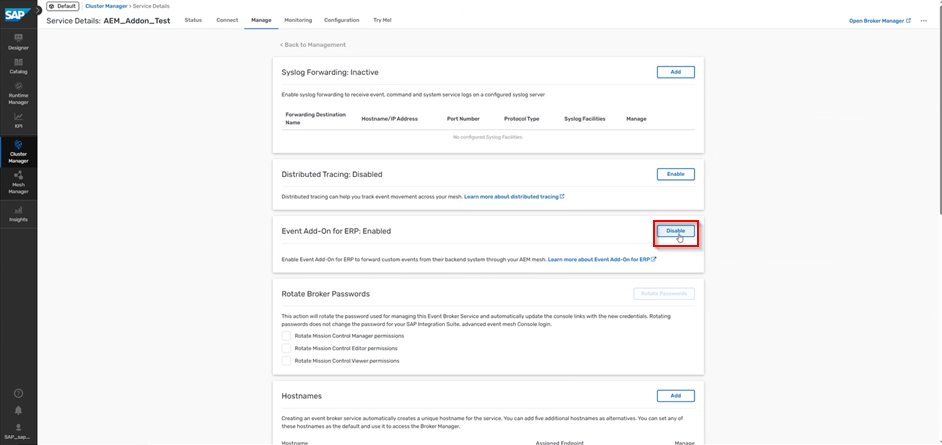

aem activation

### 1. Validation Service RFC Destination

Create an HTTP RFC destination (transaction SM59, type G) pointing to the AEM validation service endpoint. This is used for OAuth token retrieval.

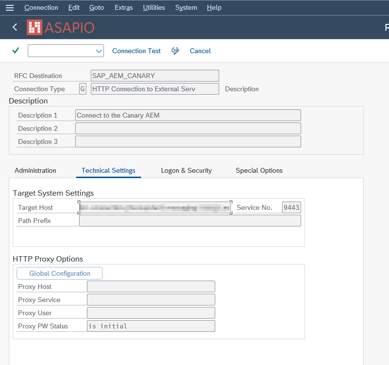

aem broker rfc

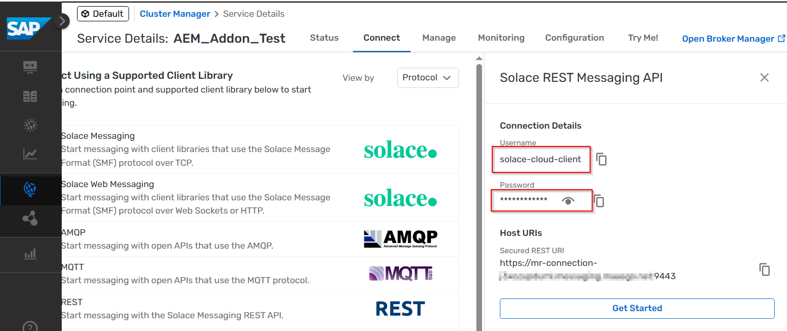

aem broker auth

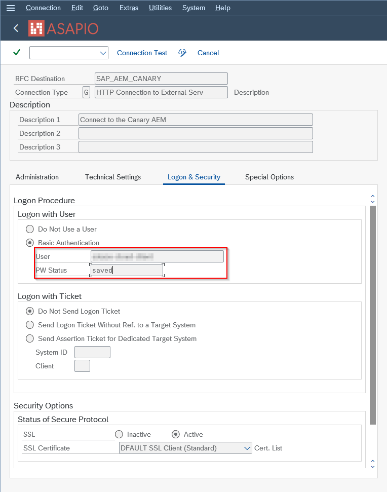

aem broker rfc sec

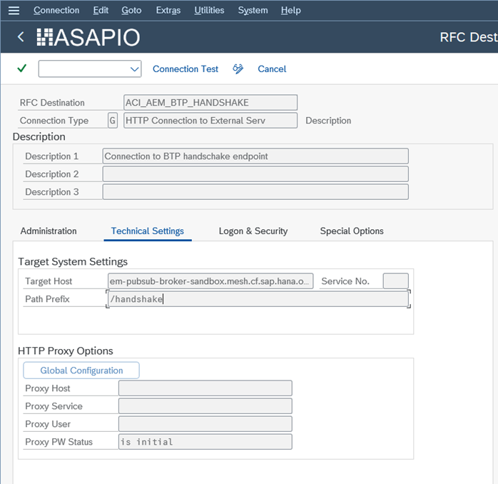

aem validation rfc

### 2. Token RFC Destination

Create a second RFC destination for the OAuth token endpoint if you are using OAuth 2.0 client credentials authentication.

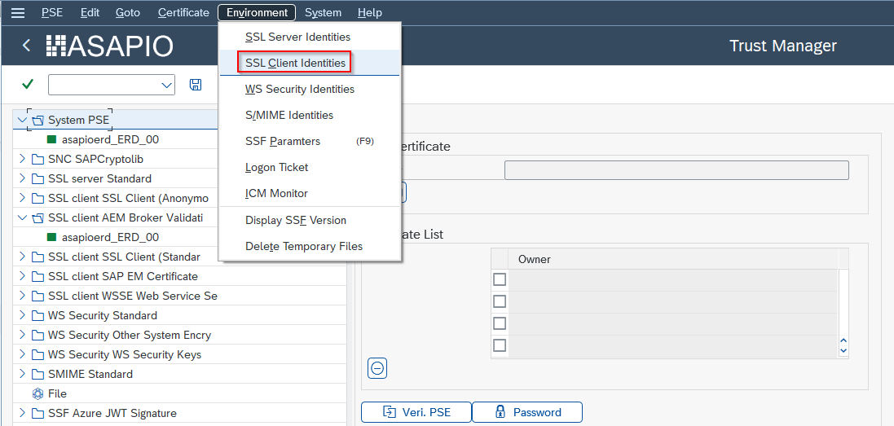

aem cert identity

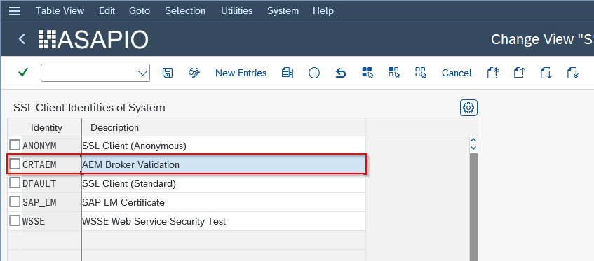

aem cert identity new

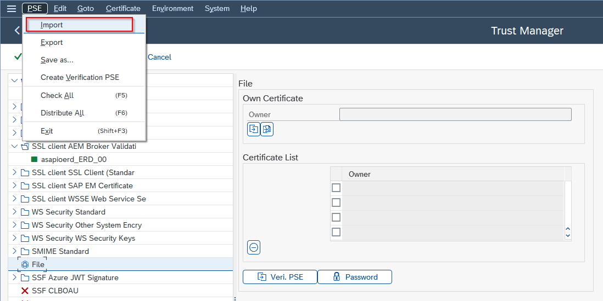

aem cert import p12

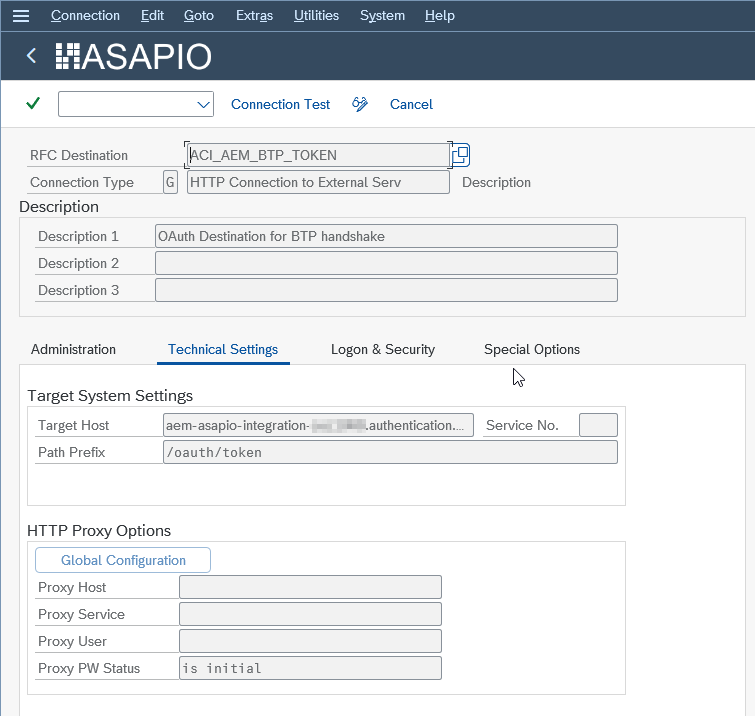

aem validation token rfc

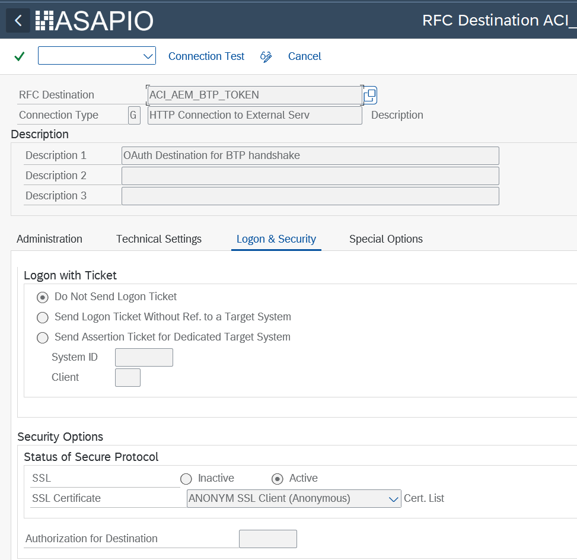

aem validation token rfc sec

### 3. Validation Service Cloud Instance

In `/ASADEV/ACI_SETTINGS`, create a cloud instance for the validation service. Configure the following default values:

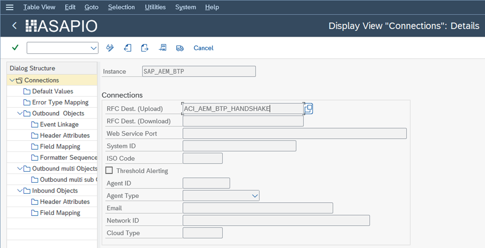

Validation service cloud instance – default values

| Default Value Key | Value | Description |
| --- | --- | --- |
| `ACI_CLIENT_ID` | Your OAuth Client ID | Client ID from the SAP BTP service key |
| `ACI_TOKEN_DESTINATION` | Token RFC destination name | RFC destination for the OAuth token endpoint |
| `AUTH_TYPE` | `CERTIFICATE` or `OAUTH` | Certificate-based or OAuth 2.0 with client secret |

For **certificate-based authentication**: import the P12 certificate into STRUST (SSL Client Identity). On older ABAP releases, use `sapgenpse import_p12` to import the certificate before using STRUST.

### 4. AEM RFC Destination

Create an RFC destination pointing to your AEM broker's REST messaging endpoint (available in the AEM Cluster Manager, Connect tab).

### 5. AEM Cloud Instance

Create the main AEM cloud instance with Cloud Type `SAP_AEM`. Use basic authentication (username and password from the AEM Cluster Manager) in the Logon & Security tab of the RFC destination.

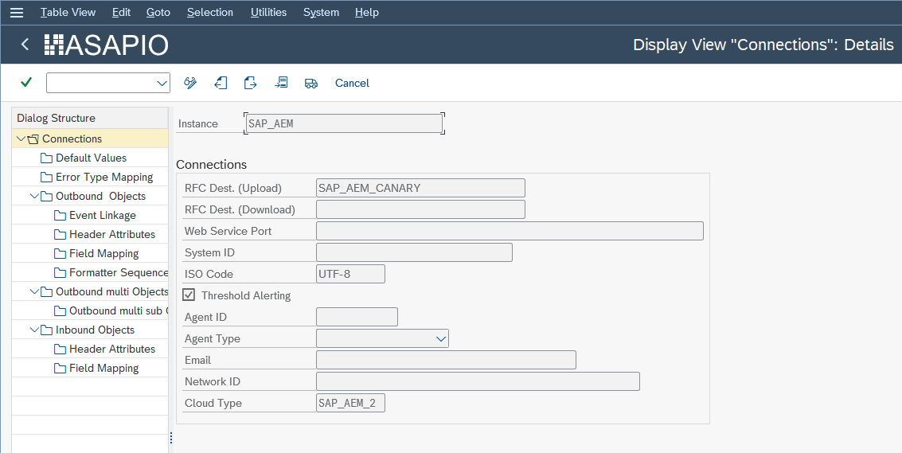

aem broker instance

Set the `AUTH_INSTANCE` default value to point to the validation service instance created in step 3.

Outbound interface configuration follows the standard outbound messaging setup. See [Outbound Messaging](../../outbound/index.md) for details; use the AEM-specific function modules and header attributes listed below.

## Dynamic Topics

AEM supports dynamic topic routing, allowing the topic name to be built from event payload fields. Configure this in the Field Mapping of the outbound object by mapping source fields to URL path segments of the topic string. This works the same way as the Solace PubSub+ dynamic topic feature.

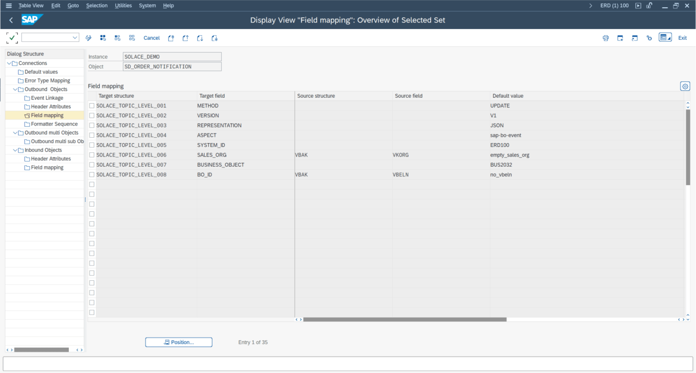

aem dynamic topics

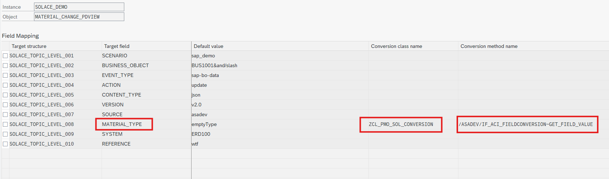

solace dyn topic conversion

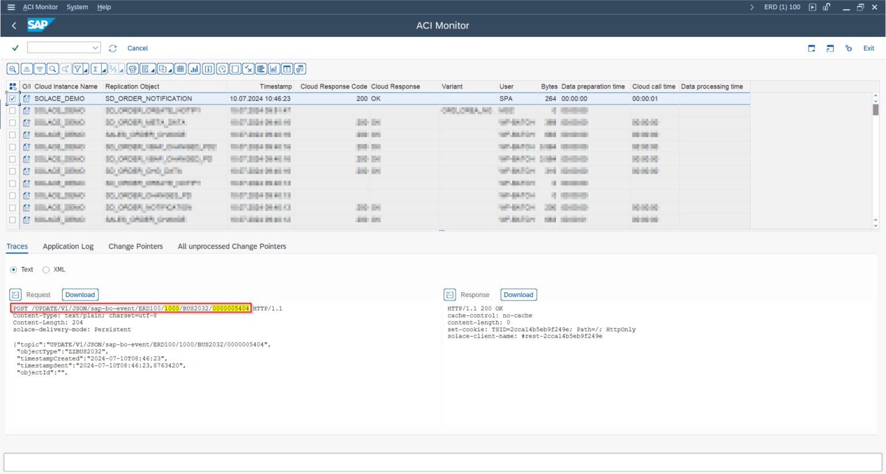

aem dynamic topics monitor

## Function Modules

| Function Module | Type | Payload Design | Purpose |
| --- | --- | --- | --- |
| `/ASADEV/ACI_GEN_PDVIEW_EXTRACT` | Extraction | Yes | Recommended extractor for Payload Design–based interfaces |
| `/ASADEV/ACI_GEN_VIEW_FORM_CB` | Format | Yes | Recommended standard formatter |
| `/ASADEV/ACI_GEN_FORM_CE_CB_AEM` | Format | Yes | Standard formatter plus CloudEvents header wrapping |
| `/ASADEV/ACI_IDOC_FORMATTER_AEM` | Format | No | Formatter for IDoc conversions |
| `/ASADEV/ACI_GEN_VIEWEXT_AEM` | Extraction | No | Extractor for DB view–based interfaces |
| `/ASADEV/ACI_GEN_NOTIFY_AEM` | Extraction / Format | No | Extractor for notification events |
| `/ASADEV/ACI_GEN_META_AEM` | Extraction | No | Example extractor (metadata) |
| `/ASADEV/ACI_GEN_DATA_AEM` | Extraction | No | Example extractor (data) |
| `/ASADEV/ACI_GEN_CHANGES_AEM` | Extraction | No | Example extractor (changes) |
| `/ASADEV/ACI_GEN_VIEWFRM_AEM` | Format | Yes | Deprecated formatter – use `/ASADEV/ACI_GEN_VIEW_FORM_CB` instead |
| `/ASADEV/ACI_GEN_RH_AEM` | Response Handler | – | Mandatory response handler for AEM |

## Header Attributes

| Header Attribute | Value / Description |
| --- | --- |
| `SOLACE_CALL_METHOD` | `POST` |
| `SOLACE_CONT_TYPE` | Content type (e.g. `application/json`) |
| `SOLACE_DELIV_MODE` | `Persistent` (recommended) |
| `SOLACE_DMQ_ELIGIBLE` | `true` – enables the dead message queue |
| `SOLACE_TIME_TO_LIVE` | Message TTL in milliseconds |
| `SOLACE_TOPIC` | Topic name or template |
