Connectors

# Solace® PubSub+ Connector

## Overview

ASAPIO connects to Solace PubSub+ message brokers (on-premise or cloud) using either **REST-based** or **AMQP-based** connectivity. REST connectivity is the standard approach and supports all Solace PubSub+ deployment types. AMQP support was introduced in release **2510**.

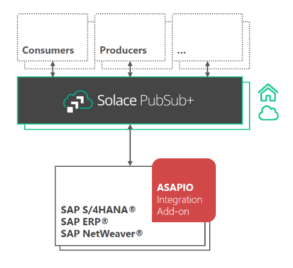

Solace PubSub+ block architecture

## REST-Based Connectivity

### RFC Destination

Create an HTTP RFC destination (SM59, type G) pointing to the Solace REST messaging endpoint (host and port, e.g. `my-broker.example.com:9000`). For HA setups with two Solace brokers, create one destination per broker. Optionally create a second RFC destination for the OAuth token endpoint if using OAuth authentication. Add the relevant certificates to the trust store in STRUST.

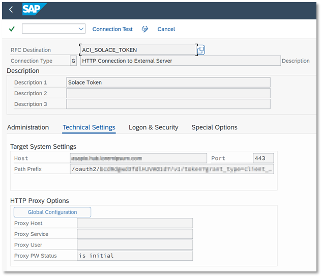

RFC destination for Solace OAuth token endpoint

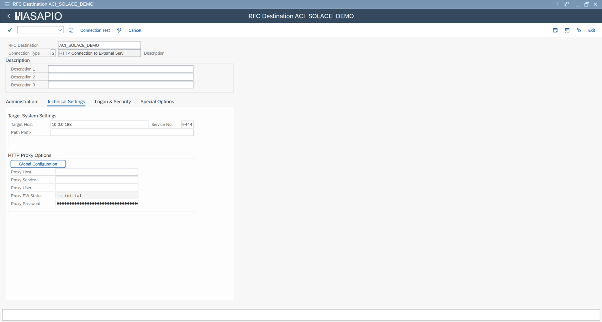

RFC destination for Solace REST messaging endpoint (SM59, type G)

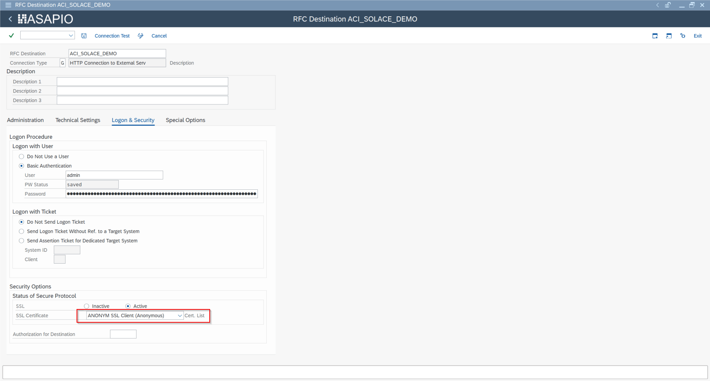

Logon & Security tab – credentials and SSL certificate list

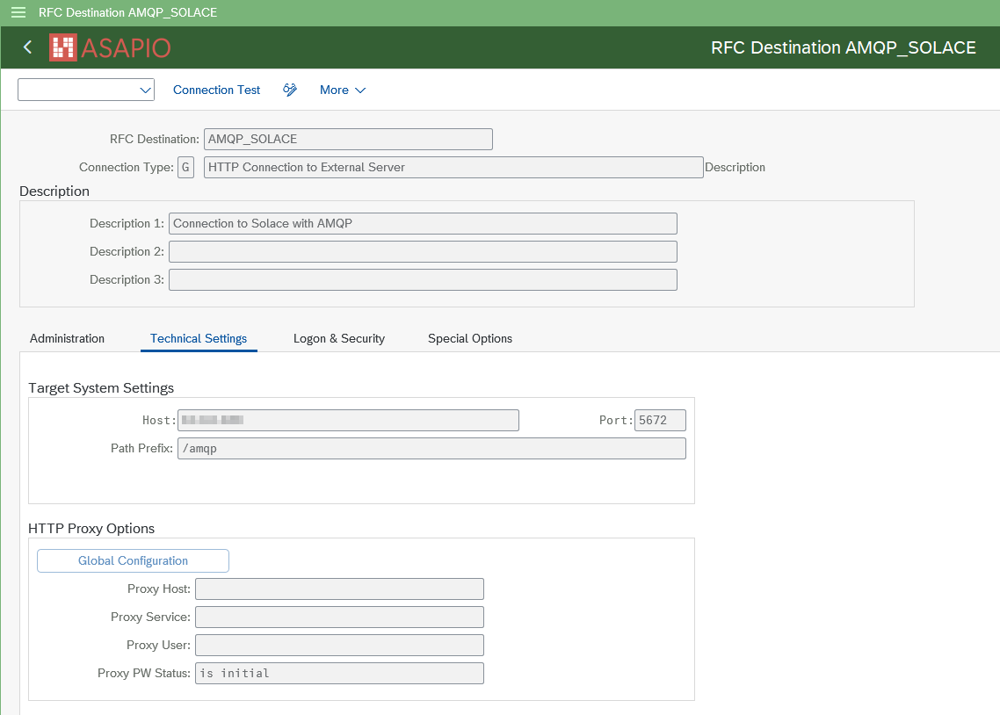

AMQP-based RFC destination configuration

### BC-Set & Cloud Adapter

Activate BC-Set `/ASADEV/ACI_BCSET_FRAMEWORK_SOLC` via SCPR20. If not using the BC-Set, manually add the cloud adapter and codepage entries.

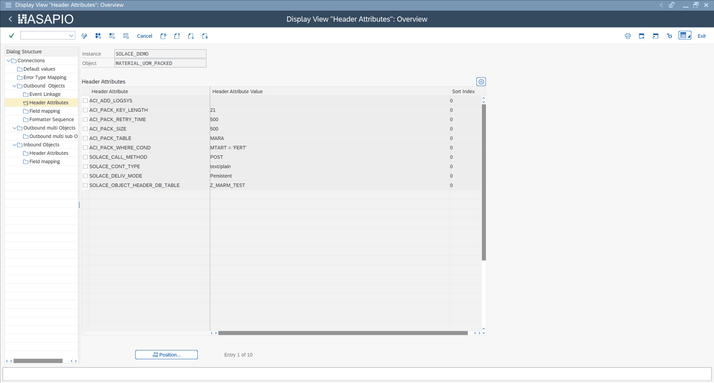

BC-Set activation – /ASADEV/ACI\_BCSET\_FRAMEWORK\_SOLC in SCPR20

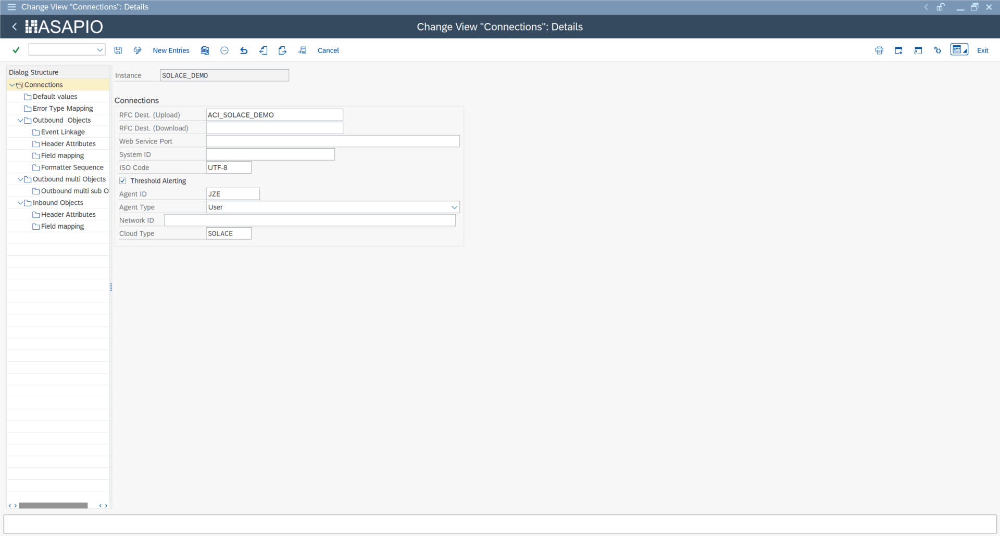

Cloud adapter configuration – /ASADEV/CL\_ACI\_SOLACE\_HANDLER

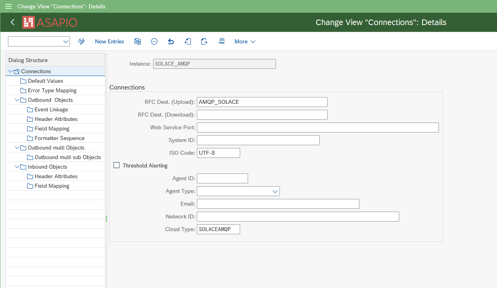

AMQP connection instance configuration

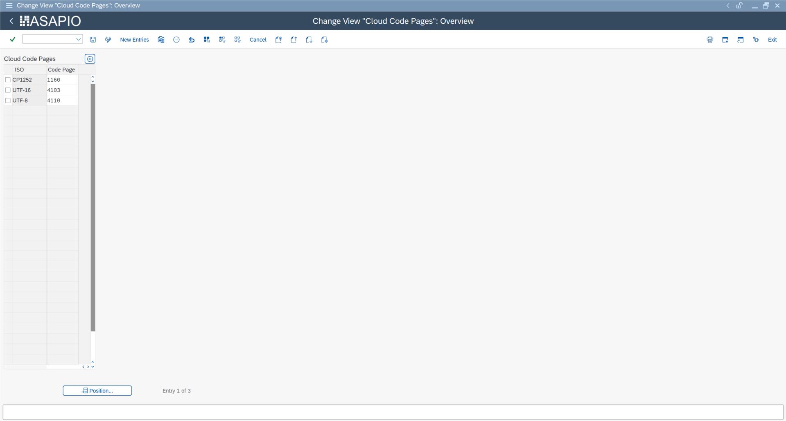

Cloud instance configuration in /ASADEV/ACI\_SETTINGS

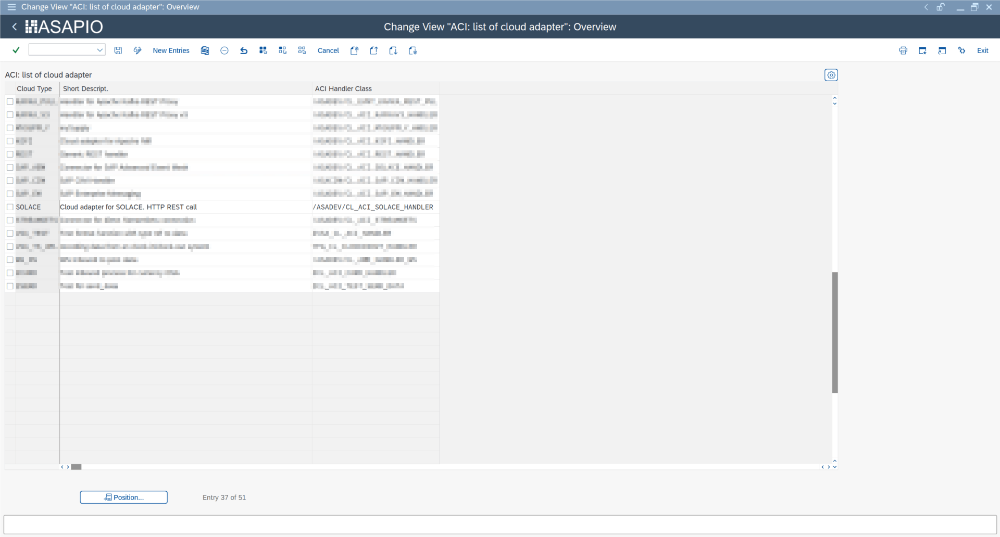

Codepage configuration in SPRO

### Cloud Instance

Create the connection instance in `/ASADEV/ACI_SETTINGS`:

| Field | Value |
| --- | --- |
| Cloud Adapter | `/ASADEV/CL_ACI_SOLACE_HANDLER` |
| Cloud Type | `SOLACE` |
| RFC Destination | Solace REST RFC destination |

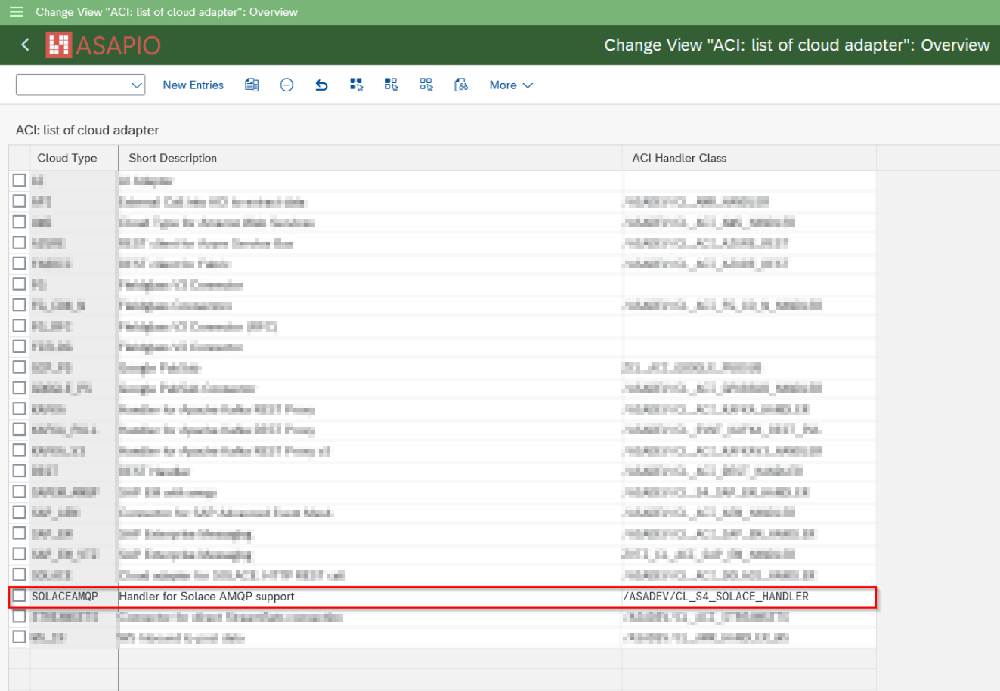

AMQP cloud adapter – /ASADEV/CL\_S4\_SOLACE\_HANDLER

For OAuth authentication, set default values:

| Key | Value |
| --- | --- |
| `AUTH_TYPE` | `OAUTH` |
| `CLIENT_ID` | OAuth Client ID |
| `TOKEN_DESTINATION` | OAuth RFC destination name |

### High Availability Setup

For Solace HA (redundant brokers), configure a second RFC destination in the **RFC Destination (Download)** field of the connection instance. ASAPIO will automatically fail over to the secondary broker if the primary is unavailable.

## AMQP-Based Connectivity (2510+)

AMQP connectivity was introduced in ASAPIO release 2510. It uses a persistent connection and session to the broker via an ABAP daemon, and requires a separate cloud handler. Currently only Basic Authentication is supported.

| Field | Value |
| --- | --- |
| Cloud Adapter | `/ASADEV/CL_S4_SOLACE_HANDLER` |
| Cloud Type | `SOLACEAMQP` |

For Basic Authentication, set the `SOLACE_USERNAME` default value in the connection instance, and store the password in the SAP Secure Store (`/ASADEV/SCI_TPW`). Outbound configuration in AMQP mode is the same as for REST connectivity.

Inbound messaging via AMQP is available from release January 2026. Configure an inbound object in `/ASADEV/ACI_SETTINGS` and set the header attribute `AMQP_SOURCE` to the Solace queue name to subscribe to:

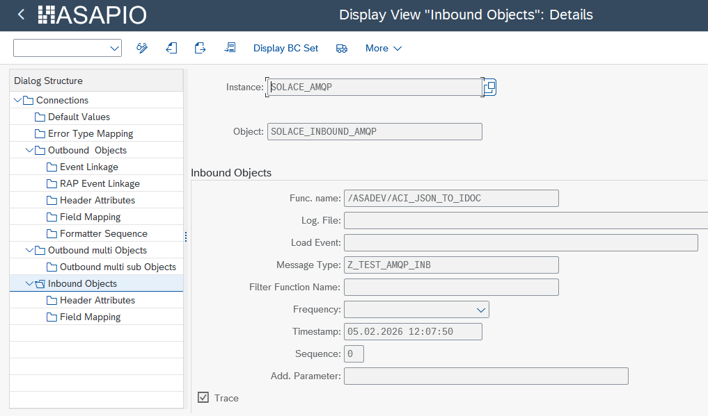

AMQP inbound object configuration

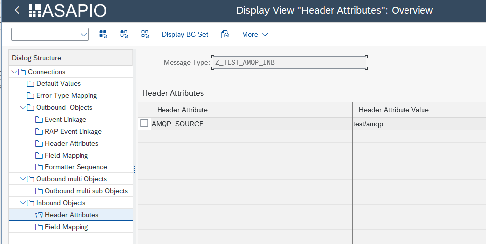

AMQP inbound header attributes – AMQP\_SOURCE queue name

## Outbound Configuration

For outbound messaging, you can use and combine the following methods:

- **Simple Notifications** – extractor `/ASADEV/ACI_GEN_NOTIFY_SOLACE`
- **Message Builder** – extractor `/ASADEV/ACI_GEN_VIEWEXT_SOLACE` + formatter `/ASADEV/ACI_GEN_VIEWFRM_SOLACE`
- **Packed Load** – extractor `/ASADEV/ACI_GEN_VIEW_EXT_PACK` with Load Type set to Packed Load

Simple notification outbound object configuration

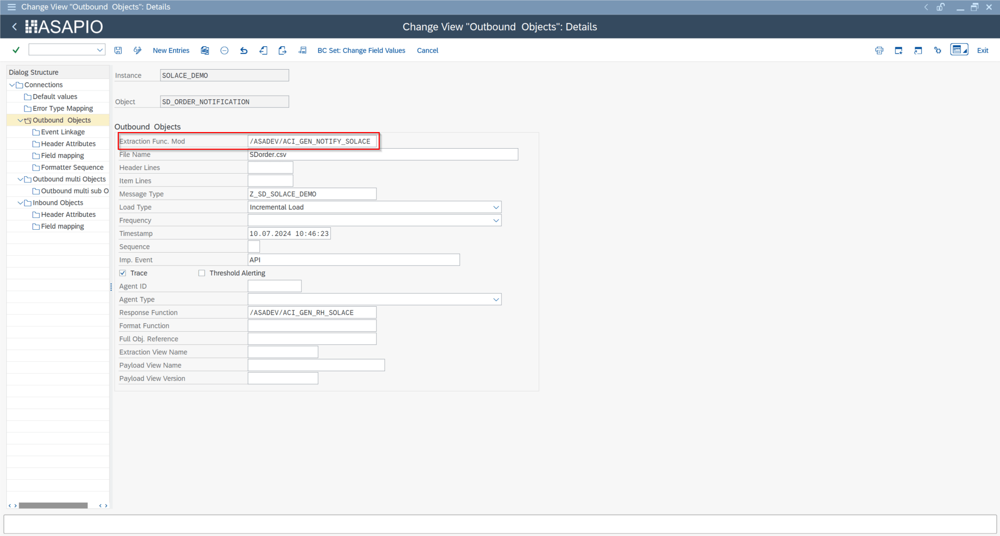

Business Object Event Linkage (SWE2) configuration

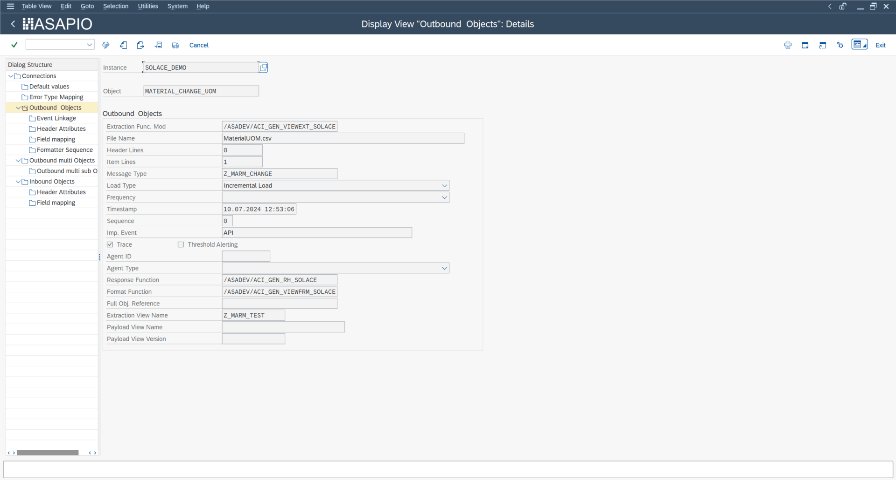

Dynamic topic field mapping configuration

| Role | Function Module |
| --- | --- |
| Simple notification extractor | `/ASADEV/ACI_GEN_NOTIFY_SOLACE` |
| DB view–based extractor | `/ASADEV/ACI_GEN_VIEWEXT_SOLACE` |
| Formatter | `/ASADEV/ACI_GEN_VIEWFRM_SOLACE` |
| Packed Load extractor | `/ASADEV/ACI_GEN_VIEW_EXT_PACK` |

### Key Header Attributes

| Attribute | Value / Description |
| --- | --- |
| `SOLACE_CALL_METHOD` | `POST` |
| `SOLACE_CONT_TYPE` | Content type (e.g. `application/json`) |
| `SOLACE_DELIV_MODE` | `Persistent` (recommended for reliable delivery) |
| `SOLACE_TOPIC` | Topic name (static or template for dynamic topics) |
| `SOLACE_OBJECT_HEADER_DB_TABLE` | Source table for message header metadata |

## Dynamic Topics

Introduced in release **9.32504**, dynamic topics allow the Solace topic name to be constructed from event payload field values at runtime. Configure this in the Field Mapping of the outbound object:

- Map SAP source fields to URL path segments within the topic template
- Apply conversion methods to transform field values (e.g. trim leading zeros from material numbers)
- The resulting topic string is assembled at runtime for each event

Example: `sap/s4/sales-orders/{region}/{salesOrg}/CHANGED` where `{region}` and `{salesOrg}` are derived from VBAK fields.
