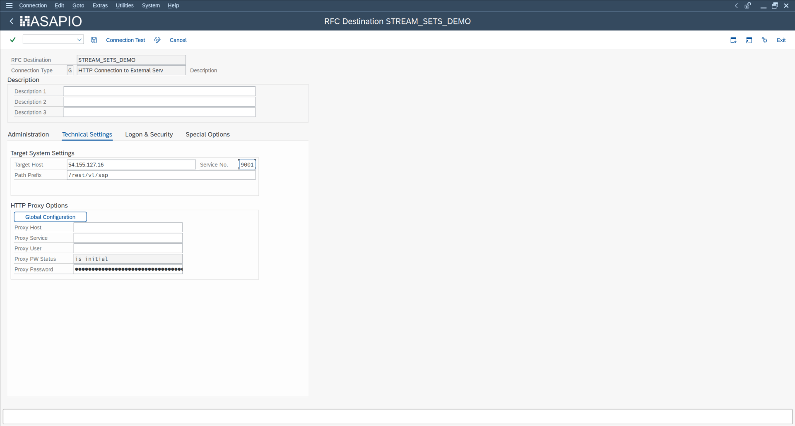
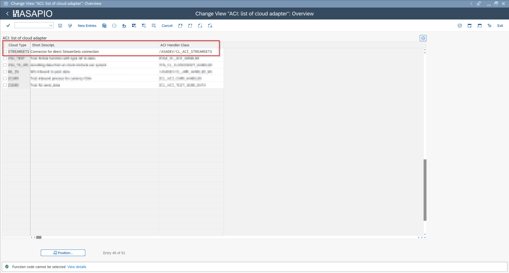
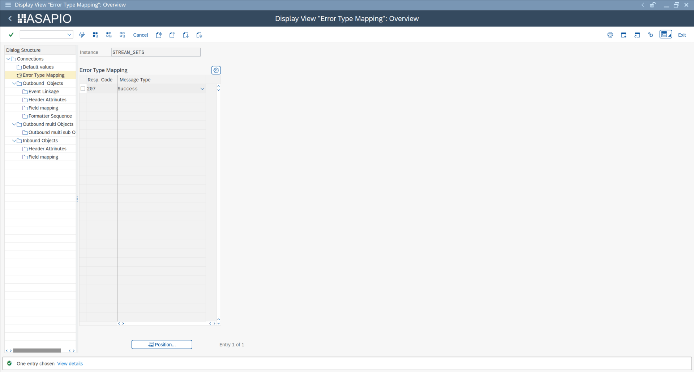

Connectors

# StreamSets® Connector

## Overview

ASAPIO can send SAP event payloads directly to a **StreamSets® Data Collector** HTTP endpoint. StreamSets then processes the data through configured pipelines, enabling integration with virtually any downstream system.

## Setup

### 1. Create RFC Destination

Create an HTTP connection (Type G) in transaction **SM59** pointing to your StreamSets Data Collector REST endpoint (host and port of the StreamSets instance).

RFC destination for StreamSets Data Collector endpoint (SM59, type G)

### 2. Create Cloud Instance

In `/ASADEV/ACI_SETTINGS`, create a new connection instance with the following values:

Cloud instance configuration – Cloud Type STREAMSETS and /ASADEV/CL\_ACI\_STREAMSETS

| Field | Value |
| --- | --- |
| Cloud Type | `STREAMSETS` |
| Cloud Adapter | `/ASADEV/CL_ACI_STREAMSETS` |
| RFC Destination | Your SM59 RFC destination |
| ISO Code (Charset) | `UTF-8` |

### 3. Error Mapping

StreamSets returns HTTP **207** for a successfully received batch. Configure the connection instance to treat HTTP 207 as a success response.

Error type mapping – HTTP 207 configured as success response

### 4. Outbound Object

Configure the outbound object using the standard ASAPIO outbound setup. Any event trigger, extractor function module, and payload design compatible with the generic REST adapter can be used with the StreamSets connector.
