Outbound Messaging

# Payload Designer

A point-and-click tool for building the JSON payload that leaves SAP. Select database tables or CDS views, map fields, and apply transformations – no ABAP coding required. The payload definition is stored per outbound object and reused across all deliveries.

## Overview

The ASAPIO Payload Designer is a no-code tool for building custom JSON payloads from SAP database views and CDS views. Instead of writing ABAP code to extract data, you visually join tables, select fields, and define the JSON structure – all within an ABAP transaction.

**Transaction:** `/n/ASADEV/DESIGN`

## Screens

The Payload Designer consists of three screens:

1. **Main Screen:** List of all payload designs with metadata (name, version, table, description). Use the toolbar to create, copy, or delete designs.
2. **Version Screen:** Manage versions of a payload design. Each version is an independent definition that can be transported and activated separately.
3. **Join Builder:** Visual join editor where you add tables, define join conditions, add fields, and configure field mapping.

## Toolbar Actions

### Payload Design actions

The application toolbar on the main screen provides seven actions:

- **Save:** Save updated values
- **Create:** Generate a new Payload Design View
- **Copy:** Copy a Payload Design View including all its versions
- **Display/Edit:** Toggle between display and edit mode
- **Delete:** Remove the current payload and all its versions (confirmation required)
- **Where used:** Find all outbound objects using this Payload View
- **Transport:** Transport all tables of the Payload View via a workbench request

### Payload Design Version actions

On the version screen the following actions are available:

- **Search:** Search for versions
- **Documentation:** Display documentation
- **Create Version:** Create a new version of the Payload Design
- **Delete Version:** Delete the selected version
- **Copy Version:** Copy the selected version with all joins to a new version
- **Where used version:** Find all outbound objects using this version

## Creating a Payload Design

1. Open `/n/ASADEV/DESIGN` and create a new Payload Design entry (name, version, description)
2. Open the Join Builder for the new design
3. Add the primary SAP table (e.g., `VBAK` for Sales Orders)
4. Add related tables with join conditions (e.g., `VBAP` joined on `VBELN`)
5. Add the required fields from each table
6. Configure field properties as needed (rename, skip, convert, hierarchy)
7. Use Data Preview to verify the output structure
8. Save and activate

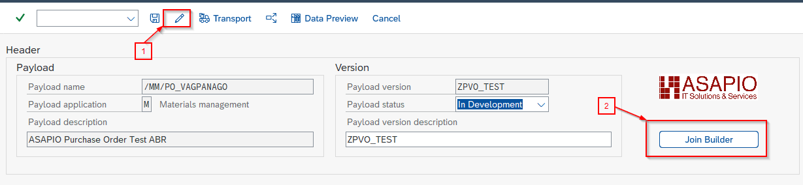

Create a table alias – step 1

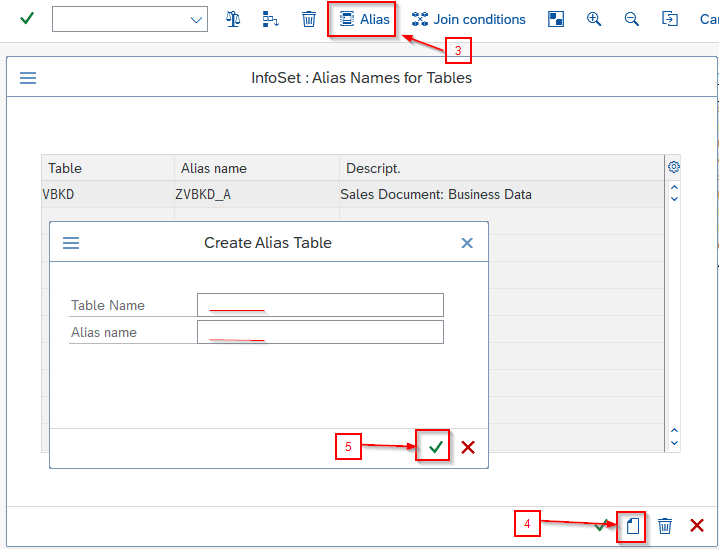

Create a table alias – step 2

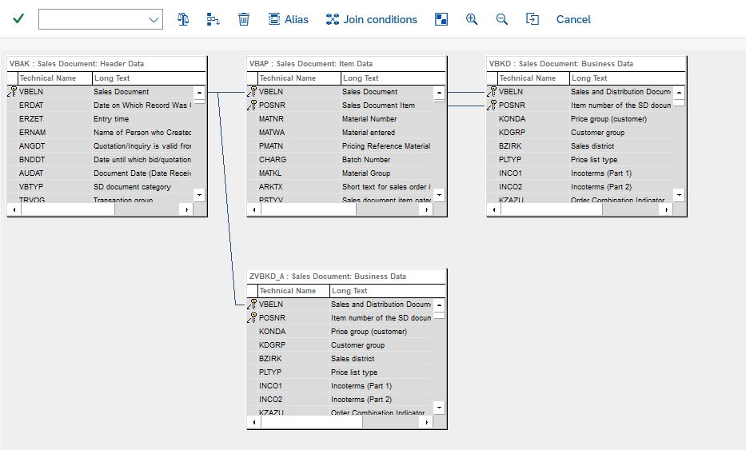

Add alias table in join builder

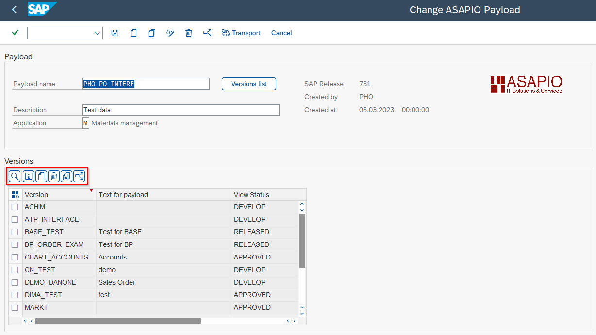

Payload Designer start screen – version actions

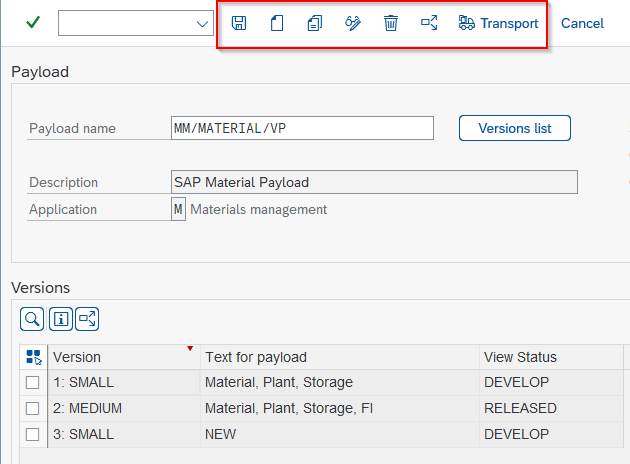

Payload Designer start screen – action buttons

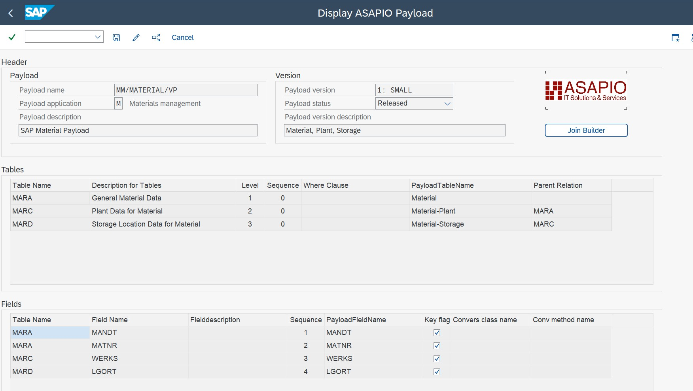

Payload Designer initial screen

## Field Configuration Options

| Option | Description |
| --- | --- |
| Add Custom field | Add a new custom field to one of the selected tables |
| Skip field | Mark fields you want to exclude from the payload |
| Conversion class / method | Specify a custom ABAP class and method to determine the value for the payload |
| Default Value | Set a default value for the specified field |
| View Fieldname | A de-duplicated technical name for the field (auto-generated) |
| Payload Fieldname | The name the field gets in the payload output |

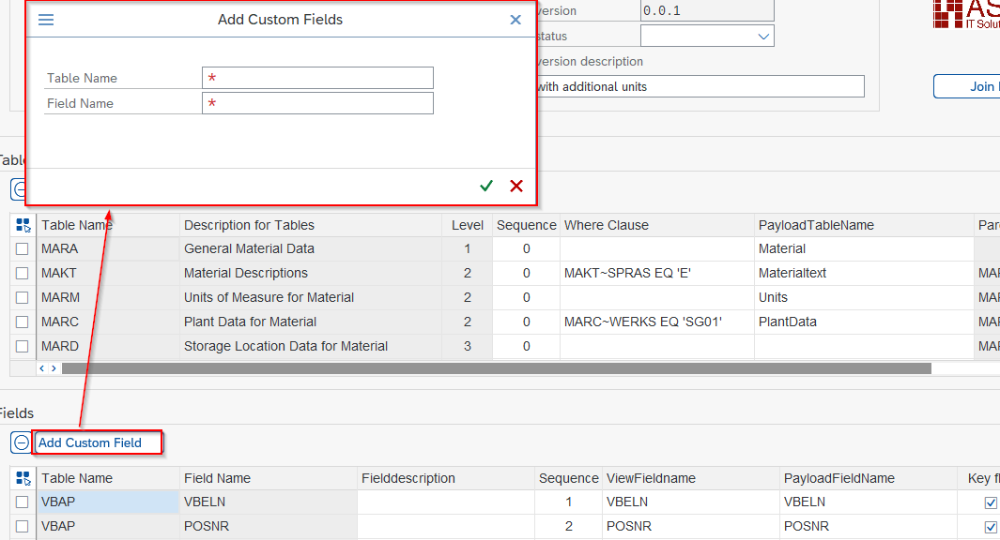

Version screen – custom fields

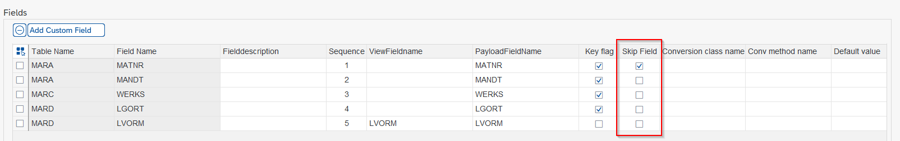

Version screen – skip fields

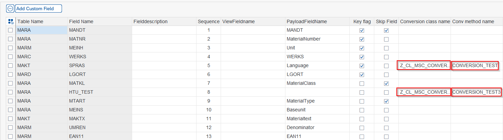

Version screen – conversion methods

## Table Aliases (SP09+)

From SP09 onwards, you can assign an alias to a joined table in the Join Builder. This is useful when the same table is joined multiple times with different conditions (e.g., ADRC joined twice for ship-to and bill-to addresses).

## Use in Outbound Objects

Reference the Payload Designer design in your outbound object by specifying:

- **Extractor FM:** `/ASADEV/ACI_GEN_PDVIEW_EXTRACT` – extracts data using the payload design at runtime
- **Formatter FM:** `/ASADEV/ACI_GEN_VIEW_FORM_CB` – formats the extracted data as JSON
- **Payload View Name:** the name of your Payload Design
- **Payload View Version:** the version to use

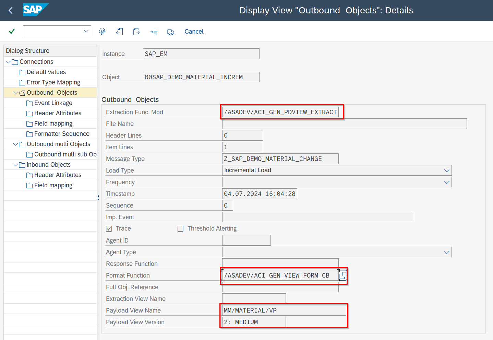

Payload Designer version screen

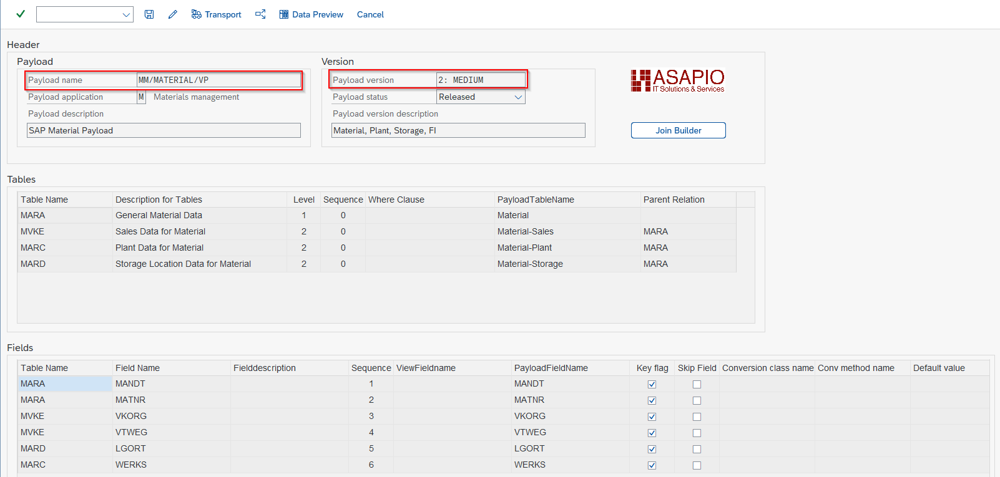

Linking a payload design to an outbound object

## Clean Core Checks

ASAPIO Payload Designs support SAP's Clean Core initiative. The check detects violations and shows recommendations – for example, which CDS views to use instead of a raw table.

To set up the checks:

1. Download the relevant rules file (.csv) from [github.com/SAP/abap-atc-cr-cv-s4hc](https://github.com/SAP/abap-atc-cr-cv-s4hc/tree/main/src). Choose the file that matches your target SAP S/4HANA release (use the *PCE* variant for Private Cloud Edition).
2. Import the rules via transaction `/ASADEV/CCC_IMPORT`.
3. Navigate to your Payload Design Version and run the checks from the toolbar.

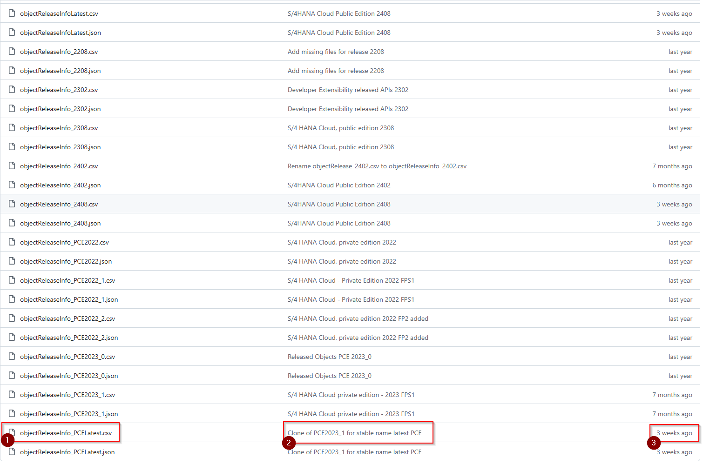

Clean Core Checks – available SAP release versions

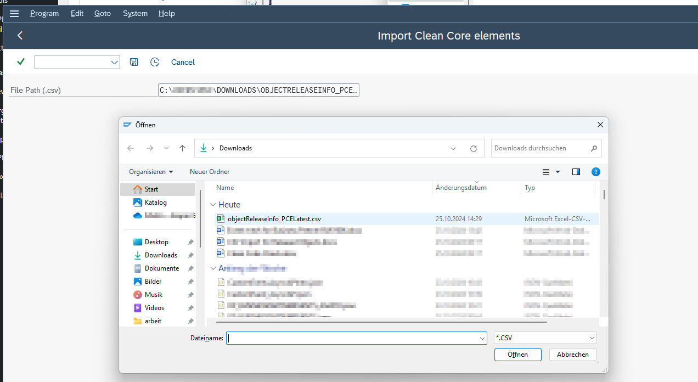

Clean Core Checks – upload rules file

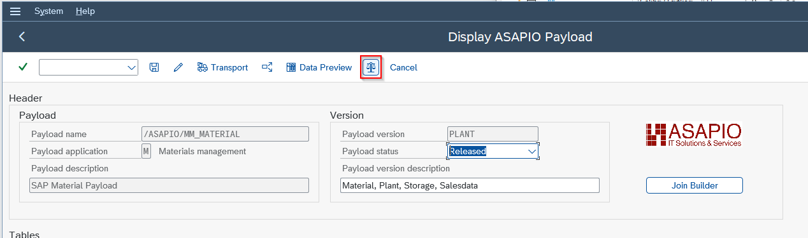

Clean Core Checks – toolbar button in Payload Designer

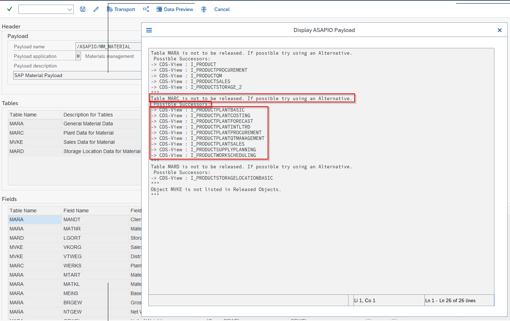

Clean Core Checks – results view
