Getting Started

# Event Studio

A no-ABAP SAP Fiori app for day-to-day integration administration – create cloud instances, activate outbound objects, and adjust settings without back-end Customizing. Designed for functional consultants and integration admins who don't write ABAP.

ASAPIO Event Studio is a web-based SAPUI5 application for configuring and managing event-driven integrations. It can connect to multiple SAP back-end systems simultaneously via SAP BTP destinations with principal propagation, and is deployed either on SAP BTP (Cloud Foundry) or directly on your ABAP server. The minimum ASAPIO version required is **9.32504 (SP11)**.

## Overview

Event Studio runs as a standalone SAPUI5 application. Depending on your deployment choice, it is accessible from the SAP BTP Launchpad or directly via your ABAP server URL. All configuration changes made in Event Studio are written to the same ABAP Customizing tables used by the classic transactions, keeping both interfaces in sync.

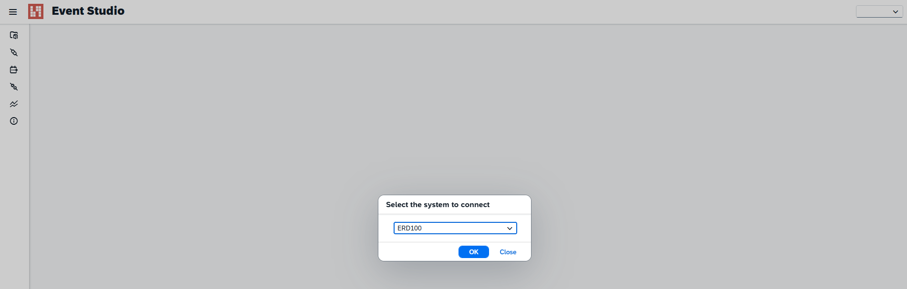

Start screen – system selection

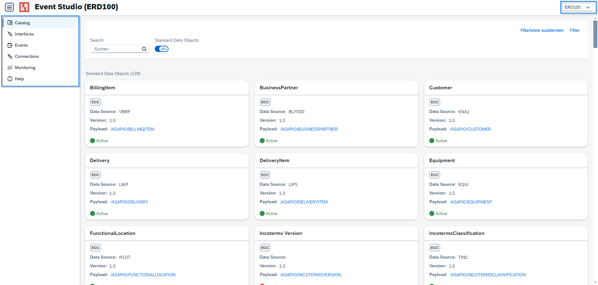

Start screen – active elements

Event Studio is organized into the following pages:

| Page | Functionality |
| --- | --- |
| **Data Catalog** | Browse available standard and custom data objects; deploy events; view AsyncAPI schema |
| **Interfaces** | View, create, transport, and export AsyncAPI schema for existing interfaces |
| **Events** | List predefined events – add, update, or delete event definitions |
| **Connections** | View configured connections; edit connection settings via SAP GUI for HTML |
| **Monitoring** | Monitor system activity; filter by timestamp; view and download traces |
| **Help** | Links to documentation and guidelines |

## Data Catalog

The **Data Catalog** page lists all available standard and custom data objects. Each object is shown as a tile with key details – Package, Object name, Event ID, and Domain. From a tile you can:

- Open the **Details Page** to inspect the object's full configuration and event list.
- Click the **Deploy** button to open the Deployment Page, where you select a target connector and activate the interface.
- Download the AsyncAPI schema for the selected data object.

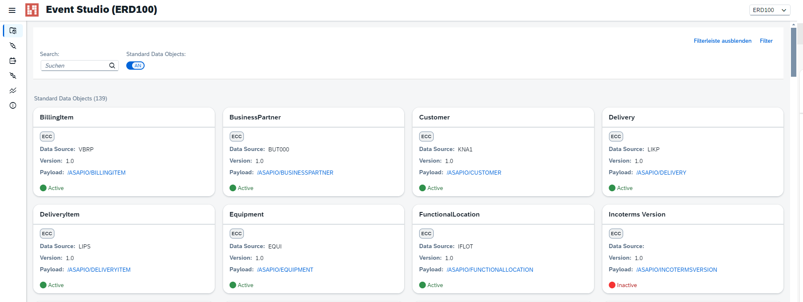

Data Catalog – list of standard data objects

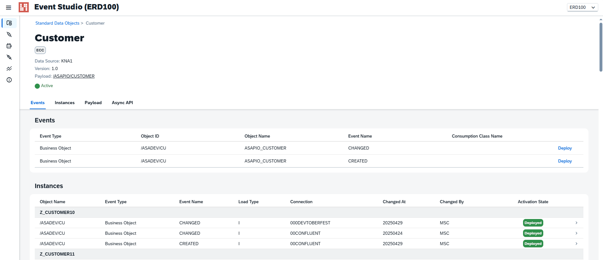

Data Catalog – details page

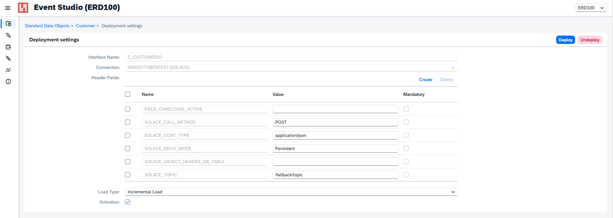

Data Catalog – deployment page

## Interfaces

The **Interfaces** page shows all configured outbound integrations. Each row corresponds to an active interface between ASAPIO and a target connector. The toolbar provides:

- **Create** – set up a new interface step by step
- **Transport** – add selected interfaces to an ABAP transport request via the Transport Dialog
- **AsyncAPI Schema** – export the AsyncAPI specification for the selected interface

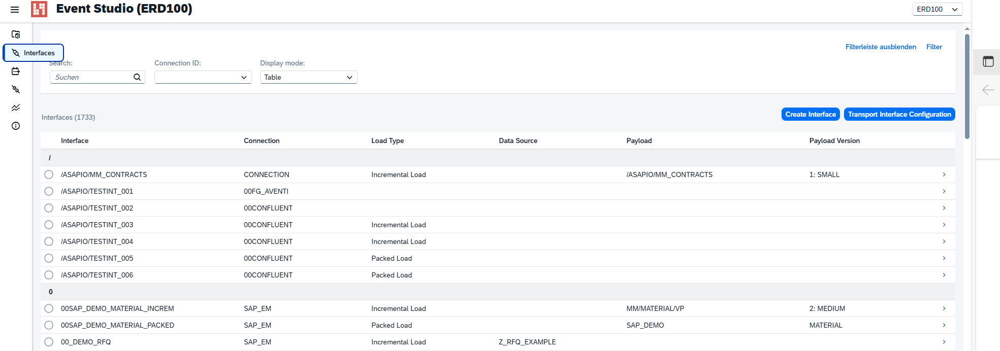

Interfaces – table view

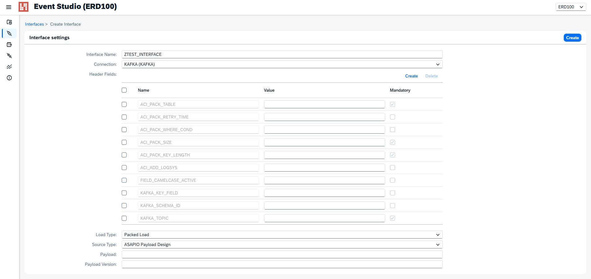

Interfaces – creation screen

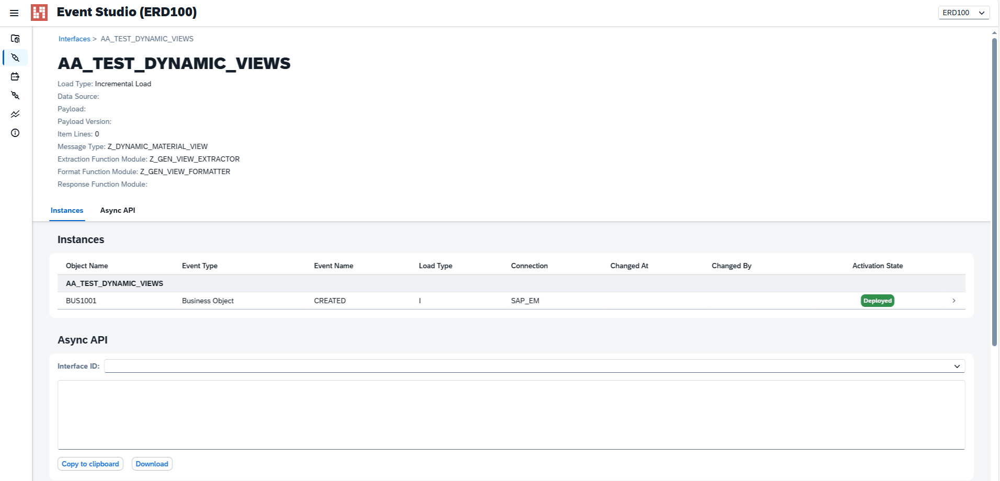

Interfaces – details screen

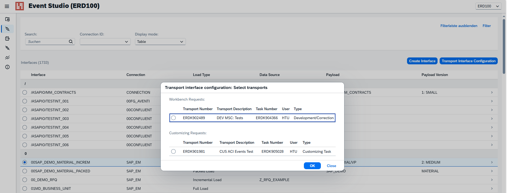

Interfaces – transport dialog

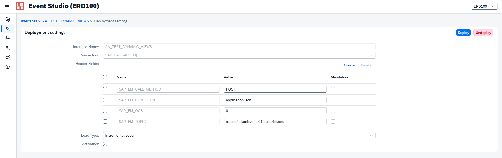

Interfaces – deployment page

## Events

The **Events** page lists all predefined events available for configuration. Use the **Create** button to add a custom event definition via the Add Event Dialog. You can also update or delete existing entries. When adding a custom event you specify:

- Event Type (e.g., RAP Event)
- Catalog Object ID and version (links to a Payload Designer view)
- Object ID and Event Name

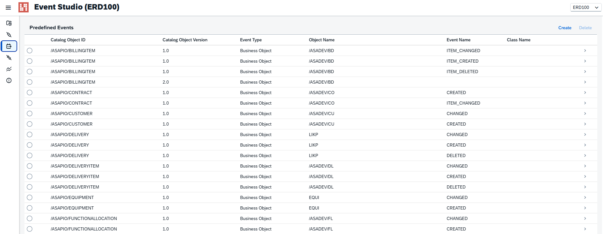

Events – predefined events list

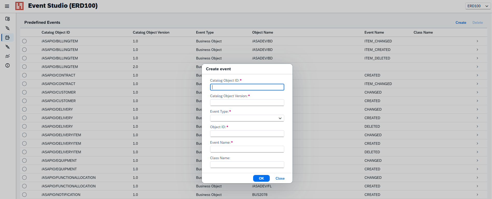

Events – Add Event Dialog

## Connections

The **Connections** page displays all configured connector instances in a table. To edit the details of a connection, click the link in the table row – this opens the connection settings in **SAP GUI for HTML**, where you can update RFC destinations, header attributes, and other parameters.

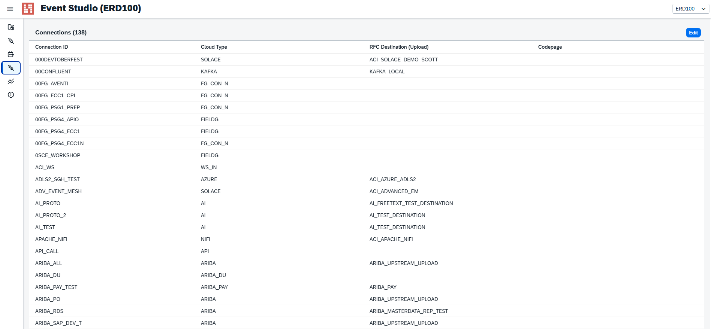

Connections page

## Monitoring

The **Monitoring** page lets you review system activity. Use the from/to timestamp filter to narrow the result set. The results table shows individual calls with status codes and timing information. Selecting a row expands the **Traces** section, where you can inspect the request and response payloads and download trace files.

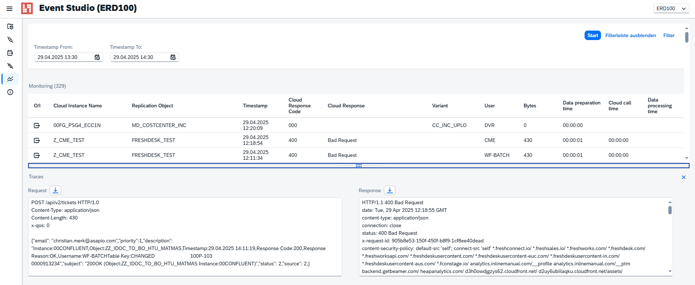

Monitoring page

## Help

The **Help** page provides direct links to the ASAPIO documentation and implementation guidelines.

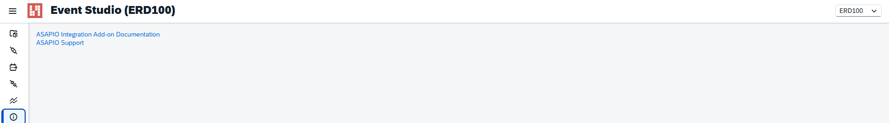

Help page

## Deployment

Event Studio can be deployed in two ways – on SAP BTP (recommended) or directly on your ABAP application server.

### Option A – SAP BTP via Business Application Studio

1. Import the project archive `eventstudio.tar` into your BAS Dev Space.
2. Open a terminal in BAS and run `npm install` to install dependencies.
3. Configure the application files:
   - `ui5.yaml` – UI5 tooling configuration
   - `xs-app.json` – routing and destination configuration
   - `App.controller.js` – back-end connectivity settings
4. Build and deploy the Multi-Target Application (MTA):
   - Via BAS terminal: `cf deploy mta_archives/eventstudio_1.0.0.mtar`
   - Or via BAS UI: right-click the `.mtar` file → **Deploy MTA Archive**

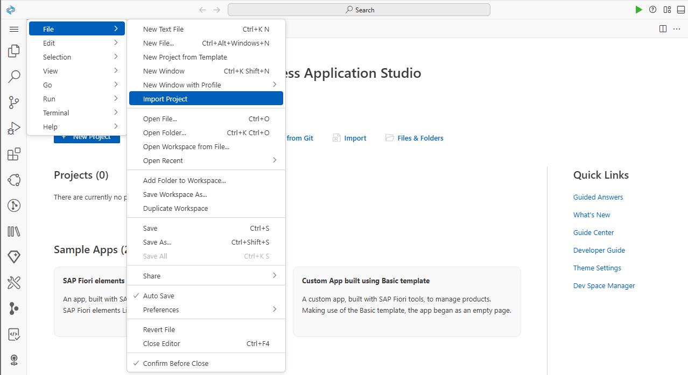

BAS – import project archive

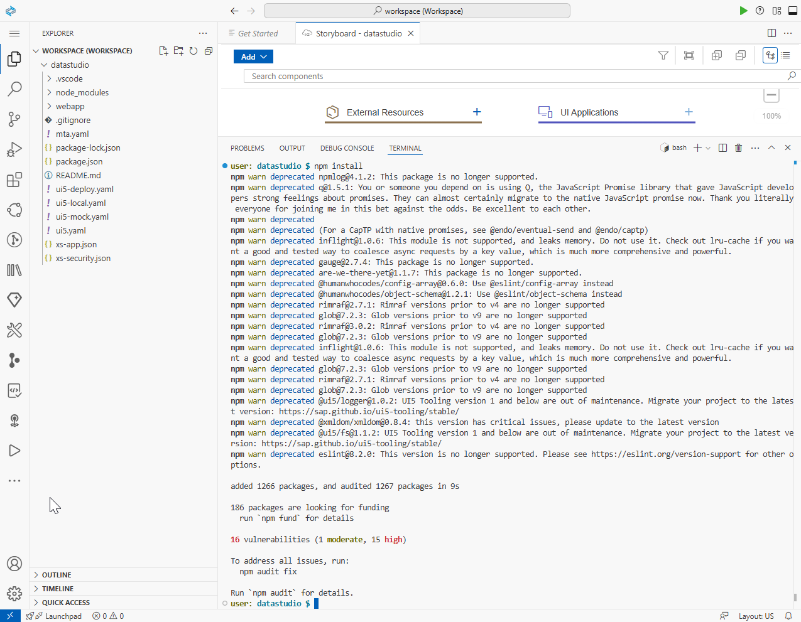

BAS terminal – npm install

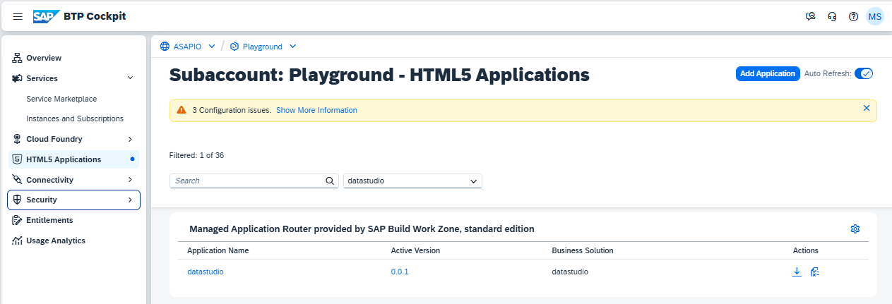

CF deploy – successful deployment

### Option B – ABAP Application Server

1. Import the Event Studio transport request into your ABAP system via STMS.
2. Activate the OData service `/ASADEV/GW_CONFIG_API_SRV` in transaction /IWFND/MAINT_SERVICE.
3. Activate the ICF node at path `default_host > sap > bc > bsp > asadev > app_ui` in transaction SICF.

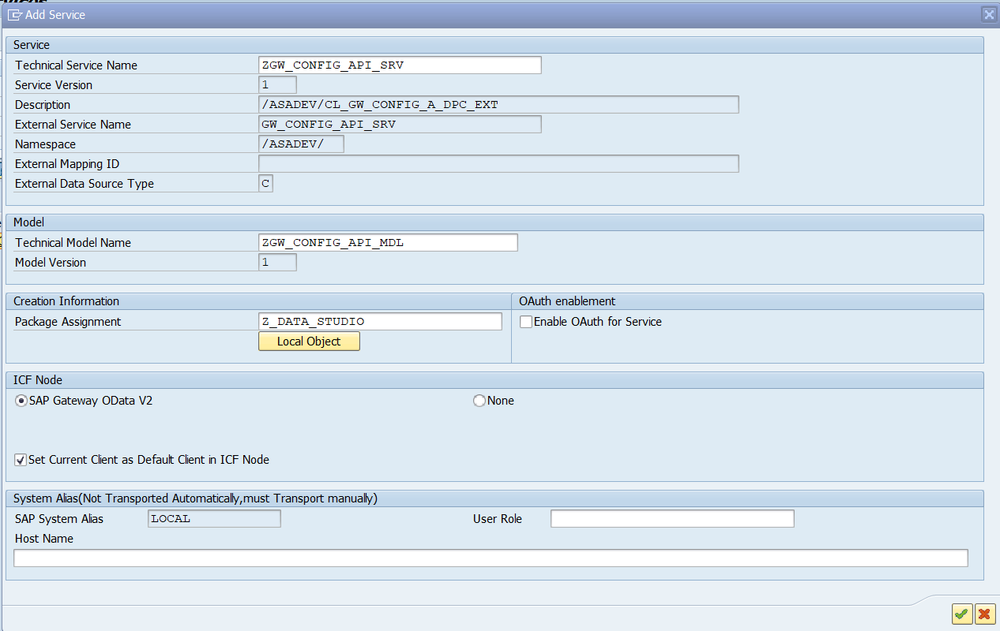

Activate OData service in /IWFND/MAINT\_SERVICE

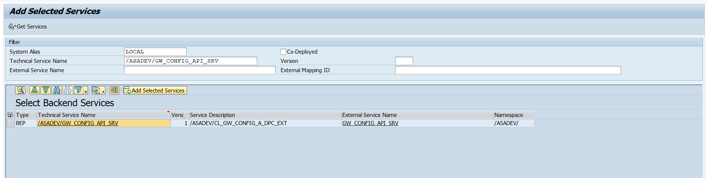

OData service details

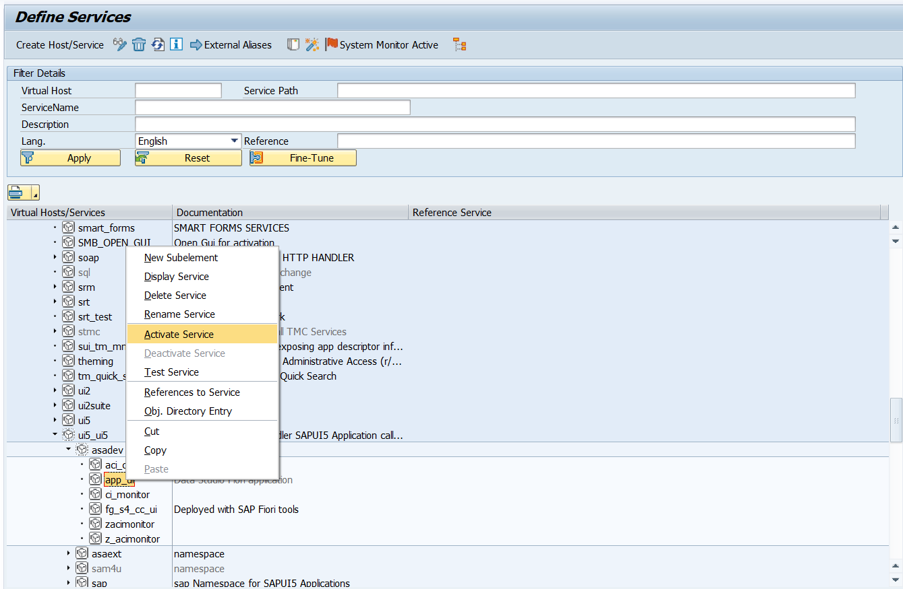

Activate ICF node in SICF

Optionally, you can configure Event Studio as an SAP Fiori Launchpad tile using transactions `/UI2/FLPD_CUST` or `/UI2/FLPCM_CUST`.
