Outbound Messaging

# IDoc Messaging

Route existing SAP IDocs to cloud message brokers without changing the IDoc setup. The Add-on intercepts outbound IDocs, converts segment data to JSON, and forwards them through the standard outbound pipeline – reusing your existing IDoc partner profiles.

## Overview

ASAPIO can convert SAP IDocs to JSON and send them to any configured messaging connector. It also supports receiving JSON messages and converting them back to IDocs for inbound SAP processing. This enables IDoc-based integration scenarios without requiring ALE/IDoc-compatible middleware.

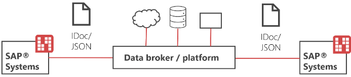

IDoc messaging architecture overview

## Outbound (IDoc → JSON → Cloud)

### ALE Configuration

Configure standard SAP ALE for outbound IDoc triggering:

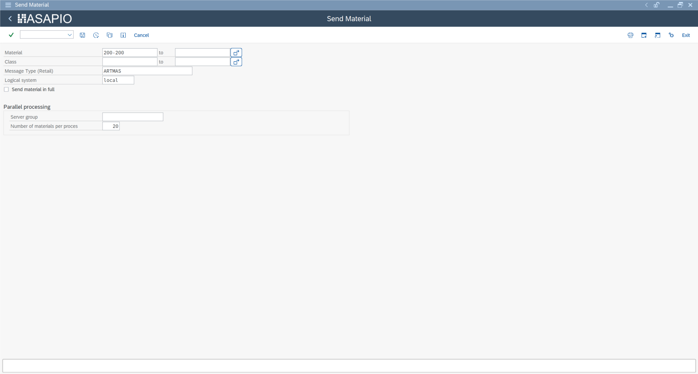

ALE configuration for IDoc outbound

1. **SALE:** Define the SAP logical system (use `LOCAL` for the source system)
2. **BD64:** Create an ALE distribution model – define a message type for the target partner `LOCAL`
3. **WE21:** Create a port named `ACI_IDOC` using function module `/ASADEV/ACI_IDOC_PORT_TRIGGER` (port type: Function Module)
4. **WE20:** Create a partner profile for partner type `LS` (logical system), partner number `LOCAL`:
   - Add the outbound parameter with the message type from BD64
   - Set the port to `ACI_IDOC`
   - Set the output mode to process immediately

### Outbound Object Configuration

Configure the outbound object in `/ASADEV/ACI_SETTINGS`:

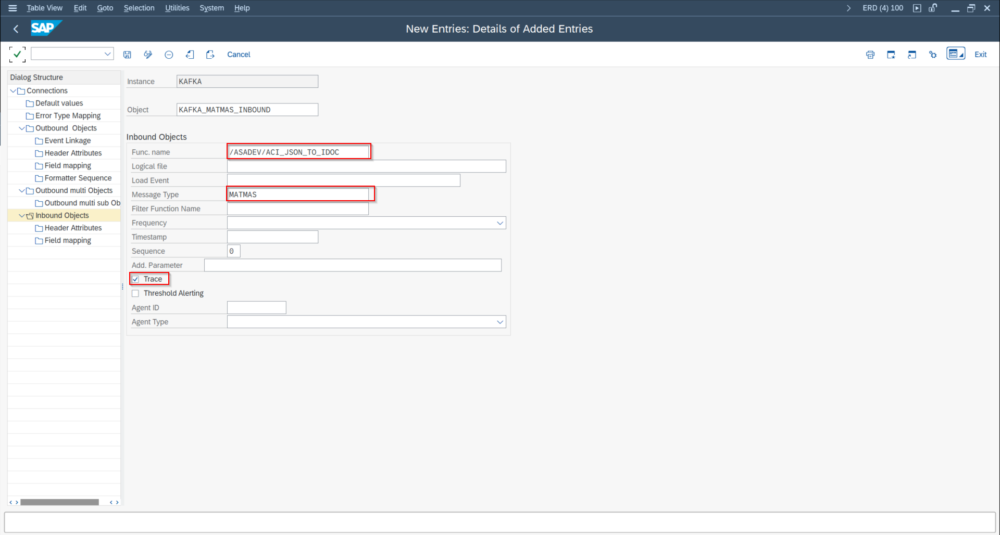

Outbound object configuration for IDoc

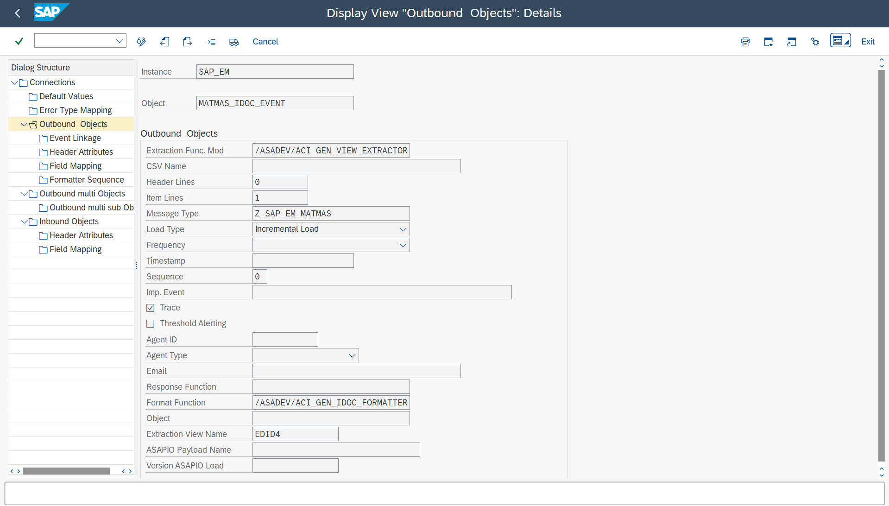

Outbound Object IDOC MATMAS

- **Extractor FM:** `/ASADEV/ACI_GEN_VIEW_EXTRACTOR` with the IDoc data view `EDID4`
- **Formatter FM:** `/ASADEV/ACI_GEN_IDOC_FORMATTER`

### Event Linkage

Link the ASAPIO IDoc trigger to the outbound object via event linkage:

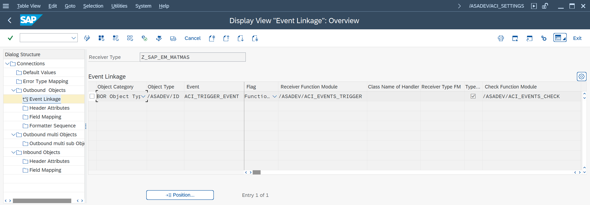

Outbound Object IDOC MATMAS Event Linkage

| Field | Value |
| --- | --- |
| Object Type (BOR) | `/ASADEV/ID` |
| Event | `ACI_TRIGGER_EVENT` |

### Connector-Specific Header Attributes

Add connector-specific header attributes to the outbound object. Common attributes across connectors:

| Attribute | Description |
| --- | --- |
| `BOR_ATTRIBUTE_MessageType` | The IDoc message type (e.g., `ORDERS`) |
| `AZURE_TOPIC` / `KAFKA_TOPIC` / etc. | Target topic/queue name (connector-specific) |

### Testing Outbound

Test IDoc outbound processing using transaction **BD10** (Send Material Master) or the equivalent transaction for your IDoc type. The IDoc is converted to JSON and sent to the configured connector.

## Inbound (Cloud → JSON → IDoc)

### Inbound Function Module

Use function module `/ASADEV/ACI_JSON_TO_IDOC` to convert an incoming JSON message into an IDoc. This function module:

1. Parses the JSON payload
2. Maps the JSON fields back to the IDoc segment structure
3. Creates the IDoc and posts it for inbound processing

### Inbound IDoc Configuration

Configure standard SAP IDoc inbound processing:

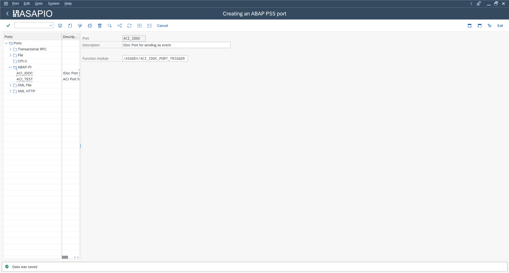

WE20 partner profile for inbound IDoc

- **WE20:** Partner profile for inbound – partner type `LS` / partner `LOCAL`, inbound parameters with message type and process code
- **WE42:** Define a process code that maps to the inbound function module

### JSON Schema

The JSON schema for any IDoc type can be exported from SAP using transaction **WE60** (IDoc Documentation). ASAPIO's JSON-to-IDoc converter uses the standard segment and field names as JSON key names.

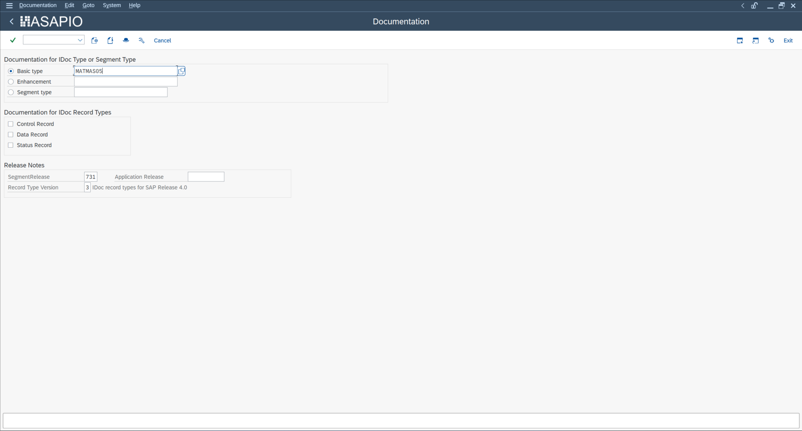

WE60 – IDoc type documentation

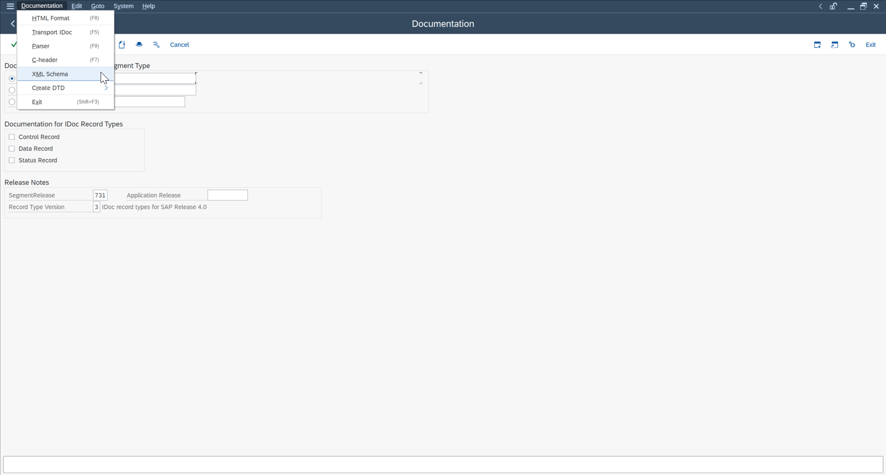

WE60 – XML schema view

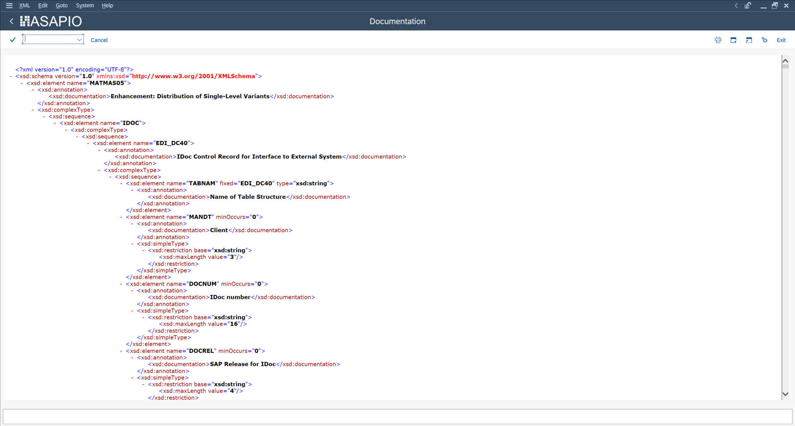

JSON header fields for IDoc creation

## PUSH and PULL Modes

For inbound scenarios, ASAPIO supports two reception modes:

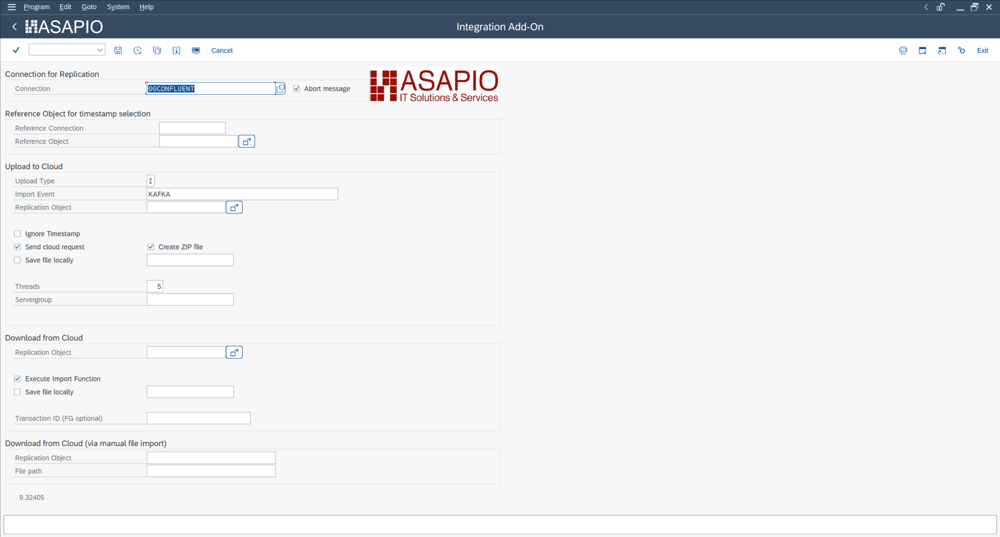

PULL-based inbound – connection and object selection

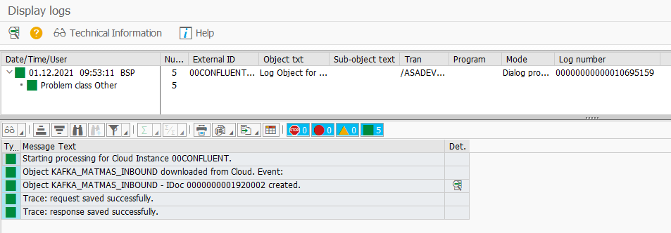

PULL-based inbound – job execution

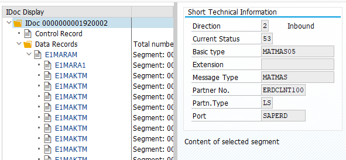

PULL-based inbound – monitor results

- **PUSH:** External systems call the ASAPIO SICF endpoint directly. Activate the `/asadev` node in SICF, then call: `https://host:port/asadev/{instance}/{object}`
- **PULL:** ASAPIO polls the messaging platform for new messages. Use transaction `/n/ASADEV/ACI` to schedule the pull job with your connection instance and inbound object.
