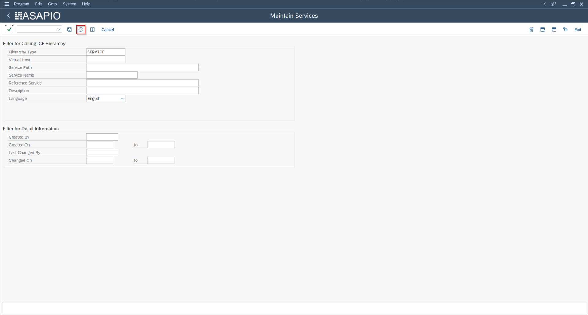
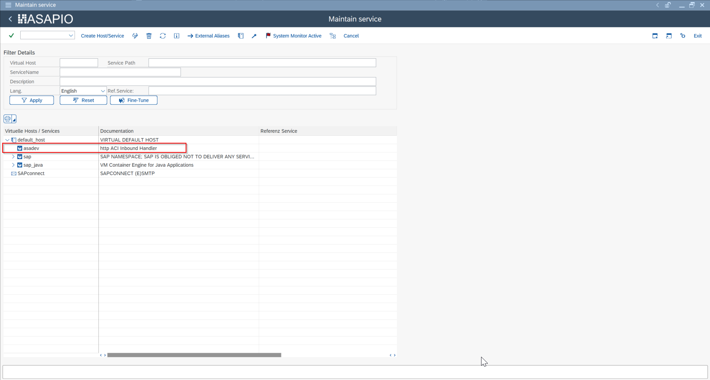
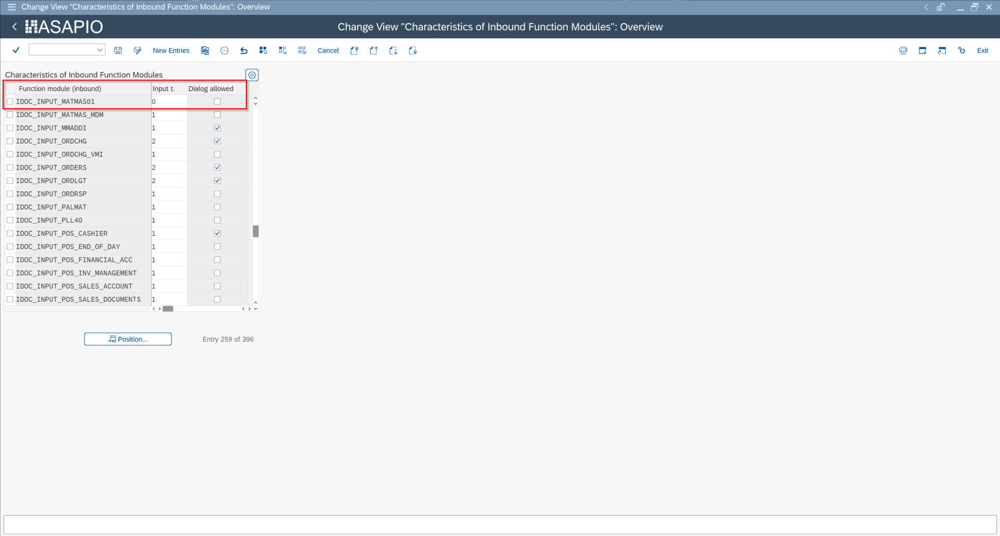
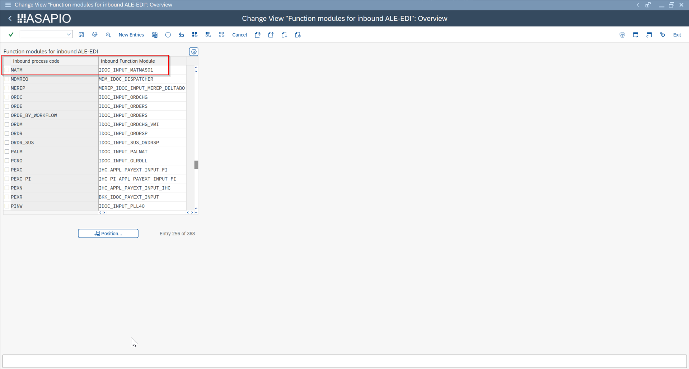
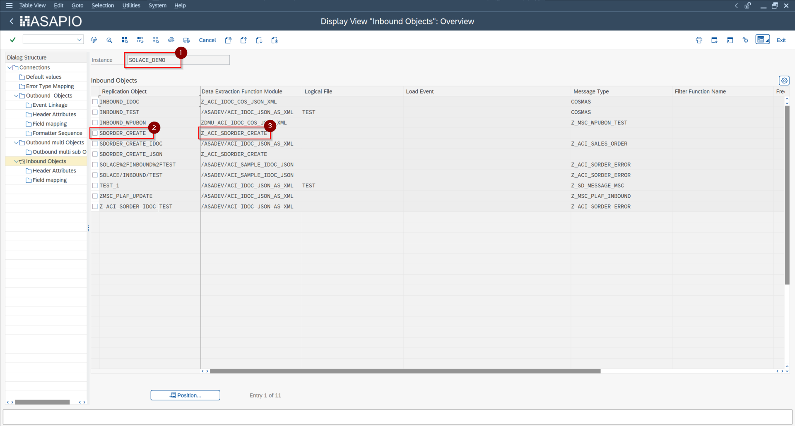

Inbound Messaging

# Inbound Messaging Overview

How external systems push data back into SAP via the ASAPIO inbound HTTP endpoint. Covers authentication, message routing to ABAP handler classes, error responses, and monitoring of received messages in the ASAPIO Monitor.

## Overview

ASAPIO provides an HTTP endpoint within SAP that external systems can call to send data into SAP. This is used for inbound scenarios such as receiving messages from cloud messaging services (poll-based inbound), or accepting push notifications from external parties.

## HTTP Endpoint (SICF)

The inbound endpoint is registered in the SAP Internet Communication Framework (ICF). Activate the ASAPIO service node in transaction **SICF**:



SICF – inbound service node activation



SICF – inbound endpoint URL mapping

- Navigate to the `/asadev` service node in the ICF tree
- Right-click and choose **Activate Service**

The endpoint URL format is:

```
https://<host>:<port>/asadev/<instance>/<object>
```

Where:

- `<instance>` – the ASAPIO Cloud Instance name (e.g., `AZ_SERVICEBUS`)
- `<object>` – the inbound object name (e.g., `PURCHASE_ORDER`)

The ICF handler maps the incoming URL path to the configured processing function module.

## Custom Inbound Function Module

Each inbound object is processed by a custom remote-enabled function module. A sample starting template is available: `/ASADEV/ACI_SAMPLE_IDOC_JSON`. The function module interface is:



Inbound processing function module interface



Inbound function module parameters


Inbound processing via generic IDoc



Inbound object configuration

| Parameter | Direction | Description |
| --- | --- | --- |
| `IV_INSTANCE` | Import | Cloud instance name from the URL |
| `IV_OBJECT` | Import | Object name from the URL |
| `IV_FILEINTERN` | Import | Internal file name used for staging |
| `IT_CONTENT` | Import | Message payload as binary table |
| `IT_ATTACHMENT` | Import | Attachments (if any) |
| `ET_RETURN` | Export | Return messages (BAPIRET2 structure) |

## Recommended Pattern

The recommended approach for inbound processing is:

1. Store the inbound payload via `/ASADEV/ACI_GENERIC_IDOC` (stages the data as an IDoc)
2. Process the IDoc asynchronously via standard IDoc inbound processing (WE20 partner profiles)

This decouples the HTTP acknowledgment from the actual processing, improving reliability and enabling standard IDoc error handling and reprocessing.

## Optional Configuration

| Transaction | Purpose |
| --- | --- |
| **WE57** | Link the inbound function module to an IDoc message type |
| **WE42** | Define a process code for the inbound handler |
| **BD51** | Register the function module for inbound IDoc processing |
| **BD67** | Restrict inbound processing to specific partner types |

## Reprocessing Failed Messages

Use the following transactions to manage failed inbound messages:

- `/ASADEV/ACI_INB_MSG_COCKPIT` – view and manage staged inbound messages
- `/ASADEV/ACI_INBOUND_PROCESSING` – reprocess failed inbound messages manually
