Monitoring

# Monitor & Traces

The central operations console for the Integration Add-on. View every sent and received message, inspect full payload content, track delivery status, read error details, and re-trigger failed messages – no ABAP debugging or SE16 required.

## ASAPIO Monitor

The ASAPIO Monitor provides a central view of all outbound message processing activity.

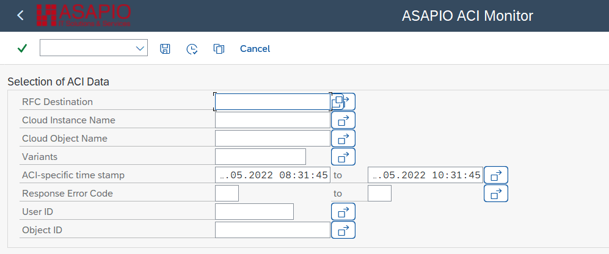

ACI Monitor – main entry screen

**Transaction:** `/n/ASADEV/ACI_MONITOR`
**Required role:** `/ASADEV/ACI_ADMIN_ROLE`

### Selection Criteria

Filter the monitor view using:

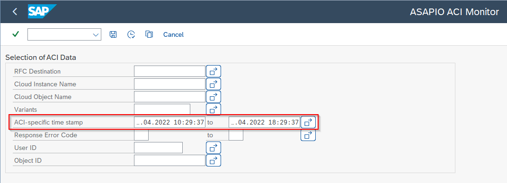

Timestamp offset configuration in SU3

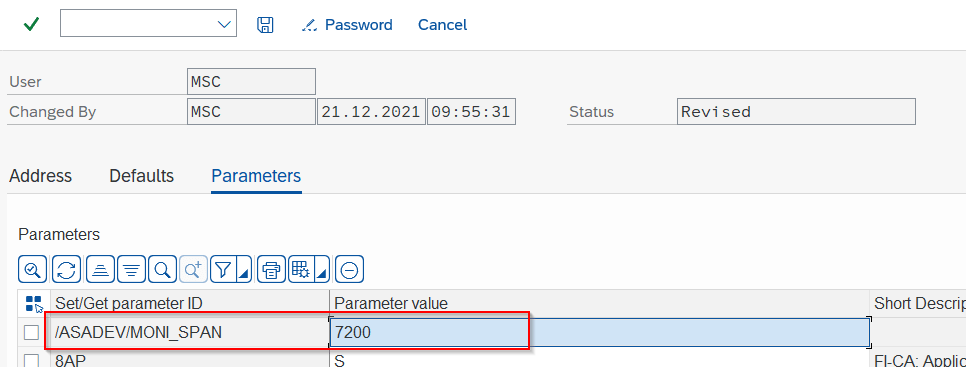

User parameter /ASADEV/MONI\_SPAN in SU3

- RFC Destination
- Cloud Instance name
- Outbound Object name
- Saved Variants
- Timestamp range (from / to)
- HTTP Response Error Code
- User ID (who triggered the event)
- Object ID (e.g., a specific Sales Order number)

### Log Entry Details

Each log entry shows message processing details. Tabstrip tabs provide:

- **Traces** – full message payload trace (only available when tracing is enabled)
- **Application Log** – SLG1 application log entries for this message
- **Change Pointers** – view and manage the underlying change pointer records
- **All Unprocessed CPs** – unprocessed change pointers for the same object

### Layout Options

Switch the monitor layout between horizontal and vertical split using the button in the toolbar (available from release **9.32410**). The default split can also be set via the user parameter `/ASADEV/MONI_SPLIT=v` (vertical) in transaction SU3.

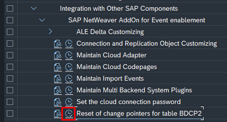

Report /ASADEV/RESET\_CAT\_CP – change pointer reset

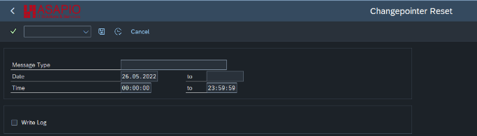

Report /ASADEV/RESET\_CAT\_CP – selection screen

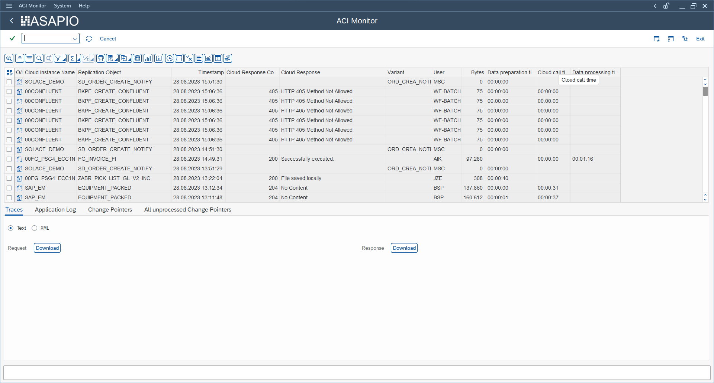

ACI Monitor – horizontal layout

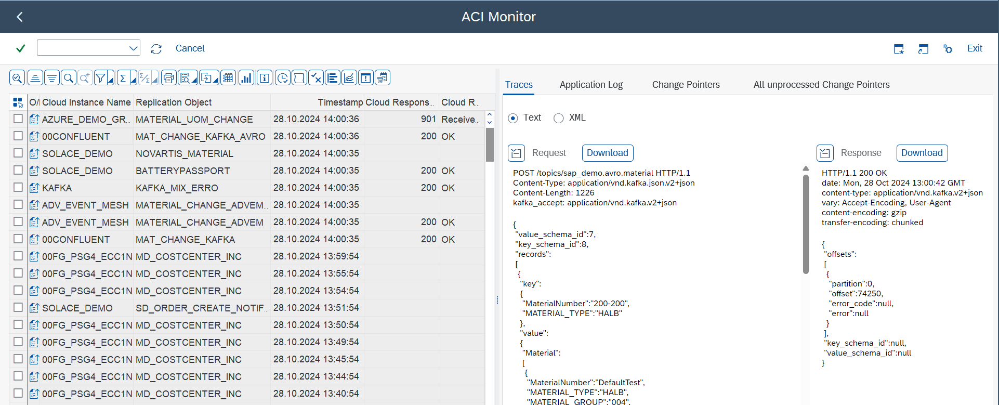

ACI Monitor – vertical layout

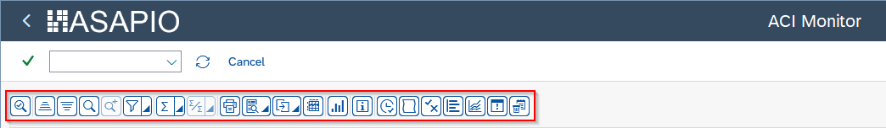

ACI Monitor – log entry view

### Monitor Actions

| Button | Description |
| --- | --- |
| Refresh | Reload the log list with current filter settings |
| Reprocess Selected Variant | Manually trigger reprocessing for selected error entries |
| Open Workflow Logs | Navigate to SAP Business Workplace for alerting workflow items |
| Display IDoc Statuses | Open IDoc status display for IDoc-based outbound messages |

### Charts & Statistics

The monitor includes ALV diagram views showing processing statistics over time:

- **Bytes:** Message size trends per connection instance or object
- **Times:** Processing duration trends
- **Errors:** Error rate trends by instance or object

## Change Pointer Operations

From the monitor, you can manage change pointer (CP) records:

- **Reprocess immediately** – trigger a new processing attempt for selected CPs
- **Mark as unprocessed** – reset a CP to unprocessed status for the next batch run
- **Close / mark as processed** – mark a CP as processed to prevent further retries

To reset an entire category of change pointers (e.g., after a mass test), use report `/ASADEV/RESET_CAT_CP`.

## Pro-Active Alerting

ASAPIO supports threshold-based alerting that sends a workflow notification when the error rate for a connection instance or outbound object exceeds a configured threshold.

### Alerting Setup

1. In the connection instance or outbound object configuration, check the **Threshold Alerting** checkbox and enter the **Agent ID** (SAP User ID or Workflow role) to receive alerts.
2. In **SWE2** (Event Type Linkage), create an entry:
   - Object Type: `/ASADEV/AA`
   - Event: `ACTIVE_ALERT`
   - Task: `TS00382117`
   - Function Module: `SWW_WI_CREATE_VIA_EVENT_IBF`
   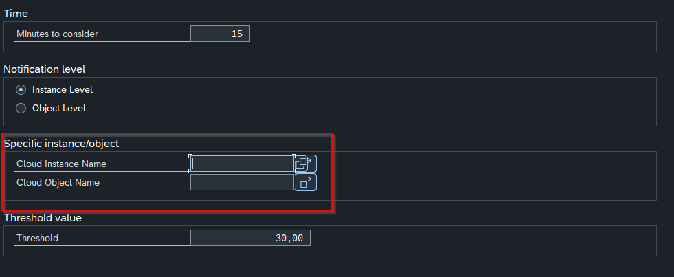

   Alerting configuration – new threshold options (release 9.32304)
3. Schedule report `/ASADEV/ACI_ACTIVE_ALERTING` (SE38) as a background job to check error rates. Parameters:
   - Minutes threshold (how far back to check)
   - Instance or object level
   - Error threshold percentage

Alerts appear in the SAP Business Workplace → Inbox → Workflow → ACI active alerting.

### Alerting BAdI

BAdI `/ASADEV/ACTIVE_ALERTING` provides extension methods:

- `send_all_to_external` – route all alerts to an external system (e.g., email, Teams)
- `send_filtered_to_external` – route only specific alerts externally
- `skip_standard` – suppress the standard SAP workflow notification

## Message Tracing

Enable tracing for a connection instance to capture full message payloads in the monitor:

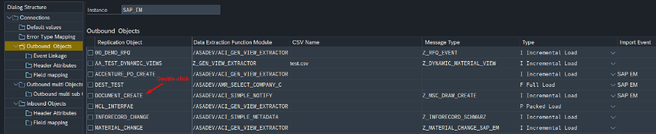

Tracing configuration in SPRO – connection level

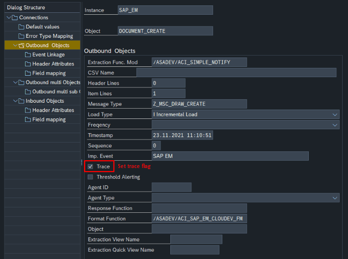

Tracing configuration – outbound object level

1. In SPRO → Connection Customizing, check the **Trace** checkbox for the instance
2. Optionally set the maximum number of trace entries via parameter `MAXTRACE` (recommended: 10000)

**Note:** Tracing stores actual payload data in STXH. Disable tracing after debugging to avoid unnecessary storage consumption. Be aware of GDPR implications – see [GDPR Functions](../gdpr-functions/index.md).

## Archiving & Deletion

Use report `/ASADEV/ACI_AMRLOG_DELETE` to archive or delete old message log entries:

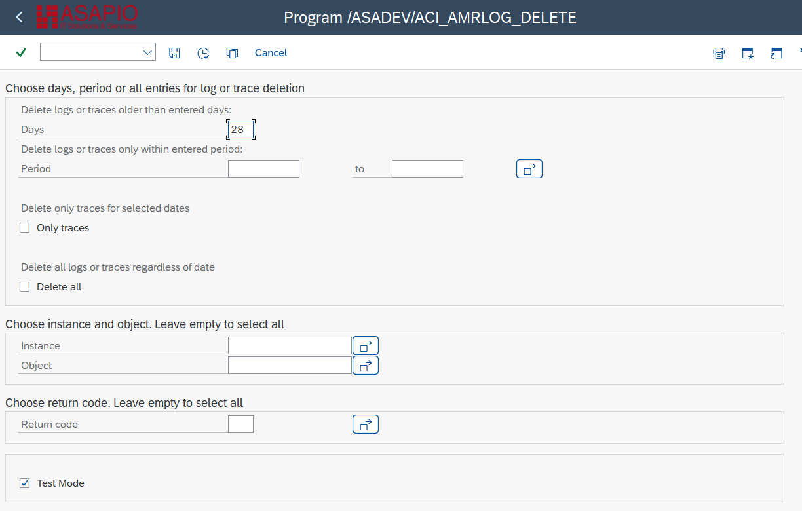

Selection screen of Log deletion report

- Selection by: number of days, date range, cloud instance, outbound object
- Archive programs for SAP archiving objects:
  - `/ASADEV/AMR_ARCHIVE_DELETE`
  - `/ASADEV/AMR_ARCHIVE_READ`
  - `/ASADEV/AMR_ARCHIVE_WRITE`

Configure the log retention period via parameter `SLG_DEL_PERIOD` (default: 90 days). The timestamp display offset can be adjusted per user via SU3 parameter `/ASADEV/MONI_SPAN` (value in seconds).

## Configuration Parameters

| Parameter | Description |
| --- | --- |
| `/ASADEV/ACI_PAR` | Health monitoring parameters (various system settings) |
| `SLG_DEL_PERIOD` | Log retention period in days (default 90) |
| `MAXTRACE` | Maximum number of trace entries stored (default 10000) |
| `/ASADEV/MONI_SPAN` | User-specific timestamp display offset in seconds (SU3) |
| `/ASADEV/MONI_SPLIT` | Default monitor layout: `v` (vertical) or `h` (horizontal) |
