Outbound Messaging

# Outbound Messaging Overview

Core concepts of outbound event processing – how SAP business events are captured, enriched with payload data, queued, and reliably delivered to cloud targets with built-in retry and error handling. Read this before diving into connector or payload configuration.

## Available Event Triggers

ASAPIO supports multiple SAP event triggering mechanisms to detect when data changes:

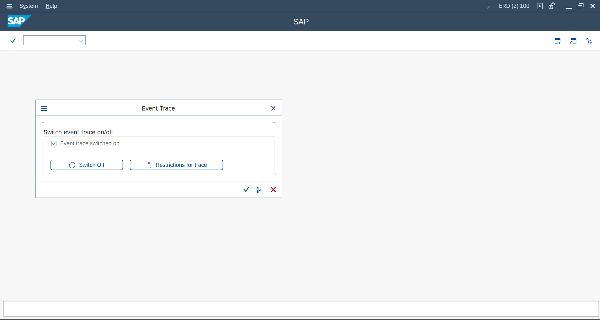

2 min

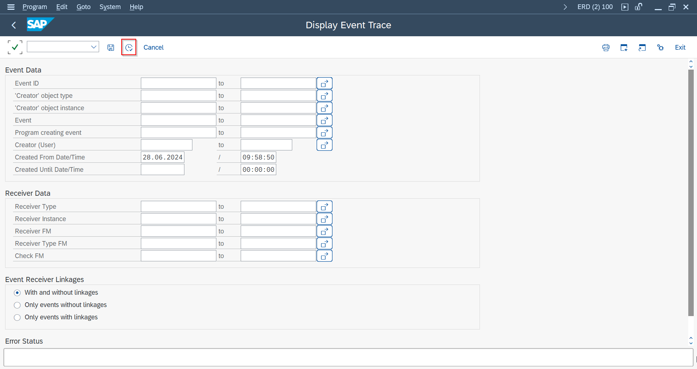

3 min

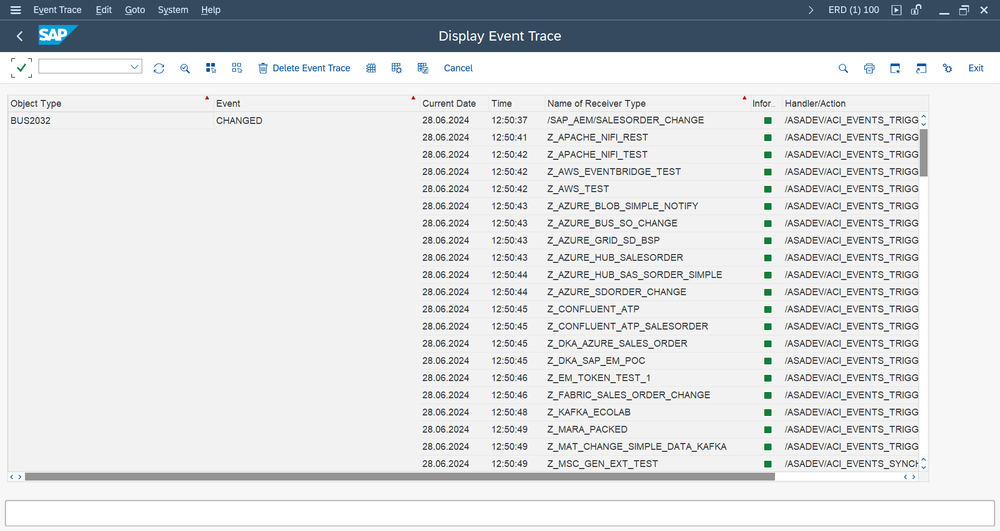

4 min

- **RAP Business Objects (RAP) Events ** - require currently a local consumption class, to capture and delegate the standard event from the RAP layer to S/4HANA, using official SAP extensibility concepts. To simplify implementation, ASAPIO provides ready-to-use consumption classes for most SAP standard RAP objects.
- **SAP Business Object (BO) Events** – raised by the Business Object Repository (BOR) when document changes occur
- **Business Transaction Events (BTE)** – FI/CO-based posting events from the FIBF framework
- **Change Documents** – generated by SAP for standard and custom business objects
- **IDocs** – outbound IDoc processing as an event source
- **Output Determination** – SAP output processing (e.g., from condition records)
- **Custom / SLT** – SAP Landscape Transformation–based triggers for real-time replication

## SAP Business Object Events

Business Object events are the recommended trigger mechanism for most standard SAP documents:

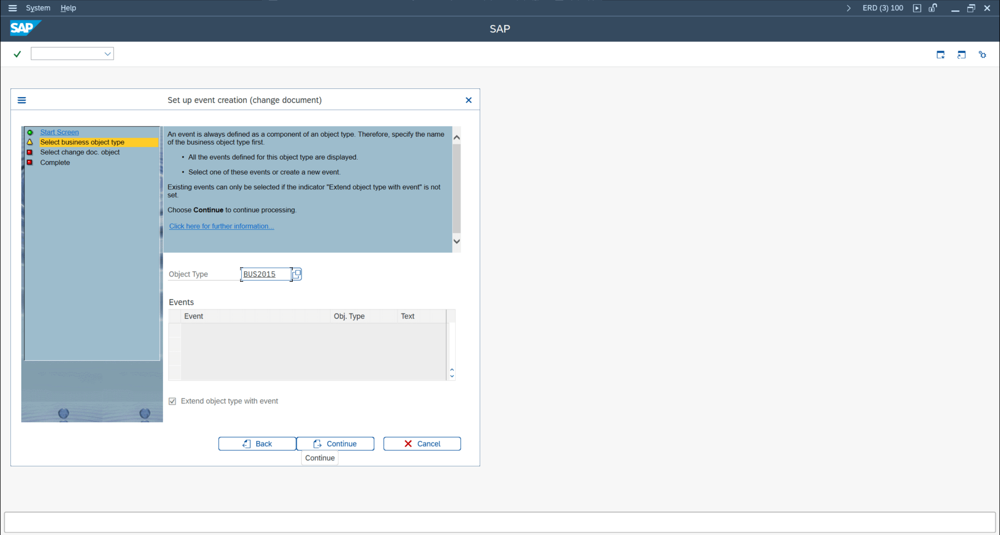

48 min

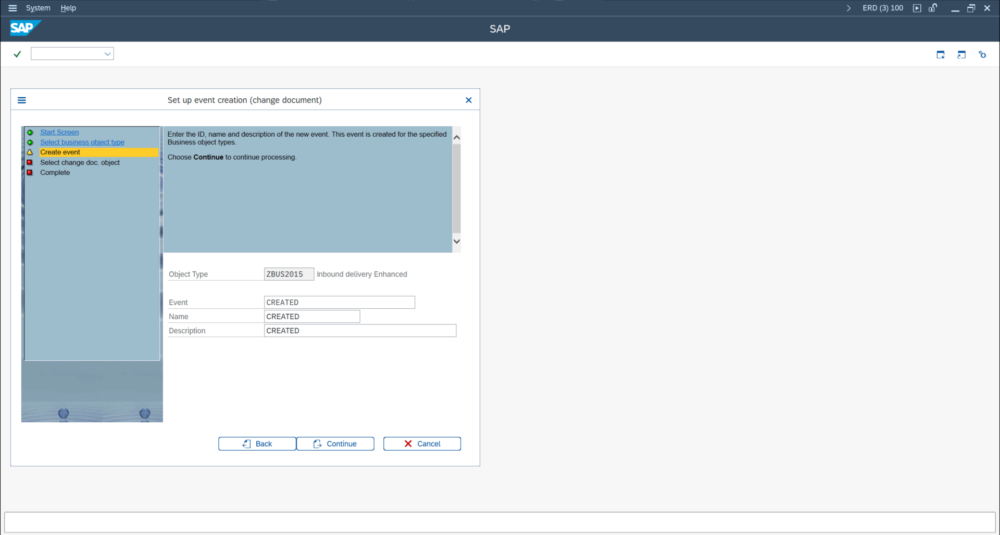

49 min

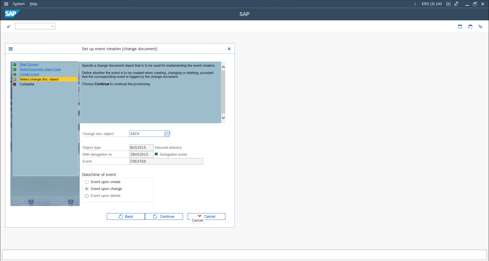

50 min

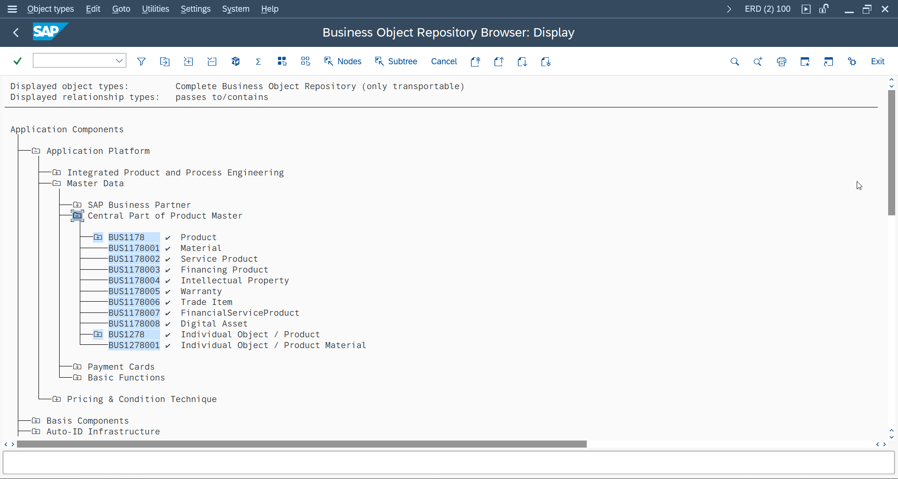

1 min

1. Find the object type using transaction **SWO3** or search in the SWO event table
2. Identify which events are actually raised for a document change by activating the event trace in transaction **SWELS**, performing a document change, then reviewing events in **SWEL**
3. Link the BO event to an ASAPIO outbound object via the event linkage in `/ASADEV/ACI_SETTINGS`

## Business Transaction Events (BTE)

BTEs are used for Finance-related events (FI posting, payment, clearing). Find and use them via:

1. Open transaction **FIBF** (Business Transaction Events)
2. Find the relevant BTE for your scenario (search by area: FI, CO, etc.)
3. Implement the BTE product function module (copy the sample FM, implement your logic)
4. Register the product FM in FIBF under the corresponding BTE

## Event Filtering

ASAPIO provides several approaches to filter which events trigger a message send:

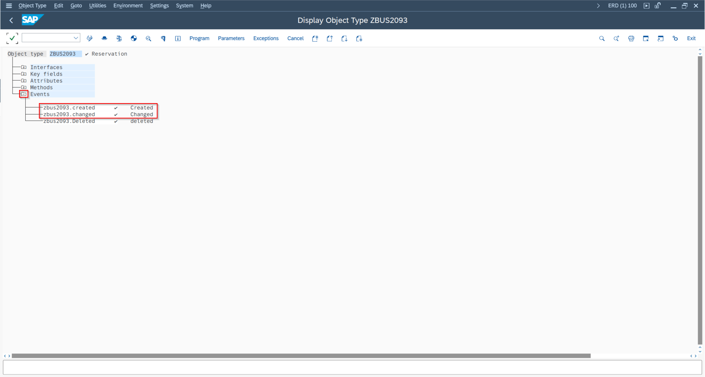

51 min

- **Function Module:** Use `/ASADEV/ACI_EVENTS_CHECK` or a custom FM specified in the event linkage – return a flag to skip or process the event
- **Custom FM:** A Z-function module in the event linkage can implement complex business logic
- **BAdI:** BAdI `/ASADEV/TRIGGER_BADI` provides a method called before message send
- **WHERE Clause in Payload Design:** Add filter conditions directly in the Payload Designer JOIN builder

## Setting Up Outbound Messaging

Basic setup steps for a new outbound integration:

1. In **WE81**, create a message type for the integration (or reuse an existing one)
2. In **BD50**, activate change pointer recording for the message type
3. In `/ASADEV/ACI_SETTINGS`, create or select the connection instance
4. Add a new outbound object under the connection instance:
   - Set the event linkage (object type + event)
   - Set the extractor function module (or Payload Designer reference)
   - Set the formatter function module
   - Configure header attributes (topic name, message type, etc.)

## Simple Notifications

For use cases where you only need to send the changed document's key fields (not the full data), use the Simple Notification approach. This uses standard ASAPIO function modules that directly send the event key (e.g., Sales Order number) without extracting additional data from the database. This is significantly faster and uses fewer resources.

## Message Builder (Full Payloads)

For rich event payloads, configure the Message Builder:

1. Create a database view or Payload Designer design containing the fields for your payload
2. Set the extractor FM to `/ASADEV/ACI_GEN_VIEW_EXTRACTOR` (DB view) or `/ASADEV/ACI_GEN_PDVIEW_EXTRACT` (Payload Designer)
3. Configure field mappings and header attributes as needed

## Payload Modification Options

The following transformations can be applied to individual fields in the payload:

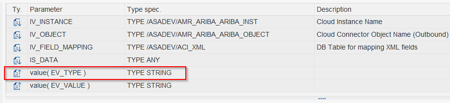

NewConversion Type

| Option | Key / Convention | Description |
| --- | --- | --- |
| Rename Field | `FIELD_RENAME` | Rename the JSON key for a field |
| Append Suffix | `APPEND_` | Append a field value to an existing JSON key |
| Skip Field | `SKIP_FIELD` | Conditionally exclude a field from the payload |
| camelCase | – | Convert field name to camelCase format |
| Hierarchy / Nesting | `TABLE_PARENT` | Nest a table's rows as child array |
| Cardinality | – | Control 1:1 vs 1:N output structure |
| Disable Conversion Exit | – | Output raw value without SAP formatting |
| Unique Message ID | `ENABLE_MESSAGE_ID` | Add a unique identifier to each message (since 9.32507) |

Change pointer field (`CP_INFO`): add this virtual field to include change pointer metadata in the payload (useful for identifying what changed in an update event).

## Batch Job Setup

ASAPIO processes change pointers asynchronously via a scheduled batch job. Set up the replicator job:

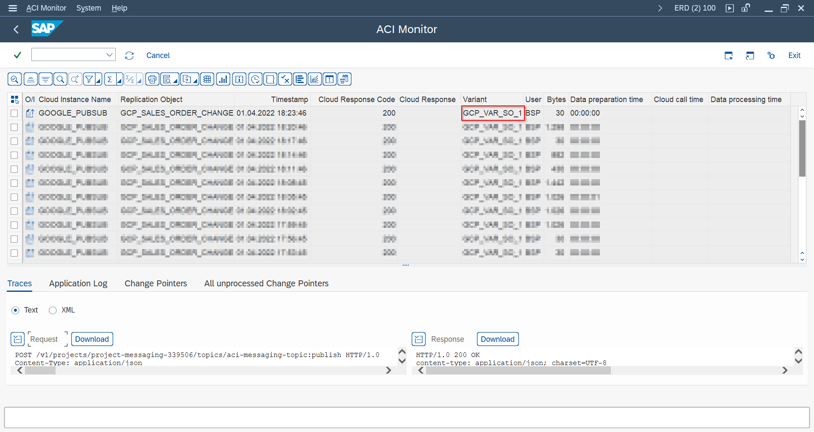

42 min

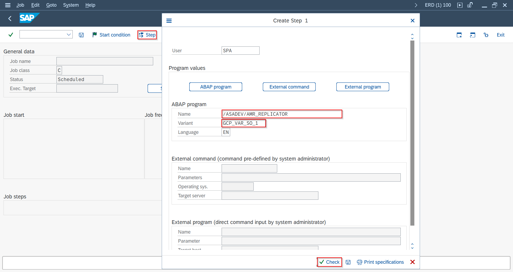

41 min

1. In transaction **/ASADEV/ACI\_SYNC** (or via SPRO → ASAPIO Cloud Integrator → Synchronous call for message type), disable synchronous processing for the message type so that change pointers are queued instead of sent immediately
2. In transaction **/ASADEV/ACI**, select the Connection and Replication Object and save as a Variant (Upload Type: `I`)
3. In **SM36**, schedule the program `/ASADEV/AMR_REPLICATOR` with your variant – typically every 1–5 minutes

## Packed Load / Initial Load

Use Packed Load for extracting large volumes of data (initial sync or bulk updates):

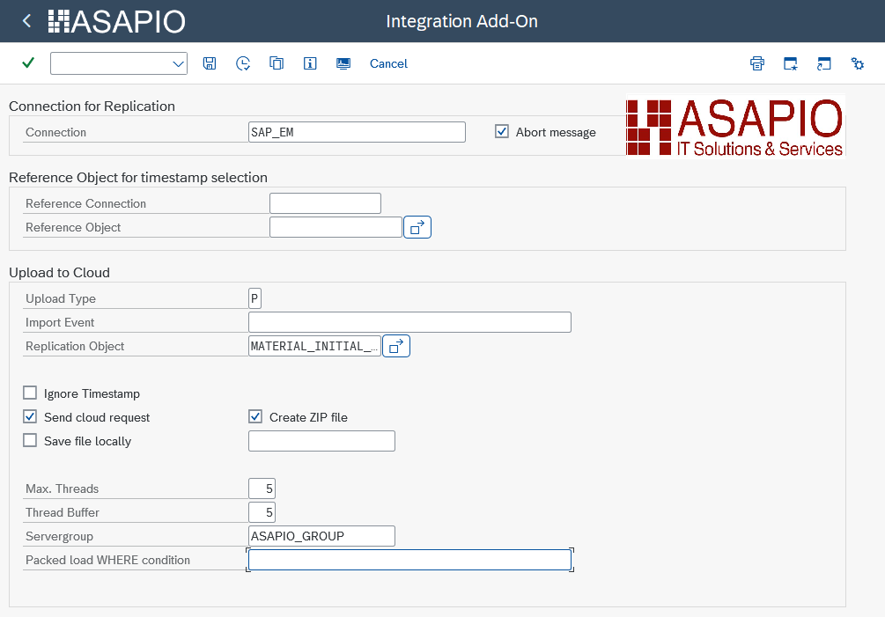

932504 ImprovedPackedLoad

- Extractor FM: `/ASADEV/ACI_GEN_VIEW_EXTRACTOR`
- Load Type: set to `Packed Load` in the outbound object configuration
- Configure key header attributes: `ACI_PACK_TABLE`, `ACI_PACK_SIZE`, `ACI_PACK_KEY_LENGTH`
- From release 9.32504, specify `Max. Threads` and `Thread Buffer` in transaction `/ASADEV/ACI`

Packed loads send data in parallel batches across SAP work process server groups. They can be reprocessed via the Packed Reprocessing method if partial failures occur.

## Immediate Retry

Configure automatic immediate retries when a send fails:

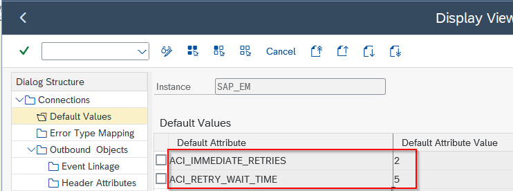

ImmediateRetry DefaultValue

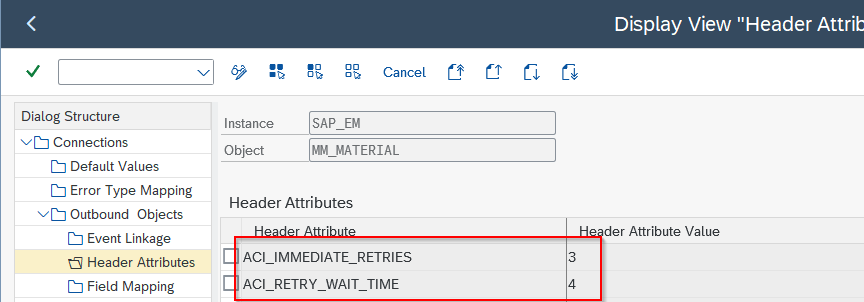

ImmediateRetry HeaderAttributes

- Parameter `ACI_IMMEDIATE_RETRIES` – number of immediate retry attempts (default: 1 if not configured)
- Parameter `ACI_RETRY_WAIT_TIME` – wait time in seconds between retries

## Custom Events, Extractors, and Triggers

For non-standard SAP objects or highly custom integration scenarios:

- Create a custom Business Object using **SWO1** if your object is not in the standard BOR
- Register event linkages via **SWEC** or **CMOD** user exits
- Use BAdI `/ASADEV/TRIGGER_BADI` for custom trigger logic
- For SLT-based triggers (real-time table replication), use exit `ES_IUUC_REPL_RUNTIME_OLO_EXIT`

## Authorization Notes

SP12 introduces two global authorization flags that can restrict write access to ASAPIO configuration:

- `ACI_AUTH_GLOBAL_CP_WRITE` – controls who can write change pointer records
- `ACI_AUTH_GLOBAL_IDOC_PORT` – controls access to IDoc port configuration

Assign the standard role `/ASADEV/ACI_ADMIN_ROLE` to administrators who require full access.
