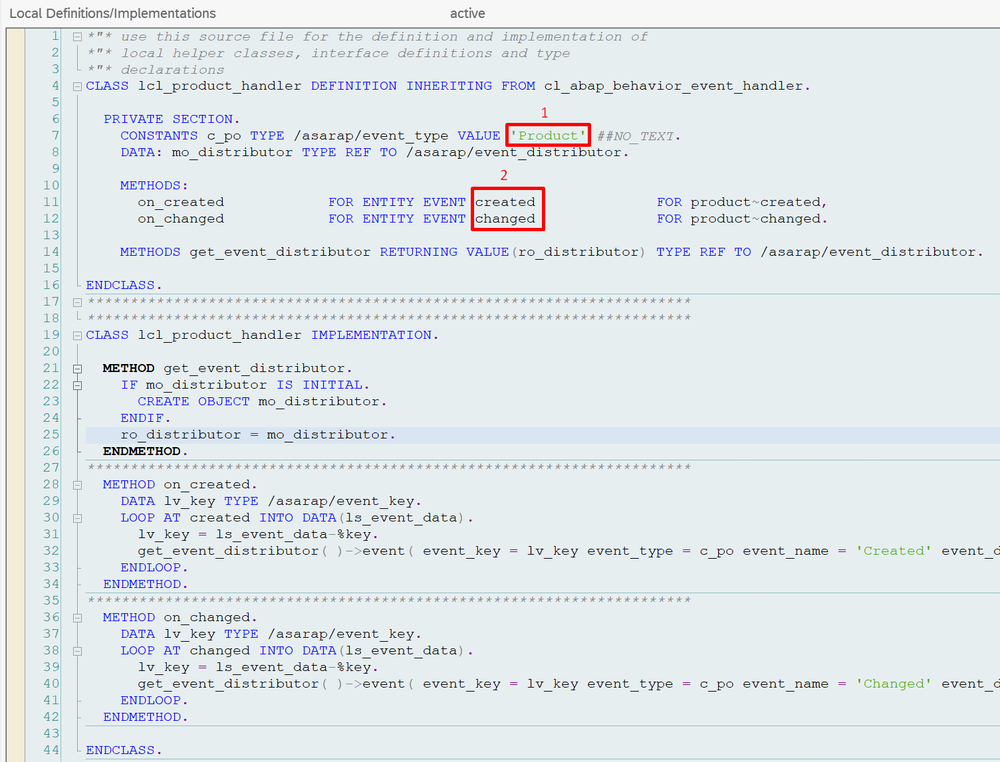
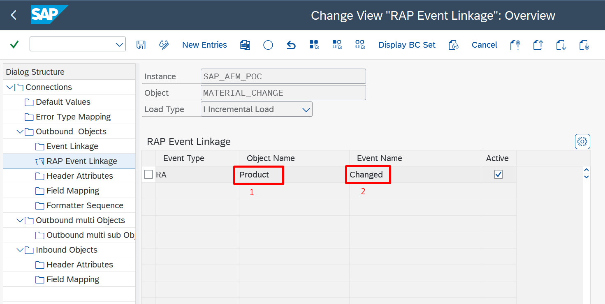

Outbound Messaging

# RAP Events

Use business events emitted by SAP RAP (ABAP RESTful Application Programming Model) business objects as native integration triggers – no custom ABAP event wiring needed. Covers event type registration, binding to outbound objects, and the supported SAP RAP event types.

## Overview

SAP's RESTful Application Programming (RAP) model introduces a standardized event mechanism for business objects. From **SAP S/4HANA 2023** onwards, RAP business objects can raise events via the bgRFC (background Remote Function Call) framework. ASAPIO consumes these RAP events and routes them to any configured messaging connector.

RAP events require the **ASAPIO Event Studio** component to be installed and configured.

## Prerequisites

- SAP S/4HANA 2023 or higher (on-premise)
- ASAPIO Event Studio installed
- bgRFC framework configured

## bgRFC Destination Setup

1. **Create default bgRFC destination `BGPF`:**
   Use transaction **SBGRFCCONF** to create the standard BGPF destination required by the SAP RAP event framework.
2. **Create application-specific bgRFC destination (e.g. `ASAPIO`):**
   Create an additional bgRFC destination specific to ASAPIO event processing. This separates ASAPIO's RAP event queue from other bgRFC processing.
3. **Add default value `ACI_BGRFC_DESTINATION`:**
   In the ASAPIO connection instance default values (`/ASADEV/ACI_SETTINGS`), add the key `ACI_BGRFC_DESTINATION` with the name of the ASAPIO bgRFC destination.

## Activating RAP Events

RAP events can be activated in two ways:

### Via SAP GUI (SPRO)

1. Go to `/ASADEV/ACI_SETTINGS` → **RAP Event Linkage**
2. Add a new entry with the following fields:

RAP event handler class

RAP event linkage in SAP GUI

| Field | Value | Source |
| --- | --- | --- |
| Handler Class | The ABAP handler class for the RAP object (e.g., `/ASADEV/CL_RAP_SALESORDER`) | Install from the [Integration Catalog](../catalog/index.md) |
| Event Type | `RA` | Fixed value |
| Object Name | Name of the RAP business object (e.g., `SalesOrder`) | Look up in the [Integration Catalog](../catalog/index.md) |
| Event Name | Name of the event (e.g., `Created`, `Changed`) | Look up in the [Integration Catalog](../catalog/index.md) |

The handler classes, object names, and event names are all provided as part of the [Integration Catalog](../catalog/index.md) download. Install the handler class transport first, then use the matching object name and event name from the catalog when you create the event linkage entry.

### Via Event Studio Deployment

When a RAP event is configured in the ASAPIO Event Studio, the event linkage is created automatically during deployment. This is the recommended approach, as it enables version-controlled event definitions. Use the predefined ASAPIO Event Handler classes available from the [Integration Catalog](../catalog/index.md) as the starting point for each object type.

## Supported RAP Objects

The [Integration Catalog](../catalog/index.md) lists all supported RAP business objects and events. The catalog download includes the handler class transports alongside the matching object names and event names required for the linkage configuration. Examples include:

- Sales Orders (Created, Changed, Deleted, Released)
- Purchase Orders (Created, Changed, Deleted, Released)
- Purchase Requisitions (Created, Changed, Deleted)
- Supplier Invoices (Created, Changed)
- Business Partners (Created, Changed)
- Production Orders (Created, Changed, Released)
- Billing Documents (Created, Changed)
- …and many more

Refer to the [Integration Catalog](../catalog/index.md) for the complete and up-to-date list.

**Roadmap:** In an upcoming release, ASAPIO plans to ship the available RAP object names and event names as preconfigured content inside the Add-on. This will eliminate the need to look up the values manually – the linkage configuration will offer them directly from a value help.

## CDS View Entity Redefinition

The CDS View Entities that SAP defines as part of the standard RAP business objects can be **redefined in a customer namespace** using the ASAPIO Integration Add-on. This lets you:

- Add or remove fields from the standard SAP CDS View Entity
- Include calculated or derived fields
- Adjust data types or apply conversions
- Combine data from multiple CDS views into a single payload

Use the integrated CDS View Entity editor in [Event Studio](../eventstudio/index.md) to create a redefined view based on the standard RAP object, then reference it in your event configuration. See [CDS View Support](../cds-view-support/index.md) for details on using CDS views as data sources.

## Custom Payloads

For each RAP event, you can define a custom payload using the Payload Designer:

1. Create a Payload Design in transaction `/n/ASADEV/DESIGN` using a CDS View Entity as the data source
2. In Event Studio, add a new event definition via **Add Event Dialog**: specify the Payload Design in "Catalog Object Id / Version", and enter the Event Type, Object ID, and Event Name
3. Your Payload Design then appears in the Data Catalog screen and can be deployed from there
